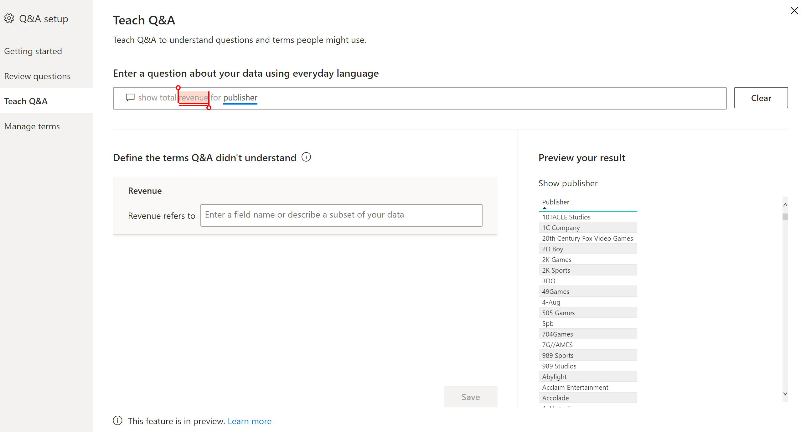

# Teach Q&A to understand questions and terms in Power BI Q&A

In the **Teach Q&A** section of Q&A setup, you train Q&A to understand natural-language questions and terms it hasn't recognized. To begin, you submit a question that contains a word or words that Q&A didn't recognize. Q&A then prompts you to define that term. You enter either a filter or a field name that corresponds to what that word represents. Q&A then re-interprets the original question. If you're happy with the results, you save them.

> [!NOTE]
> The Teach Q&A functionality only supports import mode. It also doesn't yet support connecting to an on-premises or Azure Analysis Services data source. This limitation should be removed in subsequent releases of Power BI.

## Start to teach Q&A

1. In Power BI Desktop, on the **Modeling** ribbon, select **Q&A Setup** > **Teach Q&A**.

    

2. Type a sentence with a term Q&A doesn't recognize and select **Submit**.

3. Select the red-underlined word. 

    Q&A offers suggestions and prompts you to provide the correct definition of the term. 
    
3. Under **Define the terms Q&A didn't understand**, provide a definition.

    

4. Select **Save** to preview the updated visual.

5. Enter the next question, or select the **X** to close.

Your report consumers won't see this change until you publish the report back to the service.

## Define nouns and adjectives

You can teach Q&A two types of terms:

- Nouns
- Adjectives

### Define a noun synonym

When working with data, you often may have names of fields that could be referred to with alternative names. An example could be 'Sales'. Numerous words or phrases could refer to sales, such as 'revenue'. If a column is named 'Sales', and report consumers type 'revenue', Q&A may fail to pick the correct column to answer the question appropriately. In that case, you want to tell Q&A that 'Sales' and 'Revenue' refer to the same thing.

Q&A automatically detects when an unrecognized word is a noun using knowledge from Microsoft Office. If Q&A detects a noun, it prompts you in the following way:

- <your term> **refers to** 

You fill in the box with the term from your data.

If you provide something other than a field from the data model, you may get undesirable results.

### Define an adjective filter condition

Sometimes you may want to define terms that act as a condition on the underlying data. An example could be 'Awesome Publishers'. 'Awesome' could be a condition that only selects publishers that have published X number of products. Q&A tries to detect adjectives, showing a different prompt:

- <field name> **that have**  

You fill in the box with the condition.

Some example conditions that you can define are:

- 'Country' which is 'USA'
- 'Country' which is not 'USA'
- 'Weight' > 2000
- 'Weight' = 2000
- 'Weight' < 2000

You can only define a single condition in tooling. To define more complex conditions, use DAX to create a calculated column and then use the tooling section to create a single condition for that calculated column. Measures aren't supported. Use calculated columns instead.

## Manage terms

After you've provided definitions, you can go back to see all the fixes you made and edit or delete them. 

1. In **Q&A setup**, go to the **Manage terms** section.

2. Delete any terms you no longer want. Currently you can't edit terms. To redefine a term, delete the term and define it.

    

## Next steps

There are a number of best practices for improving the natural language engine. For more information, see the following article:

* [Q&A Best Practices](q-and-a-best-practices.md)
