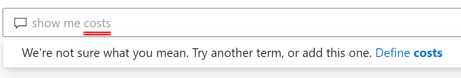
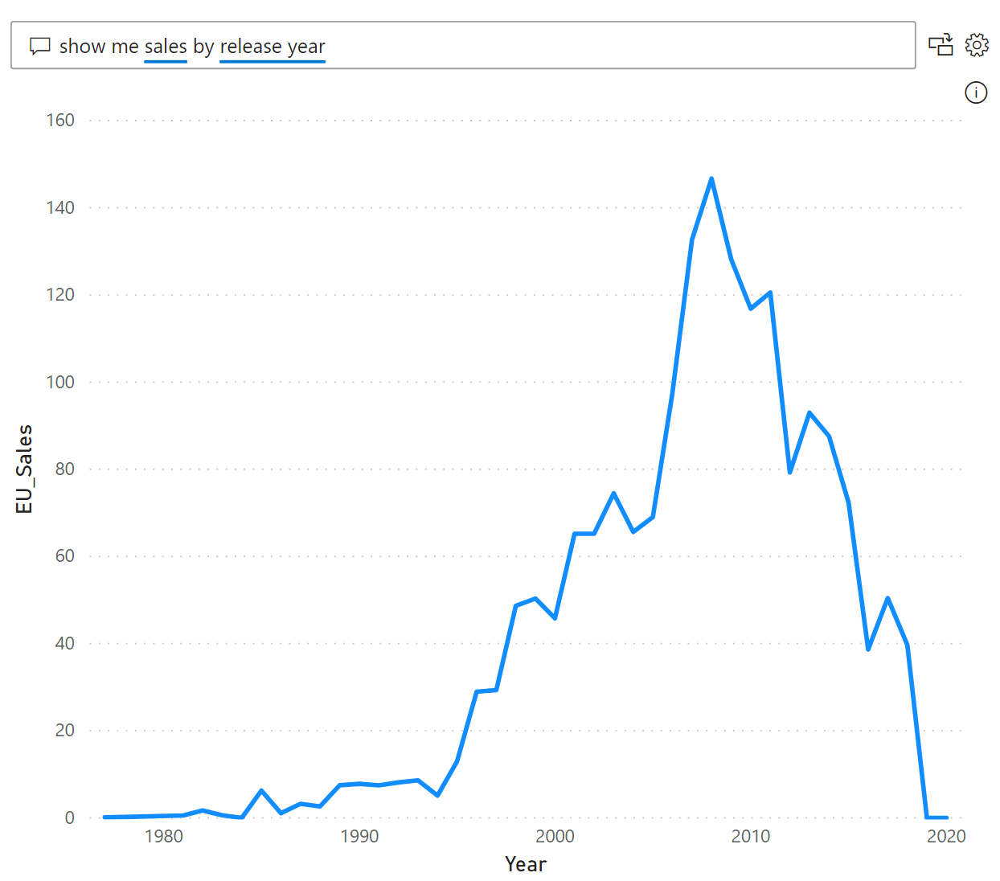

# Introduction to Power BI Q&A
## What is Power BI Q&A

Sometimes the fastest way to get an answer from your data is to perform a search over your data using natural language. The Q&A feature in Power BI lets you explore your data in your own words seamlessly using natural language. Q&A is interactive, even fun. Often, one question leads to others as the visualizations reveal interesting paths to pursue. Asking the question is just the beginning.  Have fun traveling through your data refining or expanding your question, uncovering trust-worthy new information, zeroing in on details and zooming out for a broader view.
You’ll be delighted by the insights and discoveries you make.

The experience is truly interactive…and fast! Powered by an in-memory storage, response is almost instantaneous. Power BI Q&A is free and available to all users.

## How to use Q&A

Even before you start typing, Q&A displays a new screen with suggestions to help you form your question. start either from one of the pre suggested questions or feel free to type in your own questions, Q&A supports a wide range of questions including but not limited to;

- **Ask natural questions** Which sales has the highest revenue?
- **Use relative date filtering** Show me sales in the last year.
- **Return only the top N** Top 10 products by sales.
- **Provide a filter** Show me sales in the USA
- **Provide complex conditions** Show me sales where product category is Category 1 or Category 2
- **Return a specific visual** Show me sales by product as Pie chart
- **Use complex aggregations** Show me median sales by product
- **Sort results** Show me top 10 countries by sales ordered by country code
- **Compare data** Show me date by total sales vs total cost
- **View trends** Show me sales over time

### Autocomplete

As users type their questions, Power BI Q&A shows relevant and contextual suggestions to help you quickly become productive with natural language. As you type, you are given instant feedback and instant results. The entire experience is how users are accustomed to typing into a search engine.

### Red/Blue underlines

Q&A shows words with underlines to easily help users identify which words were understood or unrecognized by the system. A solid blue underline indicates that the system has been able to successfully match the word to a field or value in the data-model. The example below shows that Q&A was able to successfully recognize the word EU Sales.

Very often, you will type in a word into Q&A which is marked with a red underline. A red underline can indicate two potential issues. The first type of issue is categorized as low confidence, if you type in a word which is vague or ambiguous, the field will be marked as red underline. An example could be when typing in the word 'Sales'. As the word 'Sales' could have multiple fields which contain 'Sales', the system uses red underlines to prompt the user to choose which field did the user mean. Another example is when the user types in the word 'area' but the column it matches is 'region' as Power BI Q&A recognizes words which mean the same thing thanks to the integration with Bing and Office. it marks the word as Red to ensure the user understands its not a direct match.

The second type of issue is when the word is not recognized at all. iThis could be because the user used a domain specific term that is not mentioned anywhere inside the data or the data fields are incorrectly named. An example could be using the word 'Costs' although the word is recognized in the english dictionary, as its not available inside the data, Q&A marks this term with a red underline.

> [!NOTE]
> Q&A allows users to customize the blue/red underline colors through the Q&A Visual formatting pane options. In the Q&A tooling section you will also find Q&A Teach Me which allows users to define what unrecognized terms mean inside Q&A.

### Visualization Results

As the user types in their question, Q&A will try to instantly interpret and visualize the answer. As part of the latest updates, Q&A will now try to interpret the question and plot the fields automatically to the correct axis. E.g. if the user types in 'Sales by year'. Q&A will detect that year is a date field and will always prioritize placing this field on the X axis. If you wish to change the visualization type, type in 'as chart type' after the question, Q&A currently supports the following types of visualizations;

- Line chart
- Bar Chart
- Matrix
- Table
- Card
- Area
- Pie Chart
- Scatter/Bubble Chart
 

## How to enable Q&A for reports

Q&A can be enabled on reports through two ways

- Adding the Q&A Visual onto a report
- Adding a Q&A button onto a report)

To add the Q&A visual onto a report, you can either navigate to the visualization pane and select the new Q&A visual icon. Or alternatively, you csn double click anywhere on the report canvas to insert the Q&A visual.

To add a button, head over to the buttons drop down list from the ribbon and insert the Q&A button, the Q&A button image can be customized completely.

> [!NOTE]
> Q&A activated from a button still uses the old Q&A, this will change in subsequent releases of Power BI

## How to enable Q&A for dashboards

By default, Q&A is available on top of dashboards. to use Q&A, click on 'Ask a question on your data'

## Next steps

There are a variety of ways you can integrate natural language. For more information, see the following articles:

* [Q&A Visual](qna-visual.md)
* [Q&A Best Practices](qna-best-practices.md)
