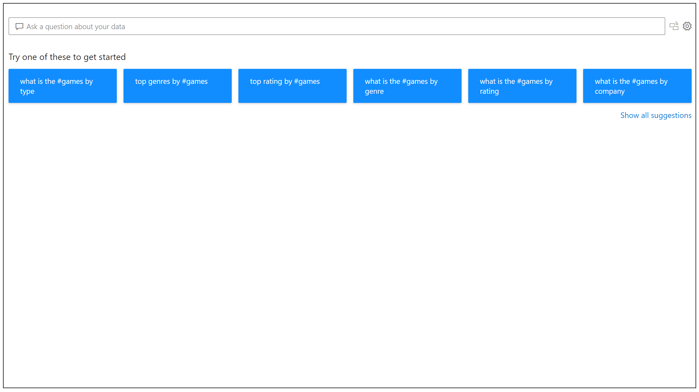

# Introduction to Power BI Q&A
## What is Power BI Q&A

Sometimes the fastest way to get an answer from your data is to perform a search over your data using natural language. The Q&A feature in Power BI lets you explore your data in your own words seamlessly using natural language. Q&A is interactive, even fun. Often, one question leads to others as the visualizations reveal interesting paths to pursue. Asking the question is just the beginning.  Have fun traveling through your data refining or expanding your question, uncovering trust-worthy new information, zeroing in on details and zooming out for a broader view.
You’ll be delighted by the insights and discoveries you make.

The experience is truly interactive…and fast! Powered by an in-memory storage, response is almost instantaneous.

## How to use Q&A

