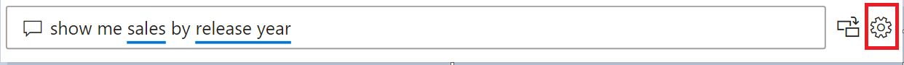
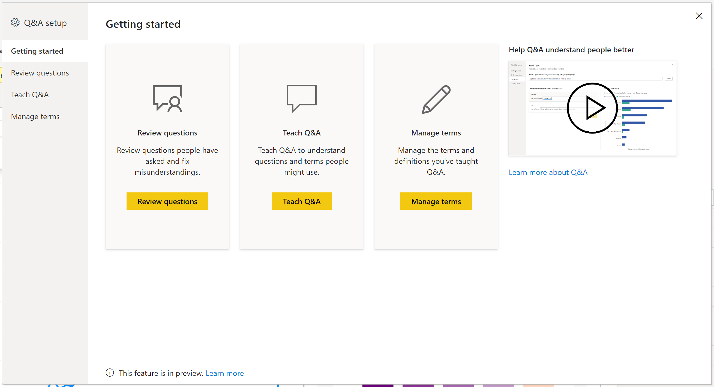
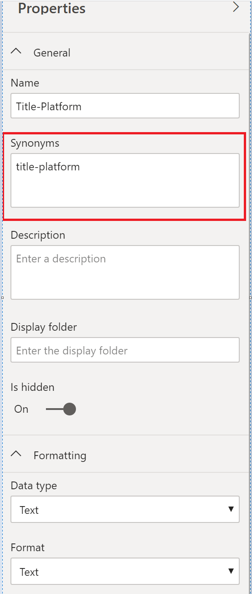

# Introduction to Power BI Q&A Tooling
## What is Power BI Q&A tooling dialog

To be able to understand and improve the natural language inside Power BI, there is now a dedicated tooling experience to enhance the natural language understanding engine inside Q&A. the Q&A tooling consist of 3 tabs;

- Review Questions
- Teach Q&A
- Manage Terms

In addition to the dedicated tooling capabilities available inside the Q&A Visual, it is also possible to configure the following things within the modelling tab:

- Synonyms
- Row label
- Hide from Q&A
- \[Advanced\] configuring the linguistic schema

## How to access Q&A tooling

> [!NOTE]
> Q&A tooling is only available inside Power BI Desktop and currently only supports import mode only

To access the Q&A tooling section, first create the Power BI Q&A Visual within Power BI Desktop and click on the gear icon in the corner of the visual.

Once you click on the gear, you will then be shown a dialog box with a getting started page.

### Review Questions

The 'Review Questions' section allows you to select a Power BI dataset in the service to see what questions users have been asking. The data shown is for the last 28 days but also shows which words are recognized and which words are not recognized. To learn more about this [click here](qna-tooling-review-questions.md)

### Teach Q&A

The 'Teach Q&A' section allows you to train Q&A using natural language on words it has not recognized. To begin, you will first enter in a question which contains a word or words which are not recognized by Q&A. You then submit this and Q&A will then prompt you for the definition of that term. In this box you will enter either a filter or a field name that correspond to what that word represent. Q&A will then re-interpret the original question and if you are happy with the results, you can then save. To learn more about this [click here](qna-tooling-teach-qna.md)

### Manage Terms

Anything that has been saved from the Teach Q&A section will show up here to allow you to review or delete terms you have defined. Today there is no ability to edit an existing definition so in order to redefine a term you must first delete and then recreate the term.

## Other Q&A Settings

### Bulk synonyms

Inside the Power BI Modelling tab, upon clicking a field or table you should be shown a right side pane showing a list of options you can tweak. One of these options will contain synonyms. This allows you to quickly define alternative words which represent the field you selected. Although the 'Teach Q&A' feature inside the tooling dialog can define synonyms, if you wish to define synonyms for lots of fields in a table, it is often easier to do some from here.

To define multiple synonyms for a single field, use commas to denote the next synonym.

### Hide from Q&A

If you hide a field from the modelling tab, Q&A will respect and ensure that field can no longer be used when using Q&A. this is good for scenarios where you wish to hide ID fields and foreign keys to avoid unnecessary duplicate fields being called the same thing. If you hide the field , it can still be used in Power BI Desktop to create visuals outside of Q&A

### Row Label

Only available on tables inside the modelling view, a Row Label allows you to define which column/field best identifies a single row inside the table. This is important for when you have a table called 'Customer' and the Row Label will usually be 'Display Name'. Providing this extra metadata allows Q&A to plot a more helpful visual when users type in 'Show me sales by customer' instead of treating 'customer' as a table, it can instead use 'Display Name' and display a bar chart showing each customers sales.

### \[Advanced\] Configure the linguistic schema

IF you wish to completely train nd enhance the natural language engine inside Q&A you can completely change the scoring and weighting of the underlying natural language engine. To learn more about this [click here](qna-tooling-teach-qna.md)

## Next steps

There are a variety of best practices you can use to also improve the natural language engine. For more information, see the following articles:

* [Q&A Best Practices](qna-best-practices.md)
