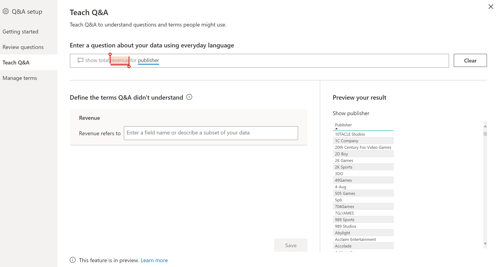
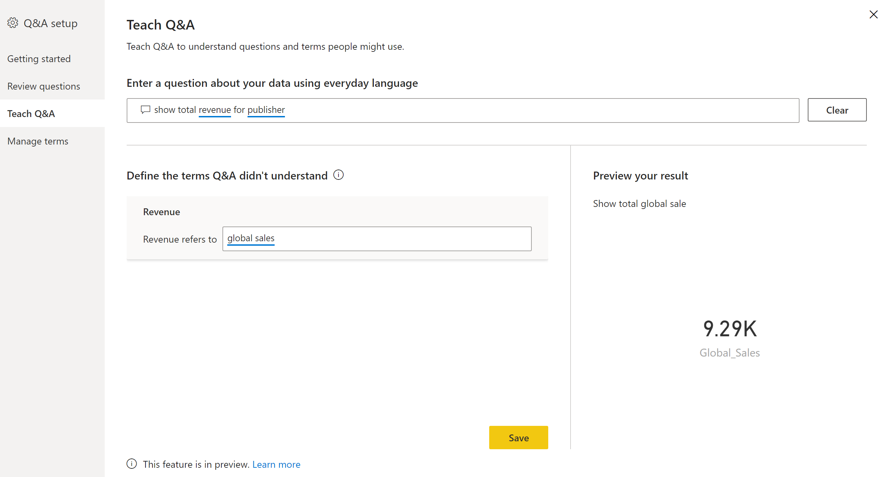
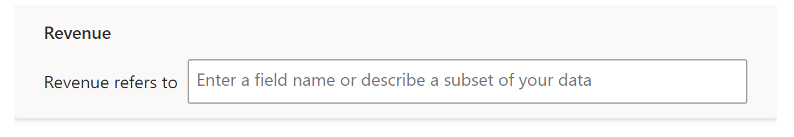
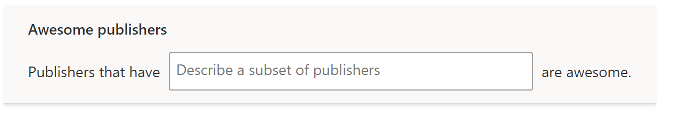
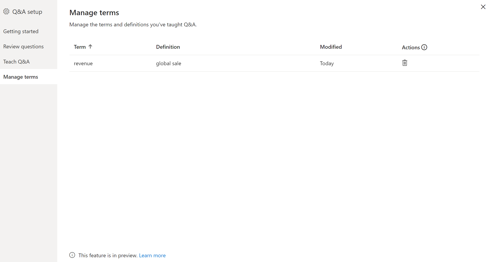

# Teach Q&A

The 'Teach Q&A' section allows you to train Q&A using natural language on words it has not recognized. To begin, you will first enter in a question which contains a word or words which are not recognized by Q&A. You then submit this and Q&A will then prompt you for the definition of that term. In this box you will enter either a filter or a field name that correspond to what that word represent. Q&A will then re-interpret the original question and if you are happy with the results, you can then save.

> [!NOTE]
> Q&A Tooling only supports import mode and does not yet support connecting to an on-prem/Azure analysis services, this is a current limitation which will be removed in subsequent releases of Power BI'

## How to use

Teach Q&A can be accessed from the tooling menu from within Power BI Desktop. Once the dialog option opens, go to the 'Teach Q&A' section to fix a question.

Once you click on submit, you will then be prompted to provide the correct definition of the term. Once you provide the correct defintion, the visual preview will update and you can then hit save and move onto the next question or hit close to finish. In order for report consumers to see this new change,you **must** publish the report back to the service in order for the changes to take effect.

There are two types of fixes you can make inside 'Teach Q&A':

- Define a noun
- Define an adjective

### Defining a noun/synonym

When working with data, you often may have names of fields that could be referred to with alternative names. An example could be 'Sales'. There could be numerous words/ phrases that could refer to sales such as 'revenue'. If the column is named 'Sales' and consumers type in 'revenue', Q&A may fail to pick the correct column to answer the question appropriately. In this case you wish to tell Q&A that 'Sales' and 'Revenue' refer to the same thing.

Q&A will automatically detect when an unrecognized word is a noun using knowledge from Office. If Q&A detects a noun, it will prompt you in the following way.

If you provide something other than a field from the data model you may get undesirable results.

### Defining an adjective/filter condition

Sometimes you may wish to use terms that act as a condition to the underlying data. An example could be 'Awesome Publishers'. 'Awesome' could be a condition which only selects publishers which have published X number of products. Q&A will try to detect adjectives and will show a varied prompt.

> [!NOTE]
> You can only define a single condition in tooling. To define more complex conditions, use DAX to create a calculated column and then use the tooling section to create a single condition

Some example conditions which you can define are:

- 'Country' which is 'USA'
- 'Country' which is not 'USA'
- 'Weight' > 2000
- 'Weight' = 2000
- 'Weight' < 2000

> [!NOTE]
> Measures are not supported, instead use calculated columns

## Manage terms

Once you have provided definitions you may decide to go back to see all the fixes made or decide to edit/delete them. Go to the 'Manage terms' section inside Q&A tooling to see this list. Currently there is no edit capability and therefore to redefine words, first delete the term and then define.

## Next steps

There are a variety of best practices you can use to also improve the natural language engine. For more information, see the following articles:

* [Q&A Best Practices](qna-best-practices.md)
