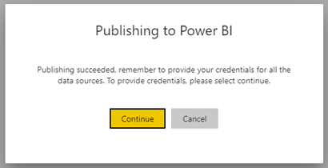
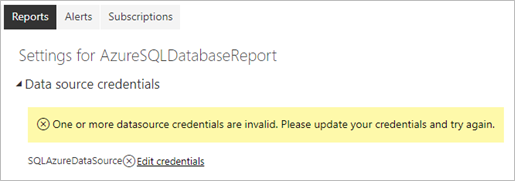
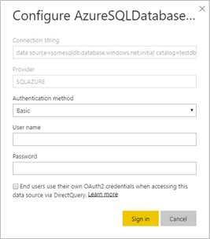

# Supported data sources for Power BI paginated reports

This article spells out supported data sources for paginated reports in the Power BI service, and how to connect to Azure SQL Database data sources. Some data sources are supported natively. You can connect to others by way of data gateways.

Paginated reports natively support the following list of data sources:

| Data Source | Authentication | Notes |
| --- | --- | --- |
| Azure SQL Database  Azure SQL Data Warehouse | Basic, single sign-on (SSO), OAuth2 |   |
| Azure Analysis Services | SSO, OAuth2 |   |
| Power BI Dataset | SSO | Premium and non-Premium Power BI datasets |
| Premium Power BI dataset (XMLA) | SSO |   |
| Enter Data | N/A | Data is embedded in the report. |

Except for Azure SQL Database, all data sources are ready to use after you have uploaded the report to the Power Bi service. The data sources default to using single sign-on (SSO), where applicable. For Azure Analysis Services, you can change the authentication type to OAuth2.

For Azure SQL Database data sources, you need to supply more information, as described in the Azure SQL Database Authentication section.

In addition to the natively supported data sources above, the following data sources can be accessed via a [Power BI data gateway](service-gateway-onprem.md):

- SQL Server
- SQL Server Analysis Services
- Oracle
- Teradata

Note that for paginated reports, Azure SQL Database and Azure Analysis Services currently can't be accessed via a Power BI data gateway.

## Azure SQL Database Authentication

For Azure SQL Database data sources, you need to set an authentication type before you run the report. That applies only if a data source is used for the first time in the current workspace. In that case, you see the following message:

If you don't supply any credentials, an error occurs when you run the report. Select **Continue**  to go to the **Edit Credentials** page for the just uploaded report:

Select the **Edit credentials** link for a given data source to bring up the **Configure** dialog box:

For Azure SQL Database data sources, here are the supported authentication types:

- Basic (user name and password)
- SSO (single sign-on)
- OAuth2 (stored AAD token)

FOr SSO and OAuth2 to work correctly, the Azure SQL Database server that the data source is connecting to needs to have [AAD authentication support enabled](https://docs.microsoft.com/azure/sql-database/sql-database-aad-authentication-configure). For the OAuth2 authentication method, AAD generates a token and stores it for future data source access. To use the SSO authentication method instead the SSO option right below, you need to check the [SSO authentication method](https://docs.microsoft.com/power-bi/service-azure-sql-database-with-direct-connect#single-sign-on).
  
## Next steps

[View a paginated report in the Power BI service](paginated-reports-view-power-bi-service.md)

More questions? [Try the Power BI Community](http://community.powerbi.com/)
