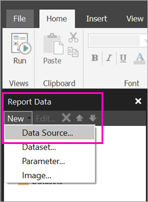

# Create an embedded data source for paginated reports in the Power BI service (Preview)

In this article, you learn how to create and modify an embedded data source for a paginated report in the Power BI service. You define an embedded data source in a single report, and use it only in that report. Currently, paginated reports published to the Power BI service need embedded datasets and embedded data sources, and can connect to these data sources:

- Azure SQL Database and Data Warehouse
- SQL Server
- SQL Server Analysis Services 

Paginated reports connect to on-premises data sources by way of a gateway. You set up the gateway after you publish the report to the Power BI service. Read more about [Power BI gateways](service-gateway-getting-started.md). 

## Create an embedded data source
  
1. Open Report Builder.

1. On the toolbar in the Report Data pane, select **New** > **Data Source**. The **Data Source Properties** dialog box opens.

    
  
2.  In the **Name** text box, type a name for the data source or accept the default.  
  
3.  Select **Use a connection embedded in my report**.  
  
1.  From the **Select connection type** list, select a data source type. 

1.  Specify a connection string by using one of these methods:  
  
    -   Type the connection string directly in the **Connection string** text box. 
  
    -   Select the expression (**fx)** button to create an expression that evaluates to a connection string. In the **Expression** dialog box, type the expression in the Expression pane. Select **OK**. 
  
    -   Select **Build** to open the **Connection Properties** dialog box for the data source you chose in step 2.  
  
        Fill in the fields in the **Connection Properties** dialog box as appropriate for the data source type. Connection properties include the type of data source, the name of the data source, and the credentials to use. After you specify values in this dialog box, select **Test Connection** to verify that the data source is available and that the credentials you specified are correct.  
  
4.  Select **Credentials**.  
  
     Specify the credentials to use for this data source. The owner of the data source chooses the type of credentials that are supported. For more information, see [Specify Credential and Connection Information for Report Data Sources](https://docs.microsoft.com/sql/reporting-services/report-data/specify-credential-and-connection-information-for-report-data-sources).
  
5.  Select **OK**.  
  
     The data source appears in the Report Data pane.  

## Next steps

- [Create an embedded dataset for a paginated report in the Power BI service](paginated-reports-create-embedded-dataset.md)
- [What are paginated reports in Power BI Premium? (Preview)](paginated-reports-report-builder-power-bi.md)