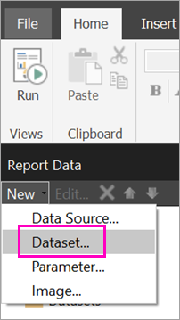
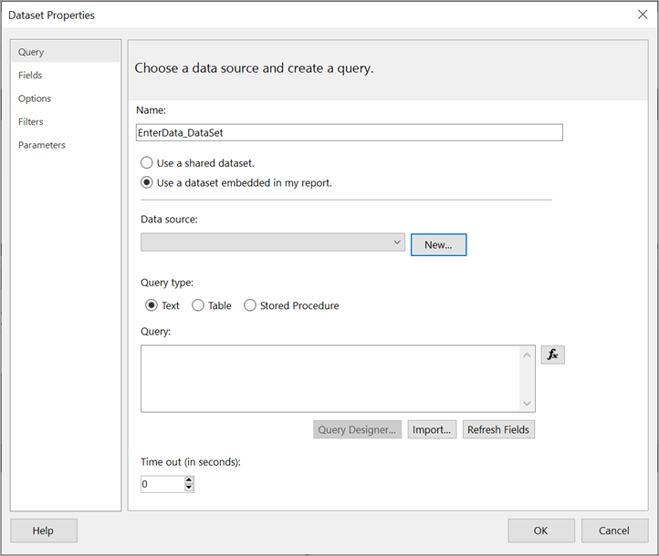
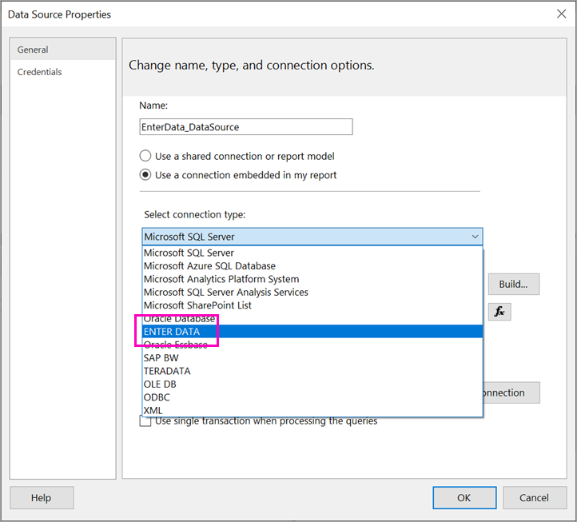
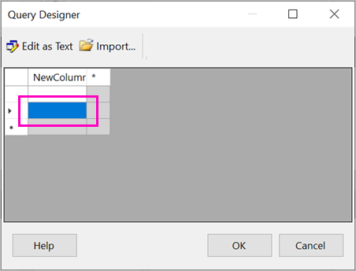
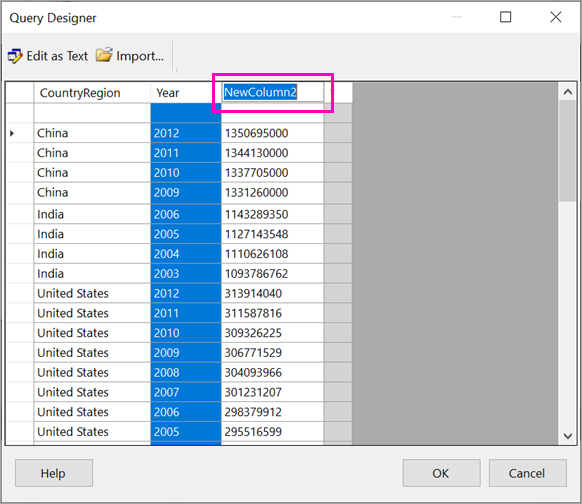
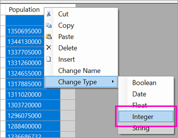
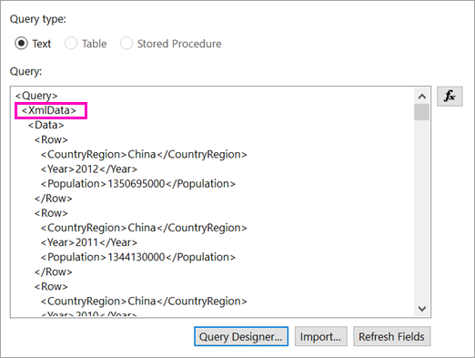
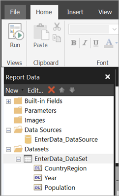

# Enter data directly in a paginated report in Report Builder (Preview) - Power BI

In this article, you learn about a feature in the new version of SQL Server 2016 Report Builder that lets you enter data directly into an RDL report as an embedded dataset.  This feature is similar to Power BI Desktop. You can type the data directly in a dataset in your report, or paste it from another program like Microsoft Excel. After you've created a dataset by entering data, you can use it just like you would any other embedded dataset you've created. Plus you can add more than one table and use one as a filter for the other. This feature is especially useful for small, static datasets you might need to use in your report, like report parameters.
 
## Prerequisites

- To enter data directly in a paginated report, install the new version of [Report Builder from the Microsoft Download Center](https://www.microsoft.com/download/details.aspx?id=53613). 
- To save your paginated report to the Power BI service, you need a [Power BI Pro account](service-self-service-signup-for-power-bi.md) and write access to a workspace in a [Power BI Premium capacity](service-premium-what-is.md).
- To save your paginated report to a report server, you need permissions to [edit the RsReportServer.config file](#upload-the-paginated-report-to-a-report-server).

## Get started

After you’ve downloaded and installed Report Builder, you follow the same workflow you use to add an embedded data source and dataset to your report. In the following procedure, under **Data Sources** you see a new option: **Enter Data**.  You only need to set up this data source once in a report. After that, you can create multiple tables of entered data as separate datasets, all using that single data source.

1. In the **Report Data** pane, select **New** > **Dataset**.

    

1. In the **Dataset Properties** dialog box, select **Use a dataset embedded in my report**.

1. Next to **Data source**, select **New**.

    

1. In the **Data Source Properties** dialog box, select **Use a connection embedded in my report**.
2. In the **Select connection type** box, select **ENTER DATA** > **OK**.

    

1. Back in the **Dataset Properties** dialog box, select **Query Designer**.
2. In the **Query Designer** pane, right-click and paste your data in the table.

    

1. To set the column names, double-click each **NewColumn** and type the column name.

    

1. If the first row contains column headings from the original data, right-click and delete it.
    
9. By default, the data type for each column is String. To change the data type, right-click the column header > **Change Type**, and set it to another data type, such as Date or Float.

    

1. When you’ve finished creating the table, select **OK**.  

    The query that’s generated is the same as you’d see with an XML data source. Under the covers, we’re using XML as the data provider.  We’ve repurposed it to enable this scenario as well.

    

12. In the **Dataset Properties** dialog box, select **OK**.

13. You see your data source and dataset in the **Report Data** pane.

    

You can use your dataset as the basis for data visualizations in your report. You can also add another dataset and use the same data source for it.

## Upload the paginated report to the Power BI service

Now that paginated reports are supported in the Power BI service in preview, you can upload your paginated report to a Premium capacity. See [Upload a paginated report](paginated-reports-save-to-power-bi-service.md#upload-a-paginated-report) for details.

## Upload the paginated report to a report server

You can also upload your paginated report to a Power BI Report Server or SQL Server Reporting Services 2016 or 2017 report server. Before you do, you need to add the following item to your RsReportServer.config as an additional data extension. Back up your RsReportServer.config file before you make the change, in case you run into any issues.

```xml
<Extension Name="ENTERDATA" Type="Microsoft.ReportingServices.DataExtensions.XmlDPConnection,Microsoft.ReportingServices.DataExtensions">
    <Configuration>
        <ConfigName>ENTERDATA</ConfigName>
    </Configuration>
</Extension>
```

After you've edited it, here's what the list of data providers in the config file should look like:


That’s it – you can now publish reports that use this new functionality to your report server.

## Next steps

- [What are paginated reports in Power BI Premium? (Preview)](paginated-reports-report-builder-power-bi.md)
- [What is Power BI Report Server?](report-server/get-started.md)
