# Tutorial: Create a paginated report and upload it to the Power BI service

In this tutorial, you connect to a sample Azure SQL database and use a wizard in Report Builder to create a paginated report with a table that wraps to multiple pages. Then you upload the paginated report to a workspace in a Premium capacity in the Power BI service. Paginated reports in the Power BI service are currently in preview.

If you don't have an Azure subscription, create a [free account](https://azure.microsoft.com/free/?WT.mc_id=A261C142F) before you begin.
 
## Prerequisites  

These are the prerequisites for creating the paginated report:

- Install [Report Builder from the Microsoft Download Center](http://go.microsoft.com/fwlink/?LinkID=734968). 

- Follow the quickstart [Create an Azure SQL database sample  in the Azure portal](https://docs.microsoft.com/azure/sql-database/sql-database-get-started-portal). Copy and save the value in the **Server name** box on the **Overview** tab, and remember the user name and password you created in Azure.

These are the prerequisites for uploading your paginated report to the Power BI service:

- You need a [Power BI Pro license](service-admin-power-bi-pro-in-your-organization.md).
- Your **My Workspace** or another app workspace on the service needs to be in a [Power BI Premium capacity](service-premium.md). Look for the diamond icon  next to the workspace name.

## Create the matrix with a wizard
  
1.  Start Report Builder from your computer.  
  
     The **Getting Started** dialog box opens.  
  
     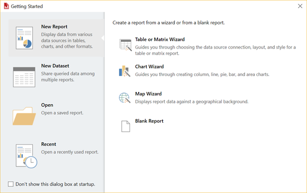
  
1.  In the left pane, verify that **New Report** is selected, and in the right pane, select **Table or Matrix Wizard**.  
  
4.  In the **Choose a dataset** page, select **Create a dataset** > **Next**.  

    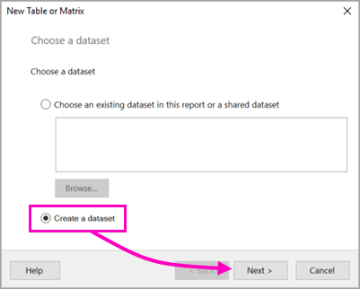
  
5.  In the **Choose a connection to a data source** page, select **New**. 

    
  
     The **Data Source Properties** dialog box opens.  
  
6.  You can name a data source anything you want, using characters and underscores. In the **Name** box, type **MyAzureDataSource**.  
  
7.  In the **Select connection type** box, select **Microsoft Azure SQL Database**.  
  
8.  Select **Build** next to the **Connection string** box. 

    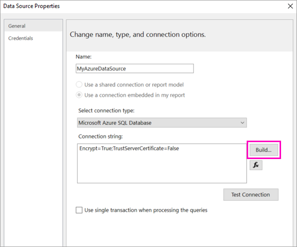

9. **In Azure:** Go back to the Azure portal and select **SQL databases**.

1. Select the Azure SQL database you created in the quickstart "Create an Azure SQL database sample in the Azure portal" in the Prerequisites section of this article.

1. On the **Overview** tab, copy the value in the **Server name** box.

2. **In Report Builder** in the **Connection Properties** dialog box, under **Server name** paste the server name you copied. 

1. For **Log on to the server**, make sure **Use SQL Server Authentication** is selected, then type the user name and password you created in Azure for the sample database.

1. Under **Connect to a database**, select the drop-down arrow and select the database name you created in Azure.
 
    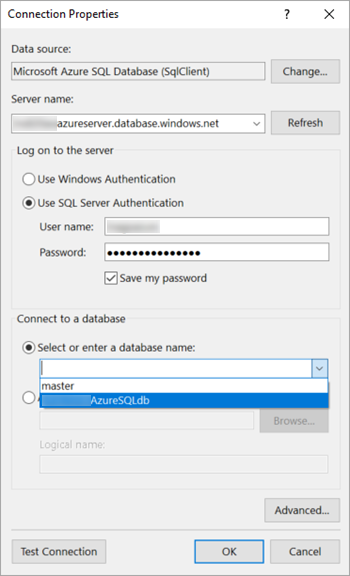

1. Select **Test Connection**. You see the **Test results** message that **Test connection succeeded**.

1. Select **OK** > **OK**. 

   Now in the **Connection string** box, Report Builder displays the connection string you just created. 

    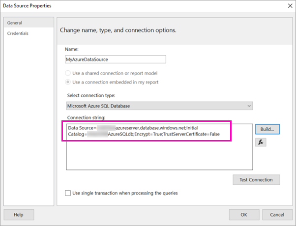

1. Select **OK**.
  
9. In the **Choose a connection to a data source** page, select the data source connection you just created (you see "(in this Report)") under the name > **Next**.  

    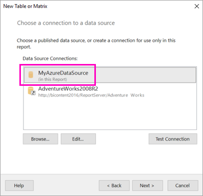

10. Type the same user name and password in the box. 
  
10. In the **Design a query** page, expand SalesLT, expand Tables, and select these tables:

    - Address
    - Customer
    - Product
    - ProductCategory
    - SalesOrderDetail
    - SalesOrderHeader

     Because **Relationships** > **Auto Detect** is selected, Report Builder detects that these tables are related. 
    
    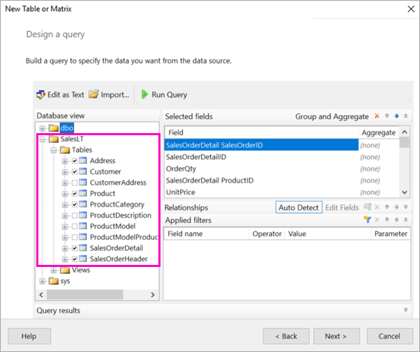
 
1.  Select **Run Query**. Report Builder displays the **Query results** > **Next**. 
 
     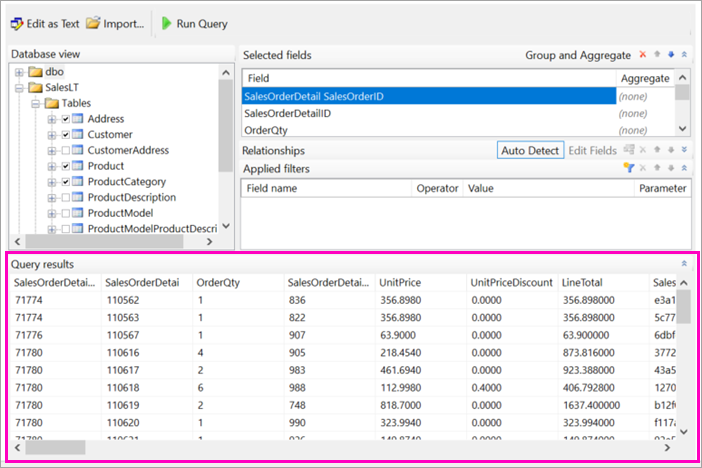

18. In the **Choose a dataset** page, choose the dataset you just created > **Next**..

    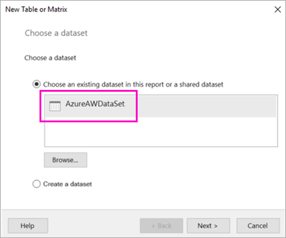

1. In the **Arrange fields** page, drag these fields from the **Available fields** box to the **Row groups** box:

    - CompanyName
    - SalesOrderNumber
    - Product_Name

1. Drag these fields from the **Available fields** box to the **Values** box:

    - OrderQty
    - UnitPrice
    - LineTotal

    Note that the fields in the **Values** box are sums.

    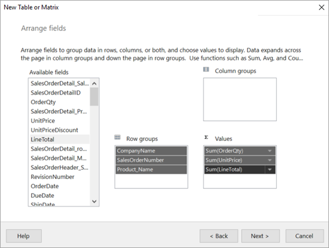

24. In the **Choose the layout** page, keep all the default settings, but clear **Expand/collapse groups**. In general, the expand/collapse groups feature is great, but this time you want the table to wrap to multiple pages.

1. Select **Next** > **Finish**. The table is displayed on the design surface.
 
## What you've created

Let's pause for a moment to look at the results of the wizard.

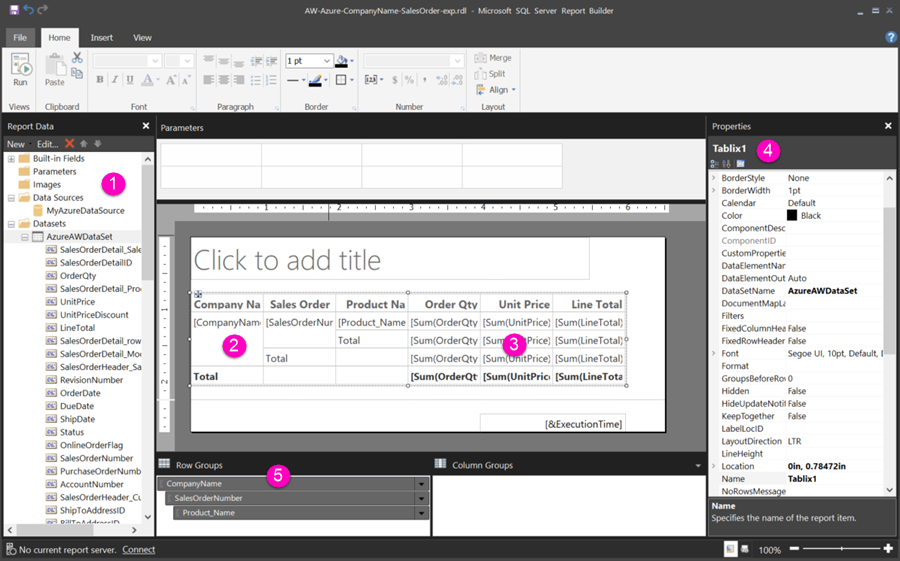

1. In the Report Data pane, you see the embedded Azure data source and the embedded dataset based on it, both of which you created. 

2. The design surface is about six inches wide. On the design surface, you see the matrix, displaying column headings and placeholder values. The matrix has six columns and appears to be only five rows tall. 

3. Order Qty, Unit Price, and Line Total are all sums, and each row group has a subtotal. 

    Notice you're still not seeing actual data values. You need to run the report to see them.

4. In the Properties pane, the selected matrix is called Tablix1. A *tablix* in Report Builder is a data region that displays data in rows and columns. It can be either a table or a matrix.

5. In the Grouping pane, you see the three row groups you created in the matrix in the wizard: 

    - CompanyName
    - Sales Order
    - Product Name
    This matrix doesn't have any column groups.

### Run the report

To see the actual values, you need to run the report.

1. Select **Run** in the **Home** toolbar.

   Now you're seeing the values. Note that Report Builder says it's page **1** of **2?**. Report Builder loads the report as quickly as possible, so it only retrieved enough data for a few pages at a time. The question mark indicates that Report Builder hasn't loaded all the data yet.

   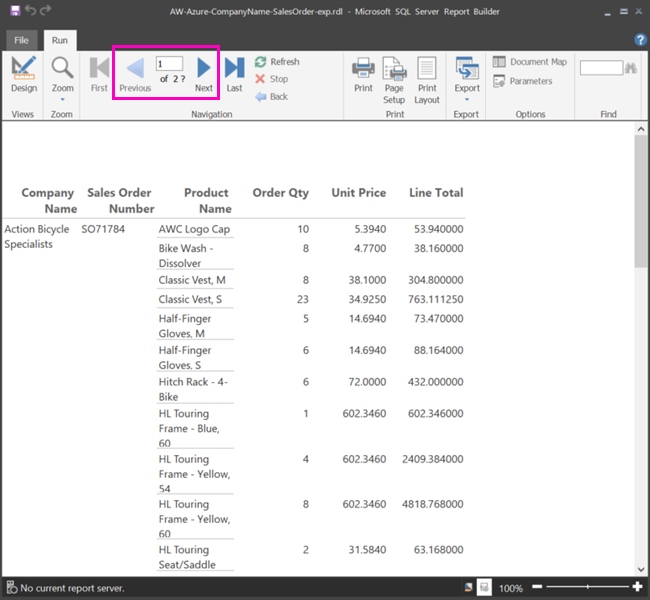

2. Select **Print Layout**. This is how the report will look when you print it. Note it how has 33 pages.

## Design the report

### Set page width

Typically a paginated report is formatted for printing, and a typical page is 8 1/2 X 11 inches. 

1. Drag the ruler to make the design surface 7 inches wide. The default margins are 1 inch on each side, so the side margins need to be narrower.

1. Click in the gray area around the design surface to show the **Report** properties.

    If you don’t see the Properties pane, click the **View** tab > **Properties**.

2. Expand **Margins** and change Left and Right from 1in to 0.75in. 

    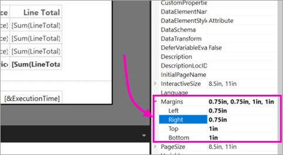
  
## Make the chart bigger  
You may want the chart to be bigger. 

1. On the **Run** tab of the Ribbon, select **Design**, so you can continue modifying it.  
 
2. Select the chart, but not on any element in the chart, and drag the lower-right corner to resize it.  

Notice the design surface gets larger as you drag.
  
## Add a report title  

1. Select the words **Chart title** at the top of the page, then type **Sales Chart**.  
2. With the title selected, in the Properties pane, change **Color** to **Blue**.
  
## Add percentages  
 
1.  Right-click the chart and select **Show Data Labels**. The data labels appear within each slice on the chart.  
  
2.  Right-click the labels and select **Series Label Properties**. The **Series Label Properties** dialog box appears.  
  
3.  In the **Label data** box, type **#PERCENT{P0}**.  
  
     The **{P0}** gives you the percentage without decimal places. If you type just **#PERCENT**, your numbers will have two decimal places. **#PERCENT** is a keyword that performs a calculation or function for you; there are many others.  
     
4. Select **Yes** to confirm you want to set **UseValueAsLabel** to **False**.

5. On the **Font** tab, select **Bold** and change **Color** to **White**.

6. Select **OK**.     
  
##  Upload the report to the Power BI service

Now that you've created this paginated report, it's time to upload it to the service.

1. In the Power BI service (http://app.powerbi.com), go to the workspace. It needs to have a diamond icon next to the name to show that it's in a Premium capacity.
    
    

    If the workspace isn't in a Premium capacity, when you try to upload your report you see the message, "Unable to upload paginated report." Contact your Power BI administrator to move the workspace.

1. Select **Get Data**.
2. In the **Files** box > **Get**.
3. Select **Local File**, navigate to where you saved the file > **Open**.
   Power BI imports your file.

## Next steps

[What are paginated reports in Power BI Premium? (Preview)](paginated-reports-report-builder-power-bi.md)

