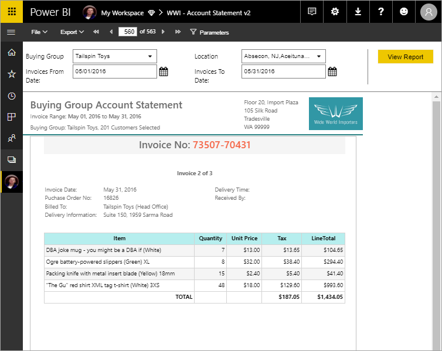

# What are paginated reports in Power BI Premium? (Preview)

Paginated reports, long the standard report format in SQL Server Reporting Services, are now available in the Power BI service. These reports can be printed or shared. They're called "paginated" because they're formatted to fit well on a page. They display all the data in a table, even if the table spans multiple pages. They're sometimes called "pixel perfect" because you can control their report page layout exactly. Paginated reports are based on the RDL report technology in SQL Server Reporting Services. Report Builder is the standalone tool for authoring paginated reports. 

Paginated reports can have many pages. For example, this report has 563 pages. Each page is laid out exactly, with one page per invoice and repeating headers and footers.

You can preview your report in Report Builder, then publish it to the Power BI service, http://app.powerbi.com. You need a Power BI Pro license to publish a report to the service. You can publish and share paginated reports in your My Workspace or in app workspaces, as long as the workspace is in a Power BI Premium capacity. Also, a Power BI admin needs to enable paginated reports in the Power BI admin portal. 

## Create reports in Power BI Report Builder

Paginated reports have their own design tool, Power BI Report Builder. It's a new tool that shares the same foundation as the tools you'd previously used to create paginated reports for Power BI Report Server or SQL Server Reporting Services (SSRS). In fact, paginated reports that you create for SSRS 2016 and 2017 or for Power BI Report Server on-premises, are compatible with the Power BI service. The Power BI service maintains backwards compatibility so you can move your reports forward, and you can upgrade any previous-version paginated reports. Not all report features are available at launch. See [Limitations and considerations](#limitations-and-considerations) in this article for details.
     
## Report from a variety of data sources

A single paginated report can have a number of different data sources. It doesn't have an underlying data model, unlike Power BI reports. For the initial release of paginated reports in the Power BI service, you create embedded data sources and datasets in the report itself. For now, you can't use shared data sources or shared datasets. You create reports in Report Builder on your local computer. If a report connects to on-premises data, after you upload the report to the Power BI service, you need to create a gateway and redirect the data connection. Here are the data sources you can connect to at this time:

- Azure SQL Database and Data Warehouse
- Azure Analysis Services (via SSO)
- SQL Server via a gateway
- SQL Server Analysis Services via a gateway
- Power BI Premium Datasets
- Oracle
- Teradata
 
More data sources will be coming during the preview period.

## Design your report  

### Create paginated reports with matrix, chart, and free-form layouts

Table reports work well for column-based data. Matrix reports, like cross-tab or PivotTable reports, are good for summarized data. Chart reports present data in a graphical format, and free-form *list* reports can present almost anything else, such as invoices. 
  
You can start with one of the Report Builder wizards. The Table, Matrix, and Chart wizards walk you through creating the embedded data source connection and embedded dataset. Then you drag and drop fields to create a dataset query, select a layout and style, and customize your report.  
  
With the Map wizard, you create reports that display aggregated data against a geographic or geometric background. Map data can be spatial data from a Transact-SQL query or an Environmental Systems Research Institute, Inc. (ESRI) shapefile. You can also add a Microsoft Bing map tile background.  

### Add more to your report

Modify your data by filtering, grouping, and sorting data, or by adding formulas or expressions. Add charts, gauges, sparklines, and indicators to summarize data in a visual format.  Use parameters and filters to filter data for customized views. Embed or reference images and other resources, including external content.  

Everything in a paginated report, from the report itself to every text box, image, table, and chart, has an array of properties you can set to make the report look exactly as you want it.

## Creating a report definition

When you design a paginated report, you're really creating a *report definition*. It doesn't contain the data. It specifies where to get the data, which data to get, and how to display the data. When you run the report, the report processor takes the report definition you've specified, retrieves the data, and combines it with the report layout to generate the report. You upload the report definition to the Power BI service, http://app.powerbi.com, either to your My Workspace or to a workspace shared with your colleagues. If the report data source is on premises, after you upload the report, you redirect the data source connection to go through a gateway. 

## View your paginated report
You view your paginated report in the Power BI service in a browser, and also in the Power BI mobile apps. From the Power BI service, you can export the report to a number of formats, such as HTML, MHTML, PDF, XML, CSV, TIFF, Word, and Excel. You can also share it with others.  
  
## Limitations and considerations

Here are some other features that aren't supported in the initial release:

- Pinning report pages or visuals to Power BI dashboards. You can still pin visualizations to a Power BI dashboard from an on-premises paginated report on a Power BI Report Server or Reporting Services report server. See [Pin Reporting Services items to Power BI dashboards](https://docs.microsoft.com/sql/reporting-services/pin-reporting-services-items-to-power-bi-dashboards) for more information.
- Interactive features such as document maps and show/hide buttons.
- Subreports and drillthrough reports.
- Subscriptions.
- Shared data sources and shared datasets.
- Visuals from Power BI reports.
 
## Next steps

- [Install Power BI Report Builder from the Microsoft Download Center](https://go.microsoft.com/fwlink/?linkid=2086513)
- [Tutorial: Create a paginated report](paginated-reports-quickstart-aw.md)
- [Enter data directly in a paginated report](paginated-reports-enter-data.md)

  

