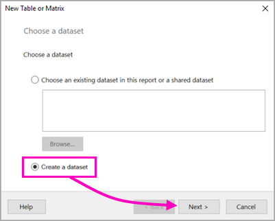
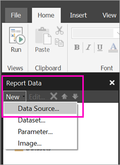

# Tutorial: Enter data directly to create a paginated report in Power BI

In this tutorial, you enter data directly into a paginated report in Report Builder, then upload it to Power BI Report Server. You don't need a connection to any other data source. 

You can store and manage paginated reports in the Power BI Report Server web portal, just as you can in the SQL Server Reporting Services (SSRS) web portal. You create and edit them in Report Builder or Report Designer in SQL Server Data Tools (SSDT), then publish them to either web portal. Then report readers in your organization can view them in a browser or in a Power BI mobile app on their mobile device.
 
## Prerequisite  

Creating a paginated report has just one prerequisite:

- Install the latest version of [Report Builder from the Microsoft Download Center](https://www.microsoft.com/download/details.aspx?id=53613). 

## Create the matrix with a wizard
  
1.  Start Report Builder from your computer.  
  
     The **Getting Started** dialog box opens.  
  
     
  
1.  In the left pane, verify that **New Report** is selected.  
  
3.  In the right pane, select **Table or Matrix Wizard**, and then select **Create**.  
  
4.  In the **Choose a dataset** page, select **Create a dataset**, and then select **Next**.  

    
  
5.  In the **Choose a connection to a data source** page, select **New**. 

    
  
     The **Data Source Properties** dialog box opens.  
  
### Set page width

Typically a paginated report is formatted for printing, and a typical page is 8 1/2 X 11 inches. 

1. Drag the ruler to make the design surface 7 inches wide. The default margins are 1 inch on each side, so the side margins need to be narrower.

1. Click in the gray area around the design surface to show the **Report** properties.

    If you don’t see the Properties pane, click the **View** tab > **Properties**.

2. Expand **Margins** and change Left and Right from 1in to 0.75in. 

    
  
## Make the chart bigger  
You may want the chart to be bigger. 

1. On the **Run** tab of the Ribbon, select **Design**, so you can continue modifying it.  
 
2. Select the chart, but not on any element in the chart, and drag the lower-right corner to resize it.  

Notice the design surface gets larger as you drag.
  
## Add a report title  

1. Select the words **Chart title** at the top of the page, then type **Sales Chart**.  
2. With the title selected, in the Properties pane, change **Color** to **Blue**.
  
##  Upload the report to Power BI Report Server

Now that you've created this paginated report, it's time to upload it to the report server.

## Next steps

[What is Power BI Report Server?](report-server/get-started.md)

