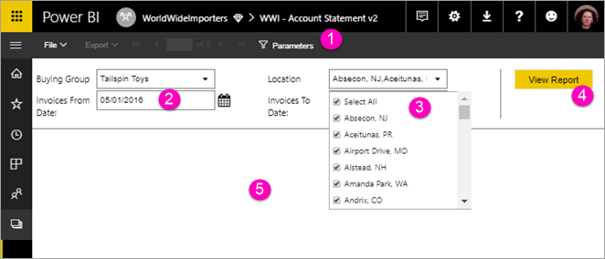

# View parameters for paginated reports in the Power BI service (Preview)

In this article, you learn how to interact with parameters for paginated reports in the Power BI service.  A report parameter provides a way to filter report data. Parameters offer a list of available values, and you can choose one or many values. Sometimes parameters have a default value, and sometimes you have to choose a value before you can see the report.  

When you view a report that has parameters, the report viewer toolbar displays each parameter so you can interactively specify values. The following illustration shows the parameter area for a report with parameters for **Buying Group**, **Location**, a **From Date**, and a **To Date**.  

## Parameters pane in the Power BI service

  
1.  **Parameters pane** The report viewer toolbar displays a prompt such as "Required" or a default value for each parameter.    
  
2.  **Invoices From / To Date parameters** The two data parameters have default values. To change the date, type a date in the text box or choose a date in the calendar.  
  
3.  **Location parameter** The Location parameter is set to allow you to select one, many, or all values. 
  
4.  **View Report**  After you enter or change parameter values, click **View Report** to run the report. 

5. **Default values** If all parameters have default values, the report runs automatically on first view. Some parameters in this report didn't have default values, so you don't see the report until you select values.  

## Next steps

[Create parameters for paginated reports in the Power BI service](paginated-reports-parameters.md)
