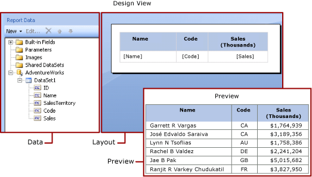
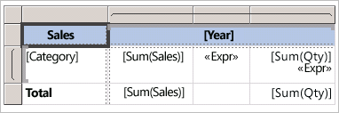
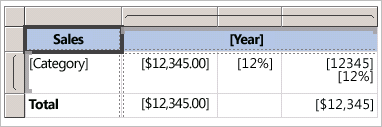

# Expressions in Power BI Report Builder

[!INCLUDE [applies-yes-report-builder-no-desktop](../../includes/applies-yes-report-builder-no-desktop.md)] 

Expressions are widely used throughout Power BI Report Builder paginated reports to retrieve, calculate, display, group, sort, filter, parameterize, and format data. 
  
Many report item properties can be set to an expression. Expressions help you control the content, design, and interactivity of your report. Expressions are written in Microsoft Visual Basic, saved in the report definition, and evaluated by the report processor when you run the report.  
  
Unlike applications such as Microsoft Excel where you work with data directly in a worksheet, in a report, you work with expressions that are placeholders for data. To see the actual data from the evaluated expressions, you must preview the report. When you run the report, the report processor evaluates each expression as it combines report data and report layout elements such as tables and charts.  
  
As you design a report, many expressions for report items are set for you. For example, when you drag a field from the data pane to a table cell on the report design surface, the text box value is set to a simple expression for the field. In the following figure, the **Report Data** pane displays the dataset fields *ID*, *Name*, *SalesTerritory*, *Code*, and *Sales*. Three fields have been added to the table: `[Name]`, `[Code]`, and `[Sales]`. The notation `[Name]` on the design surface represents the underlying expression `=Fields!Name.Value`.  
  

  
When you preview the report, the report processor combines the table data region with the actual data from the data connection and displays a row in the table for every row in the result set.  
  
To enter expressions manually, select an item on the design surface, and use shortcut menus and dialog boxes to set the properties of the item. When you see the ***(fx)*** button or the value `<Expression>` in a drop-down list, you know that you can set the property to an expression. 
  
##   Understand simple and complex expressions

Expressions begin with an equal sign (=) and are written in Microsoft Visual Basic. Expressions can include a combination of constants, operators, and references to built-in values (fields, collections, and functions), and to external or custom code.  
  
You can use expressions to specify the value of many report item properties. The most common properties are values for text boxes and placeholder text. Typically, if a text box contains only one expression, the expression is the value of the text box property. If a text box contains multiple expressions, each expression is the value of placeholder text in the text box.  
  
By default, expressions appear on the report design surface as *simple* or *complex* expressions.  
  
- **Simple**: A simple expression contains a reference to a single item in a built-in collection, for example, a dataset field, a parameter, or a built-in field. On the design surface, a simple expression appears in brackets. For example, `[FieldName]` corresponds to the underlying expression `=Fields!FieldName.Value`. Simple expressions are created for you automatically as you create the report layout and drag items from the **Report Data** pane to the design surface. For more information about the symbols that represent different built-in collections, see [Understand prefix symbols for simple expressions](#DisplayText).  
  
- **Complex**: A complex expression contains references to multiple built-in references, operators, and function calls. A complex expression appears as `<<Expr>>` when the expression value includes more than a simple reference. To view the expression, hover over it and use the tooltip. To edit the expression, open it in the **Expression** dialog box.  
  
The following figure shows typical simple and complex expressions for both text boxes and placeholder text.  
  
 
  
To display sample values instead of text for expressions, apply formatting to the text box or placeholder text. The following figure shows the report design surface toggled to show sample values:  
  
  

##  Understand prefix symbols in simple expressions  

Simple expressions use symbols to indicate whether the reference is to a field, a parameter, a built-in collection, or the *ReportItems* collection. The following table shows examples of display and expression text:  
  
|Item|Display text example|Expression text example|  
|----------|--------------------------|-----------------------------|  
|Dataset fields|`[Sales]`    `[SUM(Sales)]`    `[FIRST(Store)]`|`=Fields!Sales.Value`   `=Sum(Fields!Sales.Value)`   `=First(Fields!Store.Value)`|  
|Report parameters|`[@Param]`    `[@Param.Label]`|`=Parameters!Param.Value`    `=Parameters!Param.Label`|  
|Built-in fields|`[&ReportName]`|`=Globals!ReportName.Value`|  
|Literal characters used for display text|`\[Sales\]`|`[Sales]`|  
  
##   Write complex expressions  

Expressions can include references to functions, operators, constants, fields, parameters, items from built-in collections, and to embedded custom code or custom assemblies.  
  
The following table lists the kinds of references you can include in an expression:  
  
|References|Description|Example|  
|----------------|-----------------|-------------|  
|Constants|Describes the constants you can access interactively for properties that require constant values, such as font colors.|`="Blue"`|  
|Operators|Describes the operators you can use to combine references in an expression. For example, the **&** operator is used for concatenating strings.|`="The report ran at: " & Globals!ExecutionTime & "."`|  
|Built-in collections|Describes the built-in collections that you can include in an expression, such as `Fields`, `Parameters`, and `Variables`.|`=Fields!Sales.Value`   `=Parameters!Store.Value`   `=Variables!MyCalculation.Value`|  
|Built-in report and aggregate functions|Describes the built-in functions, such as `Sum` or `Previous`, that you can access from an expression.|`=Previous(Sum(Fields!Sales.Value))`|  
|Custom code and assembly references in expressions in Report Builder |Describes how you can access the built-in CLR classes `xref:System.Math` and `xref:System.Convert`, other CLR classes, Visual Basic run-time library functions, or methods from an external assembly.   Describes how you can access custom code that is embedded in your report, or that you compile and install as a custom assembly on both the report client and the report server.|`=Sum(Fields!Sales.Value)`   `=CDate(Fields!SalesDate.Value)`   `=DateAdd("d",3,Fields!BirthDate.Value)`    `=Code.ToUSD(Fields!StandardCost.Value)`|  
   
##   Validate expressions

When you create an expression for a specific report item property, the references that you can include in an expression depend on the values that the report item property can accept and the scope in which the property is evaluated. For example:  
  
- By default, the expression `[Sum]` calculates the sum of data that's in scope at the time the expression is evaluated. For a table cell, the scope depends on row and column group memberships. 
  
- For the value for a *Font* property, the value must evaluate to the name of a font.  
  
- Expression syntax is validated at design time. Expression scope validation occurs when you publish the report. For validation that depends on the actual data, errors can only be detected at run-time. Some of these expressions produce **#Error** as an error message in the rendered report. 

## Next steps

- [What are paginated reports in Power BI?](../paginated-reports-report-builder-power-bi.md)
