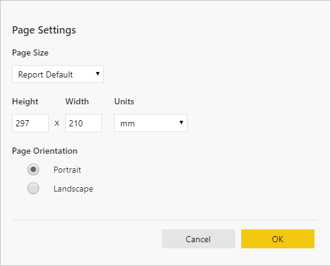

# Set report views for paginated reports in the Power BI service

[!INCLUDE [applies-yes-report-builder-no-desktop](../includes/applies-yes-report-builder-no-desktop.md)]

When you render a paginated report in the Power BI service, the default view is HTML based and interactive. Another report view, for fixed page formats like PDF, is the new *Print Layout* option.

## Prerequisites 

[!INCLUDE [power-bi-paginated-prerequisites](../includes/power-bi-paginated-prerequisites.md)]

## Report views

### Default interactive view

Paginated reports open in the default Web Layout view.

:::image type="content" source="media/page-view/power-bi-paginated-default-view.png" alt-text="Screenshot that shows the default view in the Power BI service.":::

### Print Layout

In the Print Layout view, the rendered report looks different compared to the default view. Some properties and concepts in paginated reports only apply to fixed pages. The view is similar to when the report is printed or exported. You can still change some elements, like parameter values, but it doesn't have other interactive features such as column sorting and toggles.

:::image type="content" source="media/page-view/power-bi-paginated-page-view.png" alt-text="Screenshot showing the Print Layout view.":::

The Print Layout supports all the features that the browser's PDF viewer supports, such as Zoom in, Zoom out, and Fit to page.

## Switch to Print Layout

When you open a paginated report, it renders in the default interactive view. If the report has parameters, select parameters, then view the report.

1. Select **View** on the toolbar > **Print Layout**.

    :::image type="content" source="media/page-view/power-bi-paginated-page-view-dropdown.png" alt-text="Screenshot showing the Print Layout button under the View menu.":::

2. You can change the view settings by selecting **Page Settings** in the **View** menu on the toolbar. 

    :::image type="content" source="media/page-view/power-bi-paginated-page-settings-dropdown.png" alt-text="Screenshot showing the Page Settings button.":::

    The **Page Settings** dialog box has options to set **Page Size** and **Orientation** for the Print Layout. After you apply page settings, the same options apply when you print the page later.
   
    

3. To switch back to the interactive view, select **Web Layout** in the **View** dropdown box.

## Browser support

Print Layout is supported in Google Chrome and Microsoft Edge browsers. Make sure that viewing PDFs in the browser is enabled. It's the default setting for these browsers.

Print Layout isn't supported in Internet Explorer and Safari, so the option is disabled. It also isn't supported in browsers on mobile devices, or in the native Power BI mobile apps.  

## Next steps

- [View a paginated report in the Power BI service](../consumer/paginated-reports-view-power-bi-service.md)
- [What are paginated reports in Power BI?](paginated-reports-report-builder-power-bi.md)
