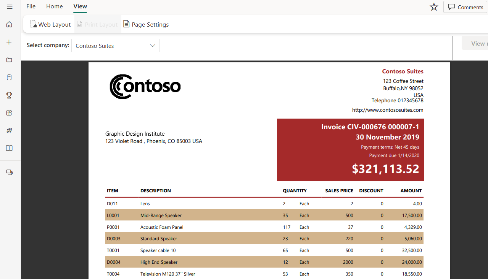
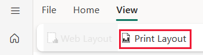

# Set report views for paginated reports in the Power BI service

[!INCLUDE [applies-yes-paginated-yes-service-no-desktop](../includes/applies-yes-paginated-yes-service-no-desktop.md)]

When you render a paginated report in the Power BI service, the default view is HTML based and interactive. Another report view, for fixed page formats like PDF, is the new Page View option.

## Prerequisites 

- To publish a Power BI paginated report to the Power BI service, you need a [Power BI Pro](../fundamentals/service-self-service-signup-for-power-bi.md) license, or [Premium Per User (PPU)](../admin/service-premium-per-user-faq.yml) license, and write access to a workspace in a Power BI Premium capacity.

## Report views

### Default interactive view

### Page View

In Page View, the rendered report looks different compared to the default view. Some properties and concepts in paginated reports only apply to fixed pages. The view is similar to when the report is printed or exported. You can still change some elements, like parameter values, but it doesn't have other interactive features such as column sorting and toggles.

Page View supports all the features the browser's PDF Viewer supports, such as Zoom in, Zoom out, and Fit to page.

## Switch to Page View

When you open a paginated report, it renders in interactive view by default. If the report has parameters, select parameters, then view the report.

1. Select **View** on the toolbar > **Page View**.

    

2. You can change the settings of the page view by selecting the **Page Settings** in **View** menu on the toolbar. 

    
    
    The **Page Settings** dialog box has options to set **Page Size** and **Orientation** for the Page View. After you apply page settings, the same options apply when you print the page later.
   
    

3. To switch back to the interactive view, select **Default** in the **View** dropdown box.

## Browser support

Page View is supported in Google Chrome and Microsoft Edge browsers. Make sure that viewing PDFs in the browser is enabled. It's the default setting for these browsers.

Page View isn't supported in Internet Explorer and Safari, so the option is disabled. It also isn't supported in browsers on mobile devices, or in the native Power BI mobile apps.  

## Next steps

- [View a paginated report in the Power BI service](../consumer/paginated-reports-view-power-bi-service.md)
- [What are paginated reports in Power BI Premium?](paginated-reports-report-builder-power-bi.md)
