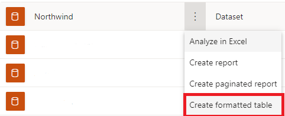
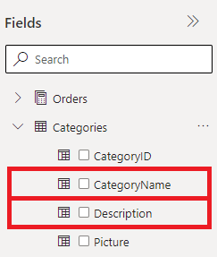
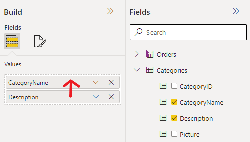
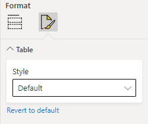
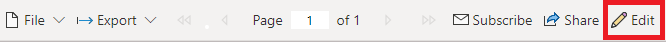

# Set report views for paginated reports in the Power BI service

[!INCLUDE [applies-to](../includes/applies-to.md)] [!INCLUDE [yes-service](../includes/yes-service.md)] [!INCLUDE [yes-paginated](../includes/yes-paginated.md)] [!INCLUDE [no-desktop](../includes/no-desktop.md)] 

In the data hub or a modern workspace, you have a new option to create a paginated report by using the formatted table editor.

## Find the formatted table option

In the dataset data hub view:

Select **Create report**.

Selecting either formatted table option above brings you to the new paginated report online editing experience called formatted table.  There are a few panels here to take a look at.

**Getting Started**

To create your first table, you will use the panel on the far right labelled `Fields`.  This panel is responsible for giving you a table\+column based view of the chosen dataset.  Once you find a column that you wish to add to your table, simply click the column or drag it into the panel labelled `Build`.

After giving the editor a few moments to run a newly created query on the dataset you will be able to see the formatted table show up on the paginated report viewer to the left side of the page

This viewer will show you a preview of your currently unsaved paginated report report.  You can use this panel to make sure everything in your report looks good before tweaking or saving the report.  

Should you discover that in adding columns to the build pane they were added in the wrong order, don't fret.  You can easily re-order the build pane columns by simply dragging the items in the build pane into the order you desire

The build pane also has other customization options for you to create a better looking table.  To access these, simply select the formatting tab at the top of the build pane

> [!NOTE]
> This section currently only supports styling the table with themes based on the ones available through Power BI Desktop Report Builder

Once you have worked with your table to the point you would like to save, download, or print it simply use the file menu to perform any of those options.  These should be familiar if you have used these options previously in a PowerBI report

> [!NOTE] 
> For save, a name and workspace must be selected before being allowed to save the report
> In addition, you can save a formatted table report to any Pro or above workspace!  This was not previously possible for paginated report reports

When a report is saving, you will see a notification in the top right of the editor.  This will notify you of the success or failure of the save.  It will give you a message, if failed, indicating the reason for the failure.  If there is already an existing report where you have chosen to save, it will instead give you a prompt asking you if you wish to overwrite the previous report at that location.  If successful, you will instead see a link to the report.  You may either follow this link or continue editing.  Once saved you will see another option in the file menu.  This `Save As` option will allow you to resave the current formatted table elsewhere.

At any point after saving the report you may preview the report using the `Reading Mode` option on the top bar within the editor.  This will allow you to leave the editor experience and enter the normal paginated report viewer experience.

> [!NOTE]
> If you have not saved the report yet, or have unsaved changes, you will instead receive a prompt asking you to save or discard your changes before taking you to the reading view.  

## Edit a formatted table

If you navigate to any formatted table that has been authored online, you will have the option within the paginated report viewer experience to edit the report.  This option is available in the toolbar above the viewer. 

This will take you back to the formatted table editor experience and allow you to affect any changes you wish to the report.  

> [!NOTE]
> This Edit button is not to be confused with the Edit button on the **File** menu.  That **Edit** button will instead open Power BI Report Builder, and isn't backwards compatible with the online formatted table experience.

## Browser support

Formatted Table is supported in Google Chrome and Microsoft Edge browsers. Make sure that viewing PDFs in the browser is enabled. It's the default setting for these browsers.

Formatted Table isn't supported in Internet Explorer and Safari, so the option is disabled. It also isn't supported in browsers on mobile devices, or in the native Power BI mobile apps.  

## Next steps

- [View a paginated report in the Power BI service](../consumer/paginated-reports-view-power-bi-service.md)