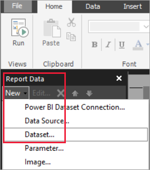

# Create an embedded dataset for a Power BI paginated report

[!INCLUDE [applies-yes-report-builder-no-desktop](../includes/applies-yes-report-builder-no-desktop.md)] 

This article explains how to create an embedded dataset, based on an embedded data source, for a paginated report in the Power BI service. Embedded datasets are contained in a single paginated report, for use in that report. Currently, paginated reports published to the Power BI service need embedded datasets and embedded data sources. You create the embedded data source and dataset in Power BI Report Builder, while you're creating your report. 

Before you can create the dataset, you need to create a data source.

- See [Create an embedded data source for a paginated report](paginated-reports-embedded-data-source.md) in the Power BI service to learn how.
- See [Supported data sources for Power BI paginated reports](paginated-reports-data-sources.md) for a complete list.

## Prerequisites 

[!INCLUDE [power-bi-paginated-prerequisites](../includes/power-bi-paginated-prerequisites.md)]

## Create an embedded dataset
  
1. In the **Report Data** pane in Power BI Report Builder, select **New** > **Dataset**.

   

1. In the **Query** tab of the **Dataset Properties** dialog box, give the dataset a name. The embedded data source is already in the **Data source** box, or you can select **New** to create a different embedded data source.
 
     

3. Under **Query type**, select the type of command or query to use for the dataset. 
    - **Text** runs a query to retrieve data from the database. It's the default and is used for most queries. Type a query or import a pre-existing query by selecting **Import**. To build the query graphically, select **Query Designer**. If you use the query designer to build a query, the text of the query will appear in this box. Select the **Expression** (**fx**) button to use an expression to dynamically generate the query. 
    - **Table** selects all the fields within a table. Enter the name of the table that you want to use as a dataset.
    - **Stored Procedure** runs a stored procedure by name.

4. In the Query Designer, you can see and interact with the tables and fields in the dataset, import a query, or edit as text. You can also add filters and parameters here. 

    

5. In the Query Designer, select **Run Query** to test it, then select **OK**.

1. Back in the **Dataset Properties** dialog box, in the **Time out (in seconds)** box, type the number of seconds until the query times out. The default is 30 seconds. The value for **Time out** must be empty or greater than zero. If it's empty, the query doesn't time out.

7.  You can set other properties for the dataset on the other tabs:
    - Create calculated fields on the **Fields** tab.
    - Set advanced options on the **Options** tab.
    - Add or update **Filters** and **Parameters** on their respective tabs.

8. Select **OK**
 
   The report opens in Report Design View. The data source, dataset, and dataset field collection appear in the **Report Data** pane, and you can continue designing your paginated report.  

     
 
## Related content 

- [What are paginated reports in Power BI?](paginated-reports-report-builder-power-bi.md)  
- [Tutorial: Create a paginated report and upload it to the Power BI service](paginated-reports-quickstart-aw.md)
- [Publish a paginated report to the Power BI service](paginated-reports-save-to-power-bi-service.md)

