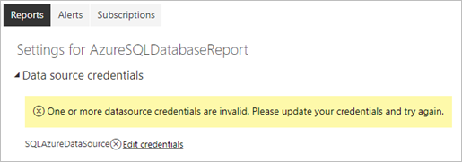
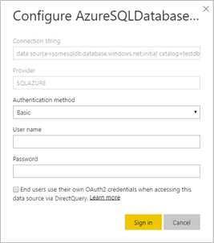

# Supported data sources for Power BI paginated reports

[!INCLUDE [applies-yes-report-builder-no-desktop](../includes/applies-yes-report-builder-no-desktop.md)] 

This article describes supported data sources for paginated reports in the Power BI service, and how to connect to Azure SQL Database data sources. Some data sources are supported natively. You can connect to others by using data gateways.

## Prerequisites 

[!INCLUDE [power-bi-paginated-prerequisites](../includes/power-bi-paginated-prerequisites.md)]

## Natively supported data sources

Paginated reports natively support the following list of data sources:

| Data source | Authentication | Notes |
| --- | --- | --- |
| Azure SQL Database  Azure Synapse Analytics | Basic, single sign-on (SSO), OAuth2 | You can use an Enterprise Gateway with Azure SQL Database.   |
| Azure SQL Managed Instance | Basic, SSO, OAuth2 | Through public or VNet-local endpoints (VNet-local endpoints need to be routed through Enterprise Gateway)  |
| Azure Analysis Services | SSO, OAuth2 | The Azure Analysis Services firewall must be disabled or configured to allow all IP ranges in the Azure Germany region. This applies only in the Azure Germany region. SSO from external tenant isn't supported. |
| Power BI semantic model | SSO | Premium and non-Premium Power BI semantic models. Requires Read permission. Only Import mode and DirectQuery Power BI semantic models are supported. Report queries using a DirectQuery Power BI semantic model as a data source have a fixed 10-minute time-out. For report queries that take longer than 10 minutes, use the Power BI semantic model's [XMLA Read/Write endpoint](../enterprise/service-premium-connect-tools.md) as the report data source. |
| Premium Power BI semantic model (XMLA) | SSO | To ensure proper connectivity in Power BI Report Builder, ensure that the **Do not use credentials** option is selected when setting your data source.  Access through the XMLA honors security group membership set at the workspace or app level.  Users with at least a [Contributor role in a workspace](../collaborate-share/service-roles-new-workspaces.md) can render paginated reports with Premium Power BI semantic models. Other users need [Build permission on the underlying datasets](../connect-data/service-datasets-build-permissions.md).    |
| Dataverse | SSO, OAuth2 | Can't use a gateway as multifactor authentication (MFA)  isn't supported.
| Enter data | N/A | Data is embedded in the report. |

Except for Azure SQL Database, all data sources are ready to use after you upload the report to the Power BI service. The data sources default to using SSO, where applicable. For Azure Analysis Services, you can change the authentication type to OAuth2. However, once the authentication type for a given data source is changed to OAuth2, it can't revert back to use SSO.  In addition, this change applies to all the reports that use that data source across all workspaces for a given tenant.  Row-level security in paginated reports won't work unless users choose SSO for authentication type.

For Azure SQL Database data sources, you need to supply more information, as described in the [Azure SQL Database Authentication](#azure-sql-database-authentication) section.

## Other data sources

In addition to the natively supported data sources, the following data sources can be accessed via a [Power BI enterprise gateway](../connect-data/service-gateway-onprem.md) or a [VNet gateway](/data-integration/vnet/overview):

| Data source | Enterprise gateway | VNet gateway |
| --- | --- | --- |
| SQL Server (supports SSO) | :::image type="icon" source="../includes/media/yes-icon.svg" border="false"::: | :::image type="icon" source="../includes/media/yes-icon.svg" border="false"::: |
| SQL Server Analysis Services | :::image type="icon" source="../includes/media/yes-icon.svg" border="false"::: | :::image type="icon" source="../includes/media/yes-icon.svg" border="false":::|
| Oracle (supports SSO) | :::image type="icon" source="../includes/media/yes-icon.svg" border="false"::: | |
| Teradata (supports SSO) | :::image type="icon" source="../includes/media/yes-icon.svg" border="false"::: | |
| ODBC | :::image type="icon" source="../includes/media/yes-icon.svg" border="false"::: | |

For paginated reports, Azure Analysis Services currently can't be accessed using either a Power BI enterprise gateway or a VNet gateway. When you authenticate with SSO, service principal isn't supported.

Also, for paginated reports, a report publisher with a Power BI enterprise gateway or a VNet gateway admin permission is required to bind the paginated report to the data source connection. You become an admin either by being added as an admin or because you installed and configured a Power BI enterprise gateway or a VNet gateway. Note that being a Power BI enterprise gateway admin does not automatically provide access to existing data source connections. You have to specify which data source connection you'd like to manage.

> [!IMPORTANT]
> Using the **SSO via Kerberos** options within the gateway's **Advanced settings** requires the [configuration of Kerberos constrained delegation](../connect-data/service-gateway-sso-kerberos.md) on the on-premises data source and gateway service.

## Azure SQL Database authentication

For Azure SQL Database data sources, you need to set an authentication type before you run the report. That applies only when you use a data source for the first time in a workspace. That first time, you see the following message:

If you don't supply any credentials, an error occurs when you run the report. Select **Continue**  to go to the **Data source credentials** page for the report you just uploaded:

Select the **Edit credentials** link for a given data source to bring up the **Configure** dialog box:

For Azure SQL Database data sources, here are the supported authentication types:

- Basic (user name and password)
- SSO (single sign-on)
- OAuth2 (stored Microsoft Entra token)

For SSO and OAuth2 to work correctly, the Azure SQL Database server that the data source connects to needs to have [Microsoft Entra authentication support enabled](/azure/sql-database/sql-database-aad-authentication-configure). For the OAuth2 authentication method, Microsoft Entra ID generates a token and stores it for future data source access. To use the [SSO authentication method](../connect-data/service-azure-sql-database-with-direct-connect.md#single-sign-on) instead, select the SSO option right below it, **End users use their own OAuth2 credentials when accessing this data source via DirectQuery**.
  
## Next steps
- [Connect to an Oracle data source](./report-data/oracle-connection-type.md)
- [View a paginated report in the Power BI service](../consumer/paginated-reports-view-power-bi-service.md).

More questions? [Try the Power BI Community.](https://community.powerbi.com/)
