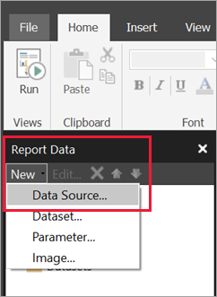
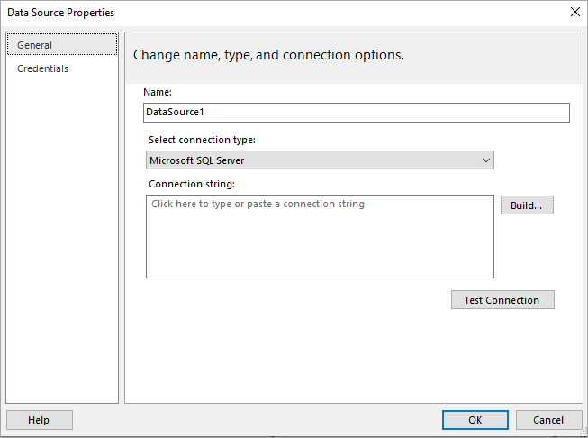
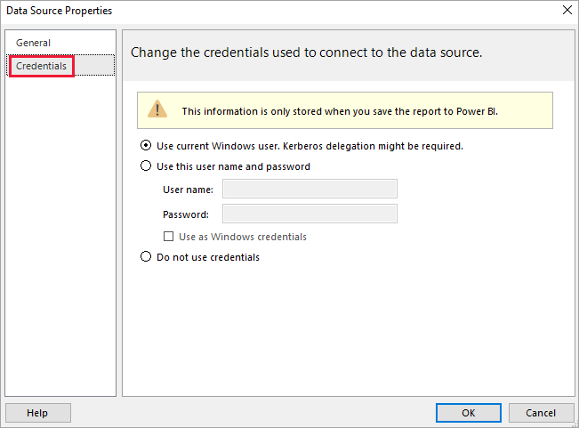

# Create an embedded data source for paginated reports in the Power BI service

[!INCLUDE [applies-yes-report-builder-no-desktop](../includes/applies-yes-report-builder-no-desktop.md)] 

This article explains how to create and modify an embedded data source for a paginated report in the Power BI service. You define an embedded data source in a single report, and use it only in that report. Paginated reports published to the Power BI service can't use shared datasets and data sources. Here are some of the data sources you can connect to:

- Azure SQL Database and Azure Synapse Analytics through Basic and oAuth
- Azure Analysis Services through SSO
- SQL Server through a gateway
- Power BI semantic models
- Oracle
- Teradata

For a complete list, see [Supported data sources for Power BI paginated reports](paginated-reports-data-sources.md).

Paginated reports connect to on-premises data sources by way of a [Power BI gateway](../connect-data/service-gateway-onprem.md). You set up the gateway after you publish the report to the Power BI service.

For more information, see [Understanding report data in Power BI Report Builder](report-builder-data.md).

## Prerequisites 

[!INCLUDE [power-bi-paginated-prerequisites](../includes/power-bi-paginated-prerequisites.md)]

## Create an embedded data source
  
1. Open Power BI Report Builder.

1. On the toolbar in the **Report Data** pane, select **New** > **Data Source**. The **Data Source Properties** dialog box opens.

   
  
1. In the **Name** text box, type a name for the data source or accept the default.  

   
  
1. From the **Select connection type** list, select a data source type. 

1. Specify a connection string by using one of these methods:  
  
   - Type the connection string directly in the **Connection string** text box. 
  
   - Select **Build** to open the **Connection Properties** dialog box for the data source you chose in step 2.  
  
     Fill in the fields in the **Connection Properties** dialog box as appropriate for the data source type. Connection properties include the type of data source, the name of the data source, and the credentials to use. After you specify values in this dialog box, select **Test Connection** to verify that the data source is available and that the credentials you specified are correct.  
  
1. Select **Credentials**.  

   
  
   Specify the credentials to use for this data source. The owner of the data source chooses the type of credentials that are supported. For more information, see [Specify credential and connection information for Report Data sources](/sql/reporting-services/report-data/specify-credential-and-connection-information-for-report-data-sources).
  
1. Select **OK**.  
  
   The data source appears in the **Report Data** pane.

## Considerations and limitations

Paginated reports that connect to Power BI semantic models follow the rules for shared datasets in Power BI with some minor changes.  For users to properly view paginated reports that use Power BI semantic models, and to ensure row-level security (RLS) is enabled and enforced for your viewers, follow these rules:

|Scenario  |Rule  |
|---------|---------|
|.rdl in same workspace as dataset   | Supported |
|Shared .rdl | You need *Read* permission assigned for each user viewing the report at the dataset level  |
|Shared app  |  You need *Read* permission assigned for each user viewing the report at the dataset level  |
|.rdl in same workspace as dataset (different user)   | Supported  |
|.rdl in different workspace as dataset (different user)   |  You need *Read* permission assigned for each user viewing the report at the dataset level     |
|Row-level security | You need *Read* permission assigned for each user viewing the report at the dataset level to have it enforced   |
|Using hidden datasets | Not supported. |

## Next steps

- [Create an embedded dataset for a paginated report in the Power BI service](paginated-reports-create-embedded-dataset.md).
- [What are paginated reports in Power BI?](paginated-reports-report-builder-power-bi.md)
