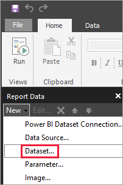

# Enter data directly into a paginated report in Report Builder

[!INCLUDE [applies-yes-report-builder-no-desktop](../includes/applies-yes-report-builder-no-desktop.md)] 

This article explains a feature in Microsoft Power BI Report Builder that lets you enter data directly into a paginated report as an embedded dataset. You can type the data directly in a dataset in your report, or paste it from another program like Microsoft Excel. After you create a dataset by entering data, you can use it just like you would any other embedded dataset you've created. Plus, you can add more than one table and then use one as a filter for the other. This feature is especially useful for small, static datasets you might need to use in your report, like report parameters.
 
## Prerequisites

[!INCLUDE [power-bi-paginated-prerequisites](../includes/power-bi-paginated-prerequisites.md)]
- To save your paginated report to a report server, you need permissions to [edit the *RsReportServer.config* file](#upload-the-paginated-report-to-a-report-server).

## Create a data source and dataset

After you download and install Report Builder, follow the same workflow you use to add an embedded data source and dataset to your report. In the following procedure, under **Data Sources** you see a new **Enter Data** option. You only need to set up this data source once in a report. After that, you can create multiple tables of entered data as separate datasets, all using that single data source.

1. In the **Report Data** pane, select **New** > **Dataset**.

    

1. In the **Dataset Properties** dialog box, give your dataset a name. Don't include spaces. 

2. Next to **Data source**, select **New**.

    

1. In the **Select connection type** box, select **Enter Data** > **OK**.

    

1. Back in the **Dataset Properties** dialog box, select **Query Designer**.

    

2. In the **Query Designer** pane, right-click and paste your data in the table.

    

1. To set the column names, double-click each **NewColumn** and type the column name.

    

1. If the first row contains column headings from the original data, right-click and delete it.
    
9. By default, the data type for each column is String. To change the data type, right-click the column header > **Change Type**, and set it to another data type, such as Date or Float.

    

1. When you’ve finished creating the table, select **OK**.  

    The query that’s generated is the same as you’d see with an XML data source. Under the covers, we’re using XML as the data provider.  We’ve repurposed it to enable this scenario as well.

    

12. In the **Dataset Properties** dialog box, select **OK**.

13. You see your data source and dataset in the **Report Data** pane.

    

You can use your dataset as the basis for data visualizations in your report. You can also add another dataset and use the same data source for it.

## Design the report

Now that you have a data source and dataset, you're ready to create your report. The following procedure creates a simple report based on the data in the previous section.

1. On the **Insert** menu, select **Table** > **Table Wizard**.

    :::image type="content" source="media/paginated-reports-enter-data/paginated-table-wizard.png" alt-text="Screenshot of the Table Wizard option.":::

1. Select the dataset you just created > **Next**.

    :::image type="content" source="media/paginated-reports-enter-data/paginated-choose-dataset.png" alt-text="Screenshot of the Choose a dataset dialog.":::

2. In the Arrange fields page, drag fields you want to group by from the **Available fields** box to the **Row groups** box. In this example:

    - CountryRegion
    - SalesYear

3. Drag the fields you want to aggregate from the **Available fields** box to the **Values** box. In this example:

    - SalesAmount

    By default, Report Builder sums the fields in the **Values** box, but you can choose another aggregation.

    :::image type="content" source="media/paginated-reports-enter-data/paginated-select-aggregation.png" alt-text="Screenshot of different aggregations to choose from.":::
 
1. Select **Next**.

1. In the **Choose the layout** page, keep all the default settings, but clear **Expand/collapse groups**. In general, expanding and collapsing groups is great, but this time you want to see all the data.

5. Select **Next** > **Finish**. The table is displayed on the design surface.

    :::image type="content" source="media/paginated-reports-enter-data/paginated-design-view-matrix.png" alt-text="Screenshot of the report in Design view.":::

### Run the report

To see the actual values and preview the report, you run it.

1. Select **Run** on the **Home** menu.

    :::image type="content" source="media/paginated-reports-enter-data/paginated-run-report.png" alt-text="Screenshot of selecting Run on the Home ribbon.":::

    Now you see the values. The matrix has more rows than you saw in Design view!  You can either format the page or decide to use the default settings before saving to your local computer or publishing to the service.

1. To see how your report looks when you print it, select **Print Layout**.

    :::image type="content" source="media/paginated-reports-enter-data/paginated-select-print.png" alt-text="Screenshot of selecting Print Layout.":::

    Now you see how it looks on a printed page.

    :::image type="content" source="media/paginated-reports-enter-data/paginated-print-layout.png" alt-text="Screenshot of the report in print layout view.":::

## Upload the paginated report to the Power BI service

Now that paginated reports are supported in the Power BI service, you can upload your paginated report to any workspace. See [Upload a paginated report](paginated-reports-save-to-power-bi-service.md) for details.

## Upload the paginated report to a report server

You can also upload your paginated report to a Power BI Report Server or SQL Server Reporting Services 2016 or 2017 report server. Before you do, you need to add the following item to your *RsReportServer.config* as an additional data extension. Back up your *RsReportServer.config* file before you make the change, in case you run into any issues.

```xml
<Extension Name="ENTERDATA" Type="Microsoft.ReportingServices.DataExtensions.XmlDPConnection,Microsoft.ReportingServices.DataExtensions">
    <Configuration>
        <ConfigName>ENTERDATA</ConfigName>
    </Configuration>
</Extension>
```

After you edit it, here's what the list of data providers in the config file looks like:


That’s it. You can now publish reports that use this new functionality to your report server.

## Next steps

- [What are paginated reports in Power BI?](paginated-reports-report-builder-power-bi.md)
- [What is Power BI Report Server?](../report-server/get-started.md)
