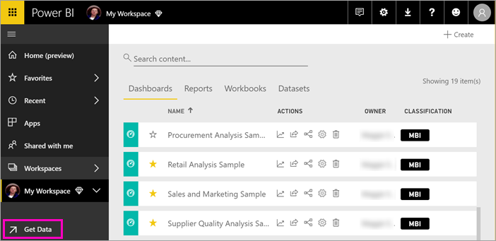

# Paginated View for paginated report in Power BI service

In addition to the current HTML based interactive view, which will be the default, you will have another report view for fixed page formats like PDF. This will be the new Paginated Report View.

There are a lot of properties and concepts in RDL that only apply to fixed pages and as a result the rendered reports looks quite 
different than for the interactive view. It does however have none of the interactive features like column sorting, toggles or links.

## Page View

When you open a paginated report, it will be rendered in interactive view by default. Below are steps to switch to Page View

1. Select **View** on the toolbar, then select **Page View**

    

1. In the **Edit workspace** dialog box, expand **Advanced**, then slide **Dedicated capacity** to **On**.

    

   You may not be able to change it. If not, then contact your Power BI Premium capacity admin to give you assignment rights to add your workspace to a Premium capacity.

## From Report Builder, publish a paginated report

1. Create your paginated report in Report Builder and save it to your local computer.

1. On the Report Builder **File** menu, select **Save as**.

    

    If you aren't signed in to Power BI yet, you need to sign in or create an account now. In the upper-right corner of Report Builder, select **Sign in** and complete the steps.

2. In the list of workspaces on the left, select a workspace with the diamond icon  next to its name. Type a **File name** in the box > **Save**. 

    

4. Open the Power BI service in a browser and browse to the Premium workspace where you published the paginated report. On the **Reports** tab, you see your report.

    

5. Select the paginated report to open it in the Power BI service. If it has parameters, you need to select them before you can view the report.

    

6. If your report data source is on premises, read about how to [create a gateway](#create-a-gateway) in this article to access the data source.

## From the Power BI service, upload a paginated report

You can also start from the Power BI service and upload a paginated report.

1. Create your paginated report in Report Builder and save it to your local computer.

1. Open the Power BI service in a browser and browse to the Premium workspace where you want to publish the report. Note the diamond icon  next to the name. 

1. Select **Get Data**.

    

1. In the **Files** box, select **Get**.

    

1. Select **Local file** > browse to the paginated report > **Open**.

    

1. Select **Continue** > **Edit credentials**.

    

1. Configure your credentials > **Sign in**.

    

   On the **Reports** tab, you see your report.

    

1. Select it to open it in the Power BI service. If it has parameters, you need to select them before you can view the report.
 
    

6. If your report data source is on premises, read about how to [create a gateway](#create-a-gateway) in this article to access the data source.

## Create a gateway

Just like any other Power BI report, if the report data source is on premises, then you need to create or connect to a gateway to access the data.

1. Next to the report name, select **Manage**.

   

1. See the Power BI service article [What is an on-premises data gateway](../service-gateway-onprem.md) for details and next steps.

### Gateway limitations

Currently gateways don't support multi-value parameters.

## Next steps

- [View a paginated report in the Power BI service](../consumer/paginated-reports-view-power-bi-service.md)
- [What are paginated reports in Power BI Premium?](paginated-reports-report-builder-power-bi.md)
- [Tutorial: Embed Power BI paginated reports into an application for your customers](../developer/embed-paginated-reports-customers.md)

