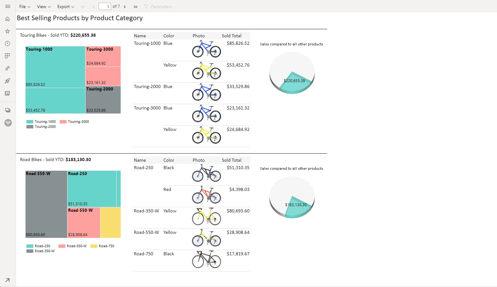
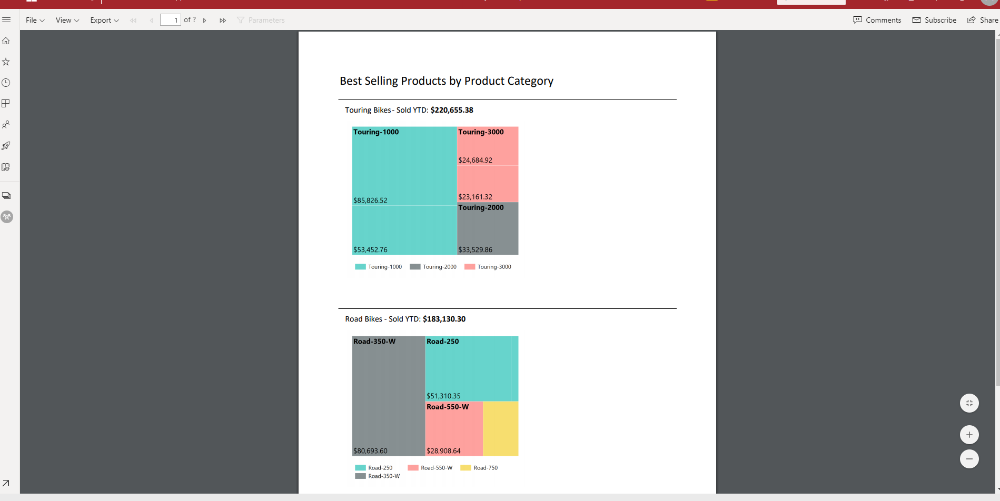
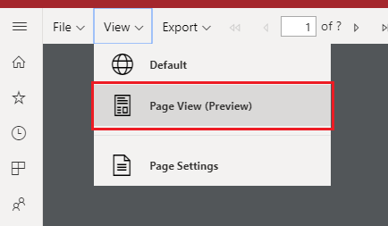
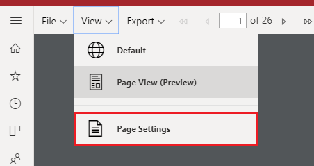
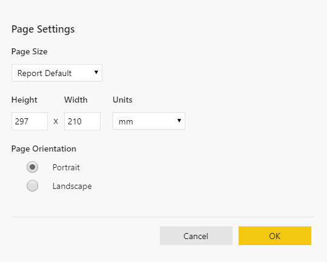

# Paginated View for paginated report in Power BI service

In addition to the current HTML based interactive view, which will be the default, you will have another report view for fixed page formats like PDF. This will be the new Paginated Report View.

The rendered report looks quite different compared to the default interactive view since there are properties and concepts in paginated reports that only apply to fixed pages. The report view will be similar to how it will be when it is printed or exported, and still be able to change parameter values, etc. However it does not have some of the interactive features like column sorting, toggles or links.

Paginated View supports all the features similar to the browser's PDF Viewer like options to Zoom in, Zoom out and Fit to page.

**Default Interactive View**

**New Page View**

## Paginated View

When you open a paginated report, it will be rendered in interactive view by default. If the report has parameters, select parameters, then select View Report. Below are steps to switch to Page View, once the report has been rendered.

1. Select **View** on the toolbar, then select **Page View**

    

2. You can change the settings of the page view by selecting the **Page Settings** in **View** menu on the toolbar. 

    
    
   Page Settings dialog has options to set Page Size and Orientation for the Page View.
   
    

You can switch back to the interactive view using the **Default** in the **View** Dropdown

## Browser Support

Page View is not supported in Internet Explorer and Safari, so the option will be disabled. It is also not supported in mobile app.

## Next steps

- [View a paginated report in the Power BI service](../consumer/paginated-reports-view-power-bi-service.md)
- [What are paginated reports in Power BI Premium?](paginated-reports-report-builder-power-bi.md)
