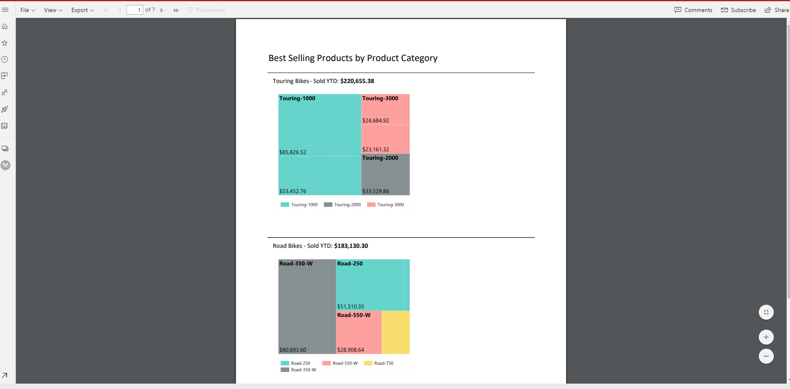
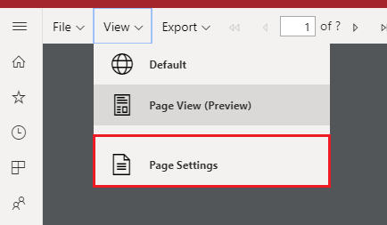

# Report Views for paginated report in Power BI service

When you render a paginated report in Power BI Service, the view is HTML based and interactive, which is the default. The other report view is for fixed page formats like PDF and this is the new Paginated View.

**Default Interactive View**

**Paginated View**

## Paginated View

In Paginated View, the rendered report looks quite different compared to the default view since there are properties and concepts in paginated reports that only apply to fixed pages. The view will be similar to when the report is printed or exported, and still be able to change parameter values, etc. However it does not have some of the interactive features like column sorting, toggles or links.

Paginated View supports all the features similar to the browser's PDF Viewer like options to Zoom in, Zoom out and Fit to page.

When you open a paginated report, it will be rendered in interactive view by default. If the report has parameters, select parameters, then select View Report. Below are steps to switch to Paginated View, once the report has been rendered.

1. Select **View** on the toolbar, then select **Page View**

    

2. You can change the settings of the page view by selecting the **Page Settings** in **View** menu on the toolbar. 

    
    
   Page Settings dialog has options to set Page Size and Orientation for the Page View. Once the page setting is saved, the same will be applied when you choose to Print later.
   
    

You can switch back to the interactive view using the **Default** in the **View** Dropdown.

## Browser Support

Page View is not supported in Internet Explorer and Safari, so the option will be disabled. It is also not supported in mobile browsers and in native Power BI mobile app.

## Next steps

- [View a paginated report in the Power BI service](../consumer/paginated-reports-view-power-bi-service.md)
- [What are paginated reports in Power BI Premium?](paginated-reports-report-builder-power-bi.md)
