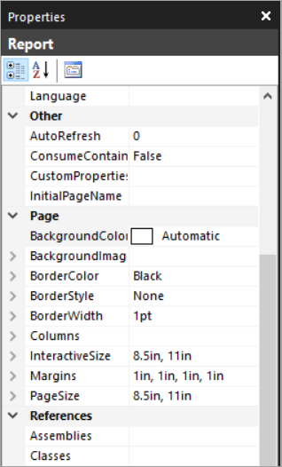
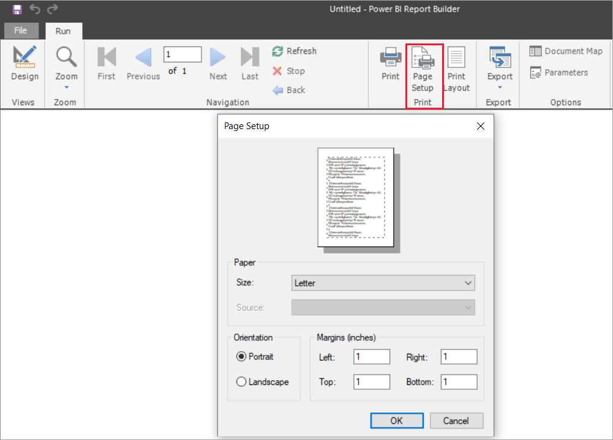
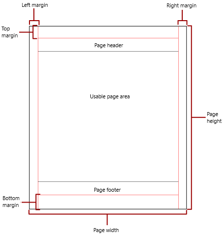
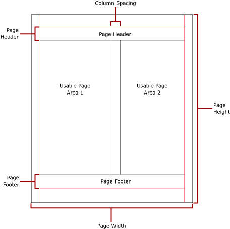

# Pagination in Power BI paginated reports

[!INCLUDE [applies-yes-report-builder-no-desktop](../includes/applies-yes-report-builder-no-desktop.md)] 

*Pagination* refers to the number of pages in a report, and the arrangement of report items on those pages. Pagination in Power BI paginated reports varies depending on the rendering extension you use to view and deliver the report. When you run a report on the report server, the report uses the HTML renderer. HTML follows a specific set of pagination rules. If you export the same report to PDF, for example, you're using the PDF renderer, which uses a different set of rules. Therefore, the report paginates differently. You need to understand the rules used to control pagination in Power BI paginated reports. Then you can successfully design an easy-to-read report that you optimize for the renderer you plan to use to deliver your report.  
  
This article discusses the effect of the physical page size and the report layout on how hard-page-break renderers render the report. You can set properties to modify the physical page size and margins, and divide the report into columns; use the **Report Properties** pane, the **Properties** pane, or the **Page Setup** dialog box. 

Access the **Report Properties** pane in Report Builder by clicking the area outside the report body.

Access the **Page Setup** dialog box by selecting **Run** on the Home tab, and then choose **Page Setup** on the Run tab.

> [!NOTE]  
>  If you've designed a report to be one page wide, but it renders across multiple pages, check that the width of the report body, including margins, isn't larger than the physical page size width. To prevent empty pages from being added to your report, you can reduce the container size by dragging the container corner to the left.  

## The report body

The report body is a rectangular container displayed as white space on the design surface. It can grow or shrink to accommodate the report items contained within it. The report body doesn't reflect the physical page size, and in fact, the report body can grow beyond the boundaries of the physical page size to span multiple report pages. Some renderers render reports that grow or shrink depending on the contents of the page. Reports rendered in these formats are optimized for screen-based viewing, such as in a Web browser. These renderers, such as Microsoft Excel, Word, HTML, and MHTML, add vertical page breaks when required.  
  
You can format the report body with a border color, border style, and border width. You can also add a background color and background image.  
  
## The physical page

The physical page size is the paper size. The paper size that you specify for the report controls how the report is rendered. Reports rendered in hard-page-break formats insert page breaks horizontally and vertically based on the physical page size. These page breaks provide an optimized reading experience when printed or viewed in a hard-page-break file format. Reports rendered in soft-page-break formats insert page breaks horizontally based on the physical size.  
  
By default, the page size is 8.5 x 11 inches. You can change this size in the **Report Properties** pane or **Page Setup** dialog box, or by changing the *PageHeight* and *PageWidth* properties in the **Properties** pane. The page size doesn't grow or shrink to accommodate the contents of the report body. If you want the report to appear on a single page, all the content within the report body must fit on the physical page. If it doesn't fit and you use the hard-page-break format, then the report requires additional pages. If the report body grows past the right edge of the physical page, then a page break is inserted horizontally. If the report body grows past the bottom edge of the physical page, then a page break is inserted vertically.  
  
You can override the physical page size that's defined in the report. Specify the physical page size using the Device Information settings for the renderer that you're using to export the report. For a complete list, see [Device Information settings for rendering extensions](./device-info/device-information-settings-for-paginated-reports-rendering-extensions.md).  
  
### Margins

Report Builder draws margins from the edge of the physical page dimensions inward to the specified margin setting. If a report item extends into the margin area, it's clipped so that the overlapping area isn't rendered. If you specify margin sizes that cause the horizontal or vertical width of the page to equal zero, the margin settings default to zero. You specify margins in the **Report Properties** pane or **Page Setup** dialog box, or by changing the *TopMargin*, *BottomMargin*, *LeftMargin*, and *RightMargin* properties in the **Properties** pane. To override the margin size defined in the report, specify the margin size using the Device Information settings for the specific renderer that you're using to export the report.  
  
The *usable page area* is the area of the physical page that remains after allocating space for margins, column spacing, and the page header and footer. Margins are only applied when you render and print reports in hard-page-break renderer formats. The following image indicates the margin and usable page area of a physical page.  
  
 
  
### Newsletter-style columns  

Your report can be divided into columns, like columns in a newspaper. Columns are treated as *logical* pages rendered on the same *physical* page. They're arranged from left to right, top to bottom, and are separated by white space between each column. If the report is divided into more than one column, each physical page is divided vertically into columns. Each column is considered a logical page. For example, suppose you have two columns on a physical page. The content of your report fills the first column and then the second column. If the report doesn't fit entirely within the first two columns, the report then fills the first and second column on the next page. Columns continue to be filled, from left to right, top to bottom, until all report items are rendered. If you specify column sizes that cause the horizontal width or vertical width to equal zero, the column spacing defaults to zero.  
  
You specify columns in the **Report Properties** pane or **Page Setup** dialog box, or by changing the *TopMargin*, *BottomMargin*, *LeftMargin*, and *RightMargin* properties in the **Properties** pane. To use a margin size that isn't defined, specify the margin size using the Device Information settings for the specific renderer where you're exporting the report. Columns are only applied when you render and print reports in PDF or Image formats. The following image indicates the usable page area of a page containing columns.  
  

  
> [!NOTE]
> Newsletter-style column reports aren't supported in subreports. For more information, see [Subreports in Power BI paginated reports](./subreports.md).

## Page breaks and page names

A report might be more readable, and its data easier to audit and export, when the report has page names. Report Builder provides properties for these items:

- reports
- table, matrix, and list data regions
- groups
- rectangles in the report to control pagination, reset page numbers, and provide new report page names on page breaks. 
 
These features can enhance reports regardless of the format in which reports are rendered. They're especially useful when exporting reports to Excel workbooks.

> [!NOTE]
> Table, matrix, and list data regions are all really the same kind of data region behind the scenes: a *tablix*. So you might encounter that name. 

The *InitialPageName* property provides the initial page name of the report. If your report doesn't include page names for page breaks, then the initial page name is used for all the new pages created by page breaks. You're not required to use an initial page name.  
  
A rendered report can provide a new page name for the new page that a page break causes. To provide the page name, you set the *PageName* property of a table, matrix, list, group, or rectangle. You don't have to specify page names on breaks. If you don't, the value of *InitialPageName* is used instead. If InitialPageName is also blank, the new page has no name.  
  
Table, matrix, and list data regions, groups, and rectangles support page breaks.  
  
The page break includes the following properties:  
  
- **BreakLocation** provides the location of the break for the page break-enabled report element: at the start, end, or start and end. On groups, BreakLocation can be located between groups.  
  
- **Disabled** indicates whether a page break is applied to the report element. If this property evaluates to True, the page break is ignored. This property is used to dynamically disable page breaks based on expressions when the report is run.  
  
- **ResetPageNumber** indicates whether the page number should be reset to one when a page break occurs. If this property evaluates to True, the page number is reset.  
 
You can set the *BreakLocation* property in the **Tablix Properties**, **Rectangle Properties**, or **Group Properties** dialog boxes, but you must set the *Disabled*, *ResetPageNumber*, and *PageName* properties in the Report Builder Properties pane. If the properties in the Properties pane are organized by category, you find the properties in the **PageBreak** category. For groups, the **PageBreak** category is inside the **Group** category.  
  
You can use constants and simple or complex expressions to set the value of the *Disabled* and *ResetPageNumber* properties. However, you can't use expressions with the *BreakLocation* property. For more information about writing and using expressions, see [Expressions in Power BI Report Builder](expressions/report-builder-expressions.md).  
  
In your report, you can write expressions that reference the current page names or page numbers by using the **Globals** collection. For more information, see [Built-in Globals and Users References](/sql/reporting-services/report-design/built-in-collections-built-in-globals-and-users-references-report-builder) in the Report Builder and Reporting Services documentation.
  
### Naming Excel worksheet tabs

These properties are useful when you export reports to Excel workbooks. Use the *InitialPage* property to specify a default name for the worksheet tab name when you export the report, and use page breaks and the *PageName* property to provide different names for each worksheet. Each new report page, defined by a page break, is exported to a different worksheet named by the value of the *PageName* property. If PageName is blank, but the report has an initial page name, then all worksheets in the Excel workbook use the same name, the initial page name.  
  
For more information about how these properties work when reports are exported to Excel, see [Exporting to Microsoft Excel](report-builder/export-microsoft-excel-report-builder.md).  
  
## Next steps

- [View a paginated report in the Power BI service](../consumer/paginated-reports-view-power-bi-service.md)
- [Avoid blank pages when printing paginated reports](../guidance/report-paginated-blank-page.md)
- More questions? [Try the Power BI Community](https://community.powerbi.com/)
