# Tutorial: Create a paginated report and upload it to the Power BI service

[!INCLUDE [applies-yes-paginated-yes-service-no-desktop](../includes/applies-yes-paginated-yes-service-no-desktop.md)] 

In this tutorial, you connect to a sample Azure SQL database. Then you use a wizard in Power BI Report Builder to create a paginated report with a table that wraps to multiple pages. Then you upload the paginated report to a workspace in a Premium capacity in the Power BI service.

Here are the steps you complete in this tutorial:

> [!div class="checklist"]
> * Create an Azure sample database.
> * Create a matrix in Power BI Report Builder with the help of a wizard.
> * Format the report with title, page numbers, and column headings on each page.
> * Format the currency.
> * Upload the report to the Power BI service.

If you don't have an Azure subscription, create a [free account](https://azure.microsoft.com/free/?WT.mc_id=A261C142F) before you begin.
 
## Prerequisites  

Here are the prerequisites for creating the paginated report:

- Install [Power BI Report Builder from the Microsoft Download Center](https://aka.ms/pbireportbuilder). 

- Follow the quickstart [Create an Azure SQL database sample  in the Azure portal](/azure/sql-database/sql-database-get-started-portal). Copy and save the value in the **Server name** box on the **Overview** tab. Remember the user name and password you created in Azure.

Here are the prerequisites for uploading your paginated report to the Power BI service:

- You need a [Power BI Pro license](../admin/service-admin-licensing-organization.md) or Premium Per User (PPU) license.
- You need a workspace on the service in a [Power BI Premium capacity](../admin/service-premium-what-is.md). It has a diamond icon  next to the workspace name.

## Create the matrix with a wizard
  
1.  Start Power BI Report Builder from your computer.  
  
     The **Getting Started** dialog box opens.  
  
     
  
1.  In the left pane, verify that **New Report** is selected, and in the right pane, select **Table or Matrix Wizard**.  
  
4.  In the **Choose a dataset** page, select **Create a dataset** > **Next**.  

    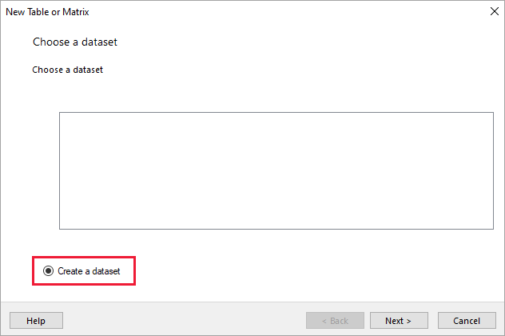
  
5.  In the **Choose a connection to a data source** page, select **New**. 

    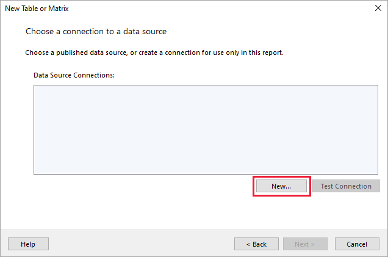
  
     The **Data Source Properties** dialog box opens.  
  
6.  You can name a data source anything you want, using characters and underscores. For this tutorial, in the **Name** box, type **MyAzureDataSource**.  
  
7.  In the **Select connection type** box, select **Microsoft Azure SQL Database**.  
  
8.  Select **Build** next to the **Connection string** box. 

    

9. **In Azure:** Go back to the Azure portal and select **SQL databases**.

1. Select the Azure SQL database you created in the quickstart "Create an Azure SQL database sample in the Azure portal" in the **Prerequisites** section of this article.

1. On the **Overview** tab, copy the value in the **Server name** box.

2. **In Report Builder**: In the **Connection Properties** dialog box, under **Server name** paste the server name you copied. 

1. For **Log on to the server**, make sure **Use SQL Server Authentication** is selected, then type the user name and password you created in Azure for the sample database.

1. Under **Connect to a database**, select the drop-down arrow and select the database name you created in Azure.
 
    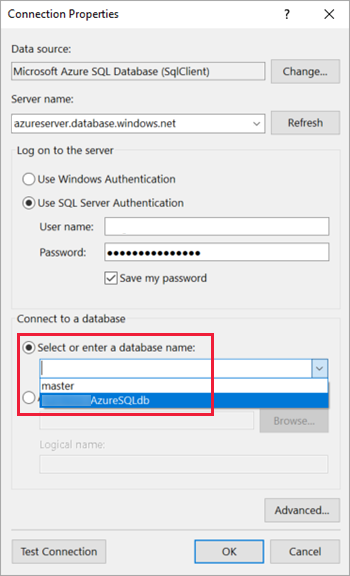

1. Select **Test Connection**. You see the **Test results** message that **Test connection succeeded**.

1. Select **OK** > **OK**. 

   Now in the **Connection string** box, Report Builder displays the connection string you just created. 

    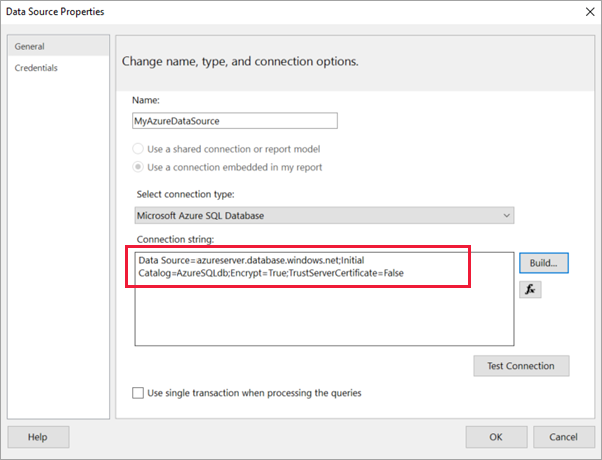

1. Select **OK**.
  
9. In the **Choose a connection to a data source** page, you see "(in this Report)" under the data source connection you just created. Select that data source  > **Next**.  

    

10. Type the same user name and password in the box. 
  
10. In the **Design a query** page, expand SalesLT, expand Tables, and select these tables:

    - Address
    - Customer
    - Product
    - ProductCategory
    - SalesOrderDetail
    - SalesOrderHeader

     Because **Relationships** > **Auto Detect** is selected, Report Builder detects the relationships between these tables. 
    
    
 
1.  Select **Run Query**. Report Builder displays the **Query results**. 
 
     

18. Select **Next**. 

19. In the **Choose a dataset** page, choose the dataset you just created > **Next**.

    

1. In the **Arrange fields** page, drag these fields from the **Available fields** box to the **Row groups** box:

    - CompanyName
    - SalesOrderNumber
    - Product_Name

1. Drag these fields from the **Available fields** box to the **Values** box:

    - OrderQty
    - UnitPrice
    - LineTotal

    Report Builder automatically made the fields in the **Values** box sums.

    

24. In the **Choose the layout** page, keep all the default settings, but clear **Expand/collapse groups**. In general, the expand/collapse groups feature is great, but this time you want the table to wrap to multiple pages.

1. Select **Next** > **Finish**. The table is displayed on the design surface.
 
## What you've created

Let's pause for a moment to look at the results of the wizard.

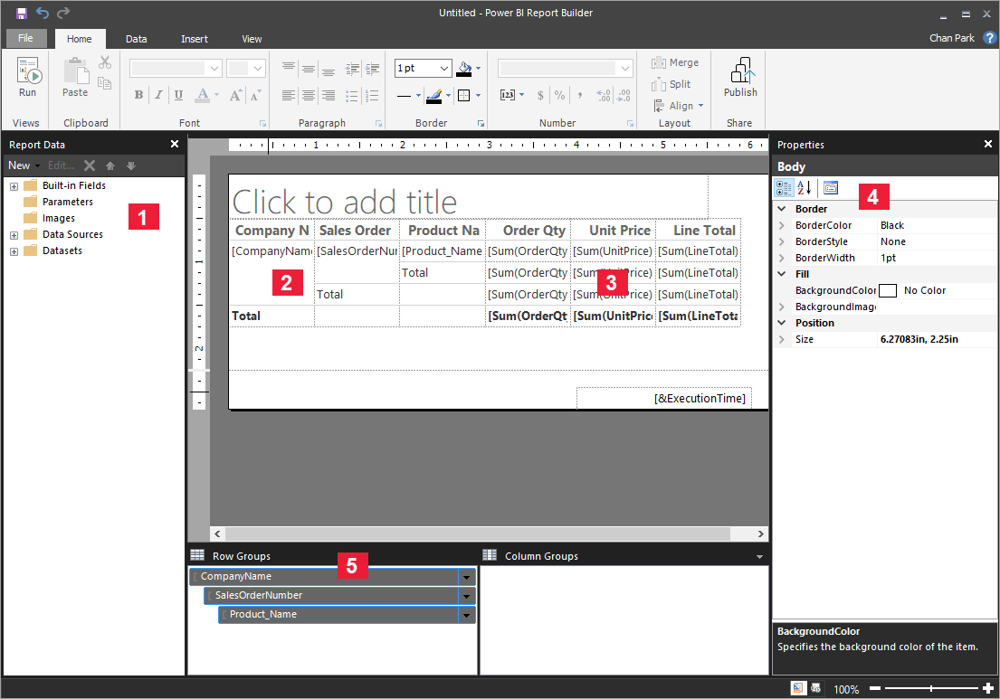

1. In the Report Data pane, you see the embedded Azure data source and the embedded dataset based on it, both of which you created. 

2. The design surface is about 6 inches wide. On the design surface, you see the matrix, displaying column headings and placeholder values. The matrix has six columns and appears to be only five rows tall. 

3. Order Qty, Unit Price, and Line Total are all sums, and each row group has a subtotal. 

    You still don't see actual data values. You need to run the report to see them.

4. In the Properties pane, the selected matrix is called Tablix1. A *tablix* in Report Builder is a data region that displays data in rows and columns. It can be either a table or a matrix.

5. In the Grouping pane, you see the three row groups you created in the wizard: 

    - CompanyName
    - Sales Order
    - Product Name

    This matrix doesn't have any column groups.

### Run the report

To see the actual values, you need to run the report.

1. Select **Run** in the **Home** toolbar.

   Now you see the values. The matrix has many more rows than you saw in Design view! Note that Report Builder says it's page **1** of **2?**. Report Builder loads the report as quickly as possible, so it only retrieves enough data for a few pages at a time. The question mark indicates that Report Builder hasn't loaded all the data yet.

   

2. Select **Print Layout**. The report will be in this format when you print it. Report Builder now knows the report has 33 pages, and has automatically added a date and time stamp in the footer.

## Format the report

Now you have a report with a matrix that wraps to 33 pages. Let's add some other features and improve how it looks. You can run the report after every step, if you want to see how it's coming along.

- On the **Run** tab of the Ribbon, select **Design**, so you can continue modifying it.  

### Set page width

Typically a paginated report is formatted for printing, and a typical page is 8 1/2 X 11 inches. 

1. Drag the ruler to make the design surface 7 inches wide. The default margins are 1 inch on each side, so the side margins need to be narrower.

1. Click in the gray area around the design surface to show the **Report** properties.

    If you don’t see the Properties pane, click the **View** tab > **Properties**.

2. Expand **Margins** and change **Left** and **Right** from 1in to 0.75in. 

    
  
### Add a report title  

1. Select the words **Click to add title** at the top of the page, then type **Sales by Company**.  

2. Select the title text, and in the Properties pane under **Font**, change **Color** to **Blue**.
  
### Add a page number

You noticed the report has a date and time stamp in the footer. You can add a page number to the footer, too.

1. At the bottom of the design surface, you see [&ExecutionTime] on the right in the footer. 

2. In the Report Data pane, expand the Built-in Fields folder. Drag **Page Number** to the left side of the footer, at the same height as [&ExecutionTime].

3. Drag the right side of the [&PageNumber] box to make it square.

4. On the **Insert** tab, select **Text Box**.

5. Click to the right of [&PageNumber], type "of", then make the text box square.

6. Drag **Overall Total Pages** to the footer, to the right of "of", then drag its right side to make it square, too.

    

### Make the table wider  

Now you can make the matrix wide enough to fill the width of the page, and make the text columns wider so the names don't scroll as much. 
 
1. Select the matrix, then select the Company Name column.

3. Hover over the gray bar at the top of the matrix at the right edge of the Company Name column. Drag to the right, until the column ends at 1 3/8 inches. 

    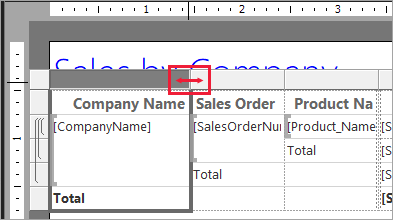

4. Drag the right edge of Product name until the column ends at 3 3/4 inches.   

Now the matrix is almost as wide as the print area.

### Format the currency

If you noticed when you ran the report, the dollar amounts aren't formatted as currency yet.

1. Select the upper-left [Sum(OrderQty)] cell, hold down the Shift key, and select lower-right [Sum(LineTotal)] cell.

    

2. On the **Home** tab, select the dollar sign (**$**) currency symbol, then select the arrow next to **Placeholder styles** > **Sample Values**.
 
    

    Now you can see the values are formatted as currency.

    

### Add column headers on each page

One more formatting improvement before publishing the report to the Power BI service: making the column headers show up on each page in the report.

1. In the far-right end of the top bar in the Grouping pane, select the drop-down arrow > **Advanced Mode**.

    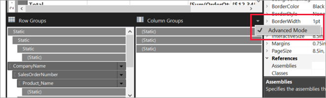

2. Select the top **Static** bar in the **Row Groups**. You see that the Company Name cell in the matrix is selected.

   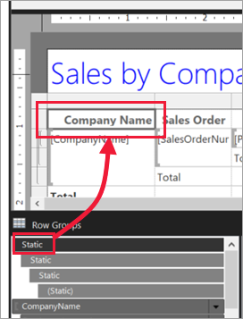

3. In the **Properties** pane, you're looking at the properties for **Tablix Member**. Set **KeepWithGroup** to **After** and **RepeatOnNewPage** to **True**.

    

    It's time to run the report and see how it looks now.

5. Select **Run** on the **Home** tab.

6. Select **Print Layout**, if it's not already selected. Now the report has 29 pages. Scroll through a few pages. You see the currency is formatted, the columns have headings on every page, and the report has a footer with page numbers and date and time stamp on every page.
 
    

7. Save the report to your computer.
 
##  Upload the report to the service

Now that you've created this paginated report, it's time to upload it to the Power BI service.

1. In the Power BI service (`https://app.powerbi.com`) in the nav pane, select **Workspaces** > **Create workspace**.

2. Name your workspace **Azure AW**, or other unique name. You're the only member for now. 

3. Select the arrow next to **Advanced** and turn on **Reserved capacity**. 

    

    If you can't turn it on, you need to ask your Power BI admin to give you permission to add the workspace to the reserved Premium capacity.

4. Choose an **available reserved capacity for this workspace**, if necessary > **Save**.
    
    

    If the workspace isn't in a Premium capacity, when you try to upload your report you see the message, "Unable to upload paginated report." Contact your Power BI administrator to move the workspace.

1. In your new workspace, select **Get Data**.

2. In the **Files** box > **Get**.

3. Select **Local File**, navigate to where you saved the file > **Open**.

   Power BI imports your file, and you see it under **Reports** on the App list page.

    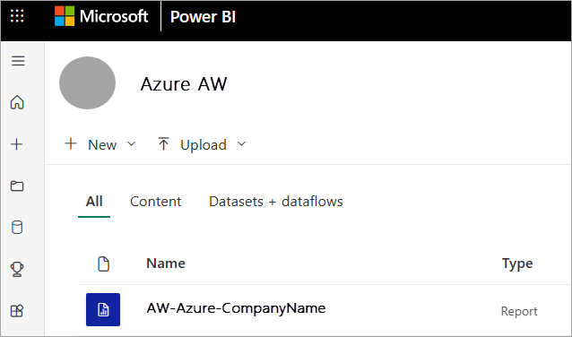

4. Select the report to view it.

5. If you get an error, you may need to reenter your credentials. Select the **Manage** icon.

    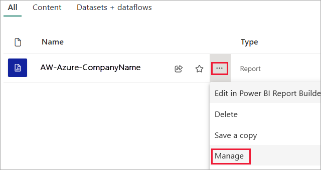

6. Select **Edit credentials** and enter the credentials you used in Azure when you created the Azure database.

    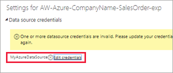

7. Now you can view your paginated report in the Power BI service.

    

## Next steps

[What are paginated reports in Power BI Premium?](paginated-reports-report-builder-power-bi.md)