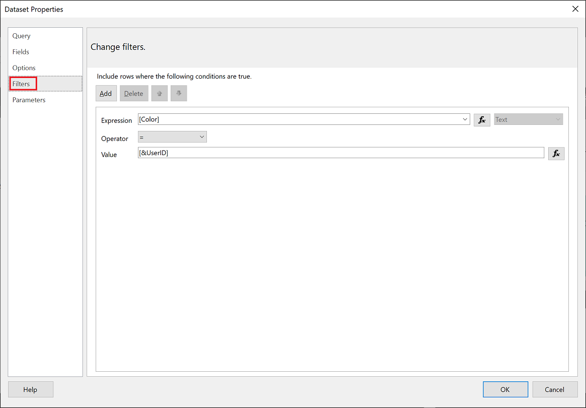
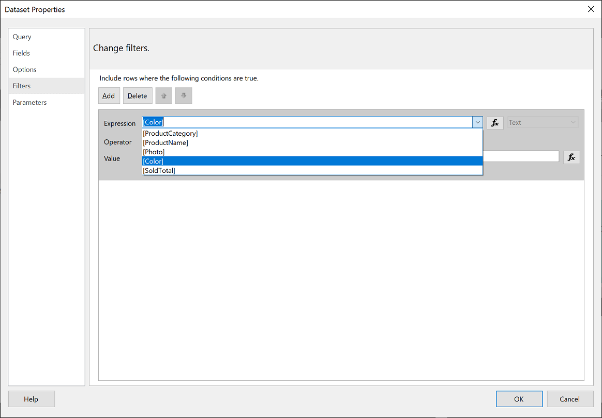
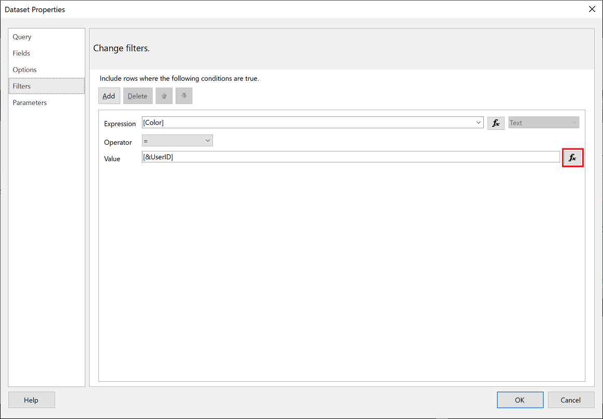
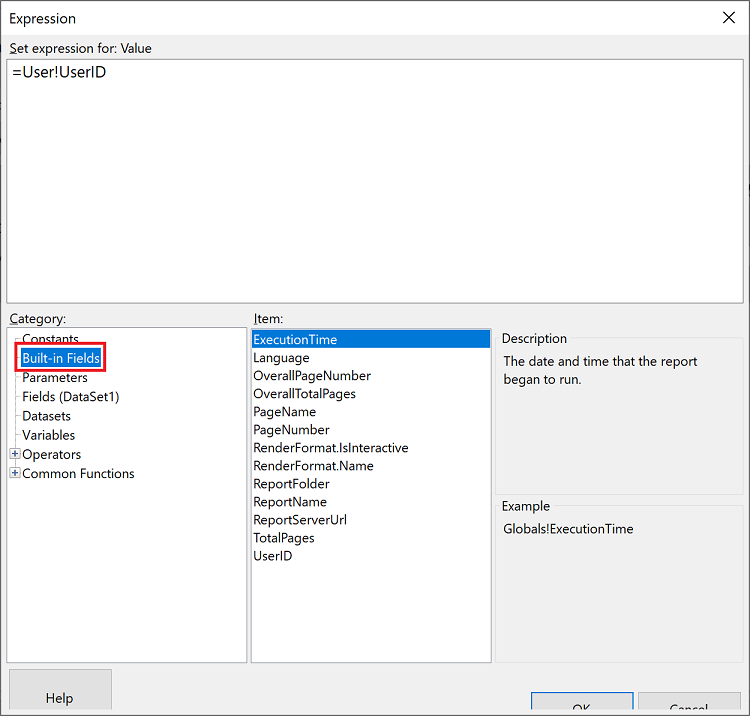

# Set up row-level security in Power BI paginated reports

[!INCLUDE [applies-yes-report-builder-no-desktop](../includes/applies-yes-report-builder-no-desktop.md)] 

This article explains how to set up row-level security (RLS) for paginated reports in Power BI. If your paginated report is based on a Power BI semantic model, the article [Row-level security (RLS) with Power BI](/fabric/security/service-admin-rls) provides a solid background for setting up RLS to use in your paginated report.

To use RLS in a paginated report, you first [create parameters](#create-a-parameter-using-userid) in that report. Then you take advantage of the built-in field **UserID**:

- Use [UserID in a filter](#use-userid-in-a-filter).
- Use [UserID in a query](#use-userid-in-a-query).

    > [!NOTE]  
    > Value for UserID expression during report preview in Power BI Report Builder could be in a different format than the value for UserID expression when run in a report on the Power BI service. It depends upon whether the computer running Power BI Report Builder uses Active Directory or Microsoft Entra ID.

## Prerequisites

[!INCLUDE [power-bi-paginated-prerequisites](../includes/power-bi-paginated-prerequisites.md)]
- For [row-level security (RLS)](/fabric/security/service-admin-rls) to work in Power BI Report Builder, You need at least a Viewer role in the dataset workspace, and Build permission for the dataset. Read about [roles in workspaces](../collaborate-share/service-roles-new-workspaces.md).
- You create paginated reports using the SQL Server Reporting Services engine, and not the Power BI (Analysis Services) engine, so you set up RLS filtering in [Power BI Report Builder](report-builder-power-bi.md).

## Create a parameter using UserID

To apply row-level security to a Power BI paginated report, the first step is to create a parameter and assign the built-in field **UserID**. See the article [Create parameters](parameters/report-builder-parameters.md) if you need help creating them. 

Then you use this parameter with **UserId** in a [*filter*](#use-userid-in-a-filter) or in a [*query*](#use-userid-in-a-query) to the data source.

## Use UserID in a filter

1. In the **Dataset Properties** window, from the left pane, select **Filter**.

    

1. From the **Expression** dropdown menu, select the parameter you want to use for filtering the data.

     

1. Select the **Value** function button.

    

1. In the **Expression** window, from the **Category** list, select **Built-in Fields**.

    

1. From the **Item** list, select **UserID** > **OK**.

    

1. In the **Dataset Properties** window, verify that the expression is *your selected parameter = UserID*.

    

1. Select **OK**.

## Use UserID in a query

1. In the **Dataset Properties** window, from the left navigation pane, select **Parameters**, then select **Add**.

    

1. In the **Parameter Name** field enter **\@UserID**, and in the **Parameter Value** add **[&UserID]**.

    

1. From the left pane, select  **Query**. In **Query**, add the **UserID** parameter as part of your query.

    This screenshot uses the color parameter as an example *(WHERE FinalTable.Color = @UserID)*. If needed, you can create a more complex query.

    

1. Select **OK**.

## Considerations and limitations

* The Test as role/View as role feature doesn't work for paginated reports.

## Next steps

[Power BI Report Builder](report-builder-power-bi.md)
