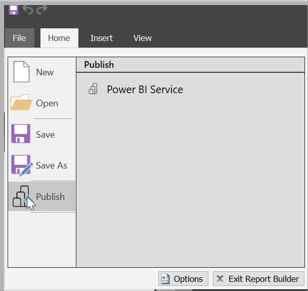
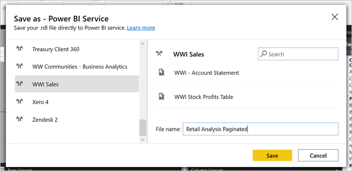
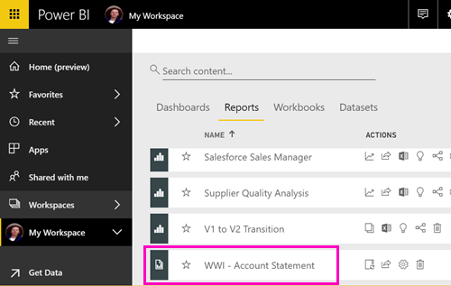
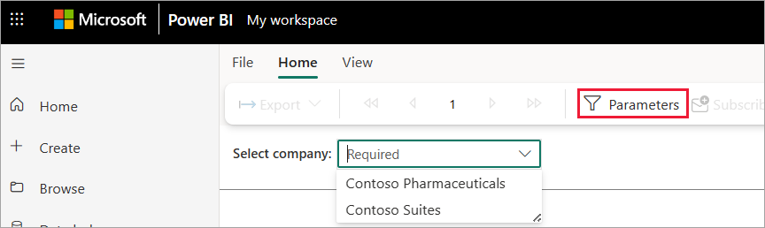
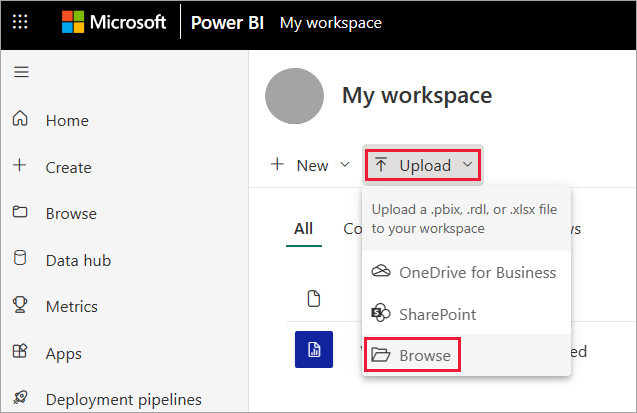
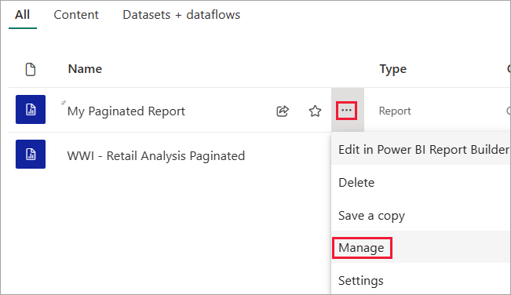
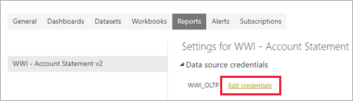
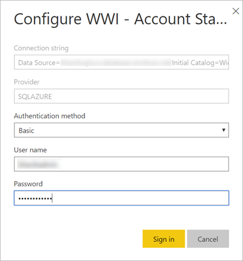
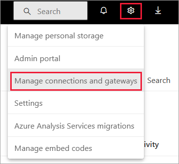

# Publish a paginated report to the Power BI service

[!INCLUDE [applies-yes-report-builder-no-desktop](../includes/applies-yes-report-builder-no-desktop.md)] 

This article explains how to publish a paginated report to the Power BI service by uploading it from your local computer.

## Requirements

[!INCLUDE [power-bi-paginated-prerequisites](../includes/power-bi-paginated-prerequisites.md)]

- If your report data source is on premises, you need to install a gateway. Read more about [on-premises gateways](../connect-data/service-gateway-onprem.md). After you upload the report, you connect to the on-premises data source by using the gateway.

## From Report Builder, publish to the Power BI service

1. In Report Builder, create a new paginated report or open an existing paginated report from the Power BI service. If you open an existing paginated report from the service, the **Save** option is disabled because you're updating a report that's live in the Power BI service.

1. On the Report Builder **File** menu, select **Publish**.

    

    If you aren't signed in to Power BI yet, you need to sign in or create an account now. In the upper-right corner of Report Builder, select **Sign in** and complete the steps.

1. In the list of workspaces on the left, select a workspace. Type a **File name** in the box > **Save**.

    

1. Open the Power BI service in a browser and find the workspace where you published the paginated report.

    

5. Select the paginated report to open it in the Power BI service. If it has parameters, you need to select them before you can view the report.

    

6. If your report data source is on premises, read about how to [connect to a gateway](#connect-to-a-gateway) in this article to access the data source.

## From the Power BI service, upload a paginated report

You can also start from the Power BI service and upload a paginated report.

> [!NOTE]
> Currently, you can't import a paginated report from OneDrive or SharePoint.

1. Create your paginated report in Report Builder and save it to your local computer.

1. Open the Power BI service in a browser and find the workspace where you want to publish the report.

1. Select **Upload**, then choose **Browse** to find the paginated report.

    

1. To edit your credentials, select the ellipses next to the report name, then choose **Manage**.

    

1. Select **Continue** > **Edit credentials**.

    

1. Configure your credentials > **Sign in**.

    

1. Select the report to open it in the Power BI service. If it has parameters, you need to select them before you can view the report.

    

1. If your report data source is on premises, read about how to [connect to a gateway](#connect-to-a-gateway) in the following section to access the data source.

## Connect to a gateway

As with any other Power BI report, if the paginated report data source is on premises, then you need to create or connect to a gateway to access the data.

1. Select the settings icon at the top right, then choose **Manage connections and gateways**.

    

1. For more details, see the Power BI service article [What is an on-premises data gateway](../connect-data/service-gateway-onprem.md).

## Considerations and limitations

- Maximum file size of a paginated report file with extension .rdl is 12 MB. If your RDL file is larger, it is typically due to using large embedded images in which case consider using external images or reducing size of the embedded images.

## Next steps

- [View a paginated report in the Power BI service](../consumer/paginated-reports-view-power-bi-service.md)
- [What are paginated reports in Power BI?](paginated-reports-report-builder-power-bi.md)
- [Embed Power BI paginated reports](../developer/embedded/embed-paginated-reports.md)

