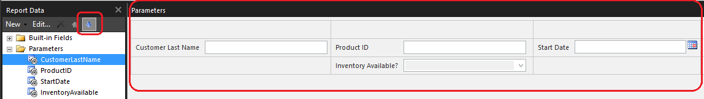

# Change the order of parameters in a Power BI paginated report (Power BI Report Builder)

[!INCLUDE [applies-yes-report-builder-no-desktop](../../includes/applies-yes-report-builder-no-desktop.md)]

  Change the order of parameters in a Power BI paginated report when you have a dependent parameter that is listed before the parameter it is dependent on. Parameter order is important when you have cascading parameters, or when you want to show users the default value for one parameter before they choose values for other parameters. A dependent report parameter contains a reference, in either its default values query or valid values query, to a query parameter that points to a report parameter that is after it in the parameter list in the **Report Data** pane.  
  
 The order that you see parameters display on the report viewer toolbar when you run the report, is determined by the order of the parameters in the **Report Data** pane and the location of the parameters in the custom parameters pane. For more information, see [Customize the Parameters Pane in a Report &#40;Power BI Report Builder&#41;](/sql/reporting-services/report-design/customize-the-parameters-pane-in-a-report-report-builder)  
  
## Change the order of report parameters  
  
You can change the order of report parameters by doing either of the following:  
  
-   Click a parameter in the **Report Data** pane, and use the up and down arrow buttons to move the parameter higher or lower in the list, as shown in the following image.  When you change the order of the parameter in the **Report Data** pane, the location of the parameter in the parameters pane is changed.  
  
       
  
-   In the parameters pane, drag the parameter to a new column or row in the pane. When you change the location of the parameter in the pane, the parameter order changes in the **Report Data** pane. For more information about moving parameters in the pane, see [Customize the Parameters Pane in a Report &#40;Power BI Report Builder&#41;](customize-parameters-pane-report-builder.md).  
  
## Related content

- [Report parameters in Power BI Report Builder](../parameters/report-builder-parameters.md)   
- [Add Cascading Parameters to a Report &#40;Power BI Report Builder&#41;](/sql/reporting-services/report-design/add-cascading-parameters-to-a-report-report-builder-and-ssrs)   
- [Tutorial: Add a Parameter to Your Report &#40;Power BI Report Builder&#41;](/sql/reporting-services/tutorial-add-a-parameter-to-your-report-report-builder)   
- [Add Dataset Filters, Data Region Filters, and Group Filters &#40;Power BI Report Builder&#41;](/sql/reporting-services/report-design/add-dataset-filters-data-region-filters-and-group-filters)   
- [Parameters Collection References &#40;Power BI Report Builder&#41;](built-in-collections-parameters-collection-references-report-builder.md)  
  
  
