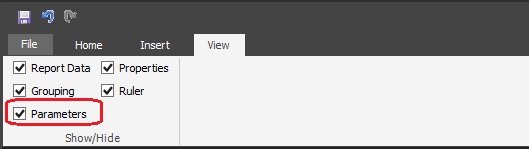
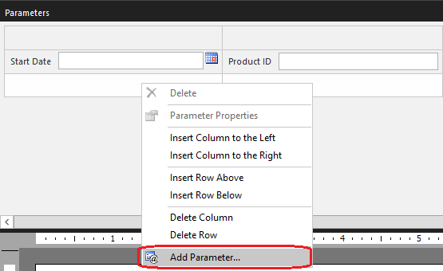
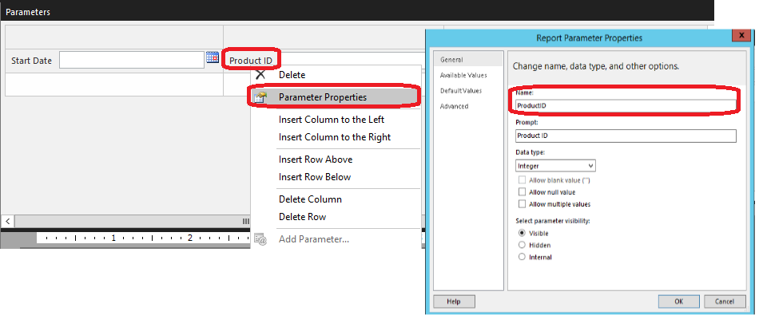
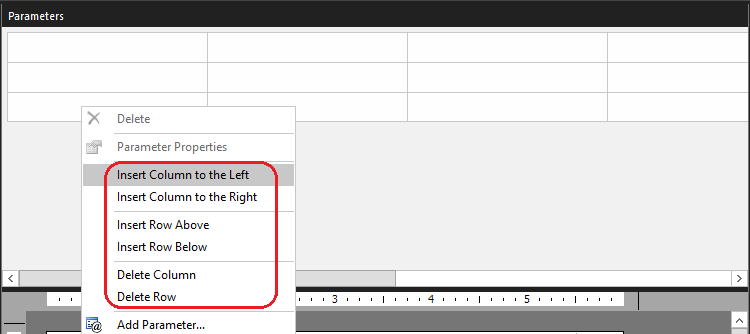
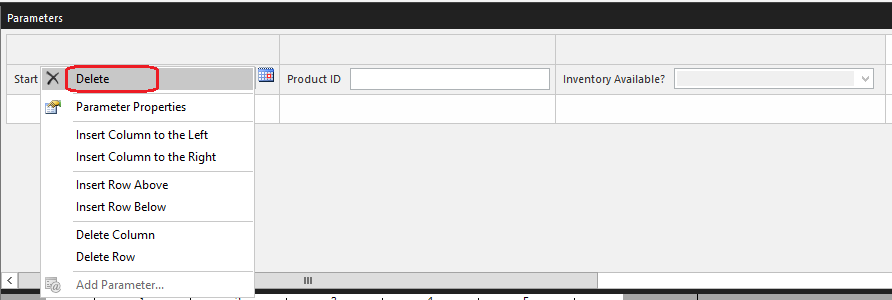
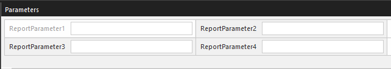
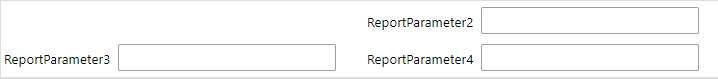
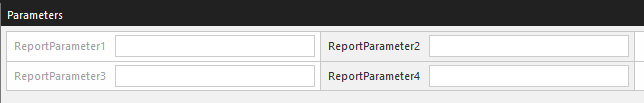

# Customize the parameters pane in a paginated report (Power BI Report Builder)

[!INCLUDE [applies-yes-report-builder-no-desktop](../../includes/applies-yes-report-builder-no-desktop.md)]ssrs-custo

  When creating paginated reports with parameters in Power BI Report Builder, you can customize the Parameters pane. In report design view, you can drag a parameter to a specific column and row in the Parameters pane. You can add and remove columns to change the layout of the pane.

 When you drag a parameter to a new column and row in the pane, the parameter order changes in the **Report Data** pane. When you change the order of the parameter in the **Report Data** pane, the location of the parameter in the pane is changed. For more information about why parameter order is important, see [Change the Order of a Report Parameter &#40;Power BI Report Builder&#41;](/sql/reporting-services/report-design/change-the-order-of-a-report-parameter-report-builder-and-ssrs).

## Customize the parameters pane

1.  On the **View** tab, select the **Parameters** checkbox to display the parameters pane.

     

     The pane appears at the top of the design surface.

2.  To add a parameter to the pane, do one of the following.

    -   Right-click an empty cell in the parameters pane, and then click **Add Parameter**.

         

    -   Right-click **Parameters** in the **Report Data** pane, and then click **Add Parameter**.

3.  To move a parameter to a new location in the parameters pane, drag the parameter to a different cell in the pane.

     When you change the location of the parameter in the pane, the order of the parameter in the **Parameters** list in the **Report Data** pane is automatically changed. For more information about the impact of the parameter order, see [Change the Order of a Report Parameter &#40;Power BI Report Builder&#41;](/sql/reporting-services/report-design/change-the-order-of-a-report-parameter-report-builder-and-ssrs)

4.  To access the properties for a parameter, do one of the following.

    -   Right-click the parameter in the parameters pane, and then click **Parameter Properties**.

         

    -   Right-click the parameter in the **Report Data** pane, and then click **Parameter Properties**.

5.  To add new columns and rows to the pane, or delete existing rows and columns, right-click anywhere in the parameters pane and then click a command on the menu that displays.

     

    > [!IMPORTANT]
    >  When you delete a column or row that contains parameters, the parameters are deleted from the report.

6.  To delete a parameter from the pane and from the report, do one of the following.

    -   Right-click the parameter in the parameters pane, and then click  **Delete**.

         

    -   Right-click parameter in the **Report Data** pane, and then click **Delete**.

## Hidden/Internal parameters during runtime

If you have a hidden/internal parameter, the logic of whether it will be rendered as empty space during runtime is as follows:

- If any row or column contains only hidden/internal parameters or empty cells, then the entire row or column won't be rendered during runtime
- Otherwise, the hidden/internal parameter or empty cell will be rendered as empty space

For example, `ReportParameter1` is hidden while the rest of the parameters are visible:

This will result as an empty space during runtime because there are visible parameters in first column or first row:

Using the same example, if you also set `ReportParameter3` as hidden:

Then the first column is not rendered during runtime because the entire column is considered empty:

## Default layout

For reports that were authored before SQL Server Reporting Services 2016, a default parameter layout grid of 2 columns and N rows is used during runtime. To change the default layout, open the report in Report Builder and save the report. After you save the report, the customized parameter layout information is saved to the .rdl file.

## Next Steps

 [Report Parameters &#40;Power BI Report Builder and Report Designer&#41;](report-builder-parameters.md)

