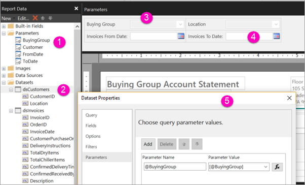

# Create parameters for paginated reports in the Power BI service

[!INCLUDE [applies-yes-report-builder-no-desktop](../../includes/applies-yes-report-builder-no-desktop.md)] 

In this article, you learn how to create parameters for paginated reports in the Power BI service.  A report parameter provides a way to choose report data and vary the report presentation. You can provide a default value and a list of available values. Your report readers can change the selection. They can also type in the parameter text boxes to search for values. See [View parameters for paginated reports](../../consumer/paginated-reports-view-parameters.md) to see how your business users interact with parameters in the Power BI service.  

The following illustration shows Design view in Power BI Report Builder for a report with the parameters @BuyingGroup, @Customer, @FromDate, and @ToDate. 
  

  
1.  The report parameters in the Report Data pane.  
  
2.  The table with one of the parameters in the dataset.  
  
3.  The Parameters pane. You can customize the layout of parameters in the parameters pane. 
  
4.  The parameters @FromDate and @ToDate have the data type **DateTime**. When viewing the report, you can either type a date in the text box, choose a date in the calendar control, or select **Go to today**.

5.  One of the parameters in the **Dataset Properties** dialog box.  

## Prerequisites 

[!INCLUDE [power-bi-paginated-prerequisites](../../includes/power-bi-paginated-prerequisites.md)]
  
## Create or edit a report parameter  
  
1. Open your paginated report in Power BI Report Builder.

1. In the **Report Data** pane, right-click the **Parameters** node > **Add Parameter**. The **Report Parameter Properties** dialog box opens.  
  
2.  In **Name**, type a name for the parameter or accept the default name.  
  
3.  In **Prompt**, type text to appear next to the parameter text box when the user runs the report.  
  
4.  In **Data type**, select the data type for the parameter value.  
  
5.  If the parameter can contain a blank value, select **Allow blank value**.  
  
6.  If the parameter can contain a null value, select **Allow null value**.  
  
7.  To allow a user to select more than one value for the parameter, select **Allow multiple values**.  
  
8.  Set the visibility option.  
  
    -   To show the parameter on the toolbar at the top of the report, select **Visible**.  
  
    -   To hide the parameter so that it doesn't display on the toolbar, select **Hidden**.  
  
    -   To hide the parameter and protect it from being modified on the report server after the report is published, select **Internal**. The report parameter can then only be viewed in the report definition. For this option, you must set a default value or allow the parameter to accept a null value.  
  
9. Select **OK**.

## Related content

See [View parameters for paginated reports](../../consumer/paginated-reports-view-parameters.md) to see how the parameters look in the Power BI service.

For in-depth information about parameters in paginated reports, see [Report parameters in Power BI Report Builder](report-builder-parameters.md).
