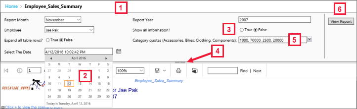
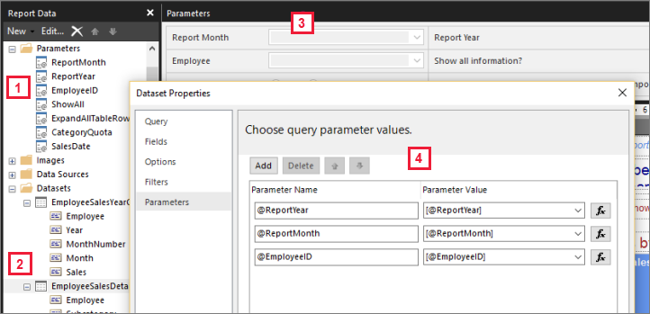

# Report parameters in Power BI Report Builder

[!INCLUDE [applies-yes-report-builder-no-desktop](../../includes/applies-yes-report-builder-no-desktop.md)] 

This article describes the common uses for Power BI Report Builder report parameters, the properties you can set, and much more. Report parameters let you control report data, connect related reports together, and vary report presentation. You can use report parameters in paginated reports that you create in Report Builder.

##  Common uses for parameters

Here are some of the most common ways to use parameters.  
  
**Control paginated report data:**
  
- Filter paginated report data at the data source by writing dataset queries that contain variables.  
  
- Allow users to specify values to customize the data in a paginated report. For example, provide two parameters for the start date and end date for sales data.  
  
**Vary report presentation:**
  
- Allow users to specify values to help customize the appearance of a report. For example, provide a Boolean parameter to indicate whether to expand or collapse all nested row groups in a table.  
  
- Allow users to customize report data and appearance by including parameters in an expression.  
  
##  View a report with parameters

When you view a report that has parameters, the report viewer toolbar displays each parameter so you can interactively specify values. The following illustration shows the parameter area for a report with parameters @ReportMonth, @ReportYear, @EmployeeID, @ShowAll, @ExpandTableRows, @CategoryQuota, and @SalesDate.  

  
1. **Parameters pane**. The report viewer toolbar displays a prompt and default value for each parameter. You can customize the layout of parameters in the parameters pane.  
  
2. **@SalesDate parameter**. The parameter **@SalesDate** is data type **DateTime**. The prompt **Select the Date** appears next to the text box. To modify the date, type a new date in the text box, use the calendar control, or select **Go to today**.  
  
3. **@ShowAll parameter**. The parameter **@ShowAll** is data type **Boolean**. Use the radio buttons to specify **True** or **False**.  
  
4. **Show or Hide Parameter Area handle**. On the report viewer toolbar, select this arrow to show or hide the parameters pane.  
  
5. **@CategoryQuota parameter**. The parameter **@CategoryQuota** is data type **Float**, so it takes a numeric value. **@CategoryQuota** is set to allow multiple values.  
  
6. **View Report**. After you enter parameter values, select **View Report** to run the report. If all parameters have default values, the report runs automatically on first view.  

See how your customers interact with parameters in your paginated reports in the article [View parameters for paginated reports in the Power BI service](../../consumer/paginated-reports-view-parameters.md).
  
##  Create parameters

You can create report parameters in a few different ways.
  
> [!NOTE]
> Not all data sources support parameters.
  
### Dataset query or stored procedure with parameters
  
Add a dataset query that contains variables or a dataset stored procedure that contains input parameters. A dataset parameter is created for each variable or input parameter, and a report parameter is created for each dataset parameter.  
  

This image from Report Builder shows:  

1. The report parameters in the **Report Data** pane.  
  
2. The dataset with the parameters.  
  
3. The **Parameters** pane.  
  
4. The parameters listed in the **Dataset Properties** dialog box.  
  
### Create a parameter manually
  
Create a parameter manually from the **Report Data** pane. You can configure report parameters so that a user can interactively enter values to help customize the contents or appearance of a report. You can also configure report parameters so that a user can't change pre-configured values.  

> [!NOTE]  
> Because parameters are managed independently on the server, republishing a main report with new parameter settings doesn't overwrite the existing parameter settings on the report.  

## Select parameter values

The following options are for selecting parameter values in the report.  
  
- Select a single parameter value from a drop-down list.  
  
- Select multiple parameter values from a drop-down list.  
  
- Select a value from a drop-down list for one parameter, which determines the values that are available in the drop-down list for another parameter. These are cascading parameters. Cascading parameters enables you to successively filter parameter values from thousands of values to a manageable number. For more information, see [Use cascading parameters in paginated reports](../../guidance/paginated-report-cascading-parameter.md).

- Run the report without having to first select a parameter value because a default value was created for the parameter.  
  
##  Report parameter properties

You can change the report parameter properties by using the **Report Properties** dialog box. The following table summarizes the properties that you can set for each parameter:  
  
|Property|Description|  
|--------------|-----------------|  
|Name|Type a case-sensitive name for the parameter. The name must begin with a letter and can have letters, numbers, or an underscore (_). The name can't have spaces. For automatically generated parameters, the name matches the parameter in the dataset query. By default, manually created parameters are similar to ReportParameter1.|  
|Prompt|The text that appears next to the parameter on the report viewer toolbar.|  
|Data type|A report parameter must be one of the following data types:   **Boolean**. The user selects True or False from a radio button.   **DateTime**. The user types a new date in the text box, selects a date from a calendar control, or selects **Go to today**.   **Integer**. The user types values in a text box.   **Float**. The user types values in a text box.   **Text**. The user types values in a text box.   When available values are defined for a parameter, the user chooses values from a drop-down list, even when the data type is **DateTime**.|  
|Allow blank value|Select this option if the value of the parameter can be an empty string or a blank.   If you specify valid values for a parameter, and you want a blank value to be one of the valid values, you must include it as one of the values that you specify. Selecting this option doesn't automatically include a blank for available values.|  
|Allow null value|Select this option if the value of the parameter can be a null.   If you specify valid values for a parameter, and you want null to be one of the valid values, you must include null as one of the values that you specify. Selecting this option doesn't automatically include a null for available values.|  
|Allow multiple values|Provide available values to create a drop-down list that your users can choose from. This is a good way to ensure that only valid values are submitted in the dataset query.   Select this option if the value for the parameter can be multiple values that are displayed in a drop-down list. Null values aren't allowed. When this option is selected, check boxes are added to the list of available values in a parameter drop-down list. The top of the list includes a check box for **Select All**. Users can check the values that they want.   If the data that provides values changes rapidly, the list the user sees might not be the most current.|  
|Visible|Select this option to display the report parameter at the top of the report when it's run. This option allows users to select parameter values at run time.|  
|Hidden|Select this option to hide the report parameter in the published report. The report parameter values can still be set on a report URL, in a subscription definition, or on the report server.|  
|Internal|Select this option to hide the report parameter. In the published report, the report parameter can only be viewed in the report definition.|  
|Available values|If you have specified available values for a parameter, the valid values always appear as a drop-down list. For example, if you provide available values for a **DateTime** parameter, a drop-down list for dates appears in the parameter pane instead of a calendar control.   To ensure that a list of values is consistent among a report and subreports, you can set an option on the data source to use a single transaction for all queries in the datasets that are associated with a data source.   **Security Note**: In any report that includes a parameter of data type **Text**, be sure to use an available values list (also known as a valid values list) and ensure that any user running the report has only the permissions necessary to view the data in the report.|  
|Default values|Set default values from a query or from a static list.   When each parameter has a default value, the report runs automatically on first view.|  
|Advanced|Set the report definition attribute **UsedInQuery**, a value that indicates whether this parameter directly or indirectly affects the data in a report.   **Automatically determine when to refresh**  Choose this option when you want the report processor to determine a setting for this value. The value is **True** if the report processor detects a dataset query with a direct or indirect reference to this parameter, or if the report has subreports.   **Always refresh**  Choose this option when the report parameter is used directly or indirectly in a dataset query or parameter expression. This option sets **UsedInQuery** to True.   **Never refresh**  Choose this option when the report parameter isn't used directly or indirectly in a dataset query or parameter expression. This option sets **UsedInQuery** to False.   **Caution**: Use **Never Refresh** with caution. On the report server, **UsedInQuery** is used to help control cache options for report data and for rendered reports, and parameter options for snapshot reports. If you set **Never Refresh** incorrectly, you could cause incorrect report data or reports to be cached, or cause a snapshot report to have inconsistent data. |  
  
##   Dataset query  
To filter data in the dataset query, you can include a restriction clause that limits the retrieved data by specifying values to include or exclude from the result set.  
  
Use the query designer for the data source to help build a parameterized query.  
  
- For Transact-SQL queries, different data sources support different syntax for parameters. Support ranges from parameters that are identified in the query by position or by name. In the relational query designer, you must select the parameter option for a filter to create a parameterized query.
  
- For queries that are based on a multidimensional data source such as Microsoft SQL Server Analysis Services, you can specify whether to create a parameter based on a filter that you specify in the query designer. 
  
##   Parameter management for a published report  
When you design a report, report parameters are saved in the report definition. When you publish a report, report parameters are saved and managed separately from the report definition.  
  
 For a published report, you can use the following parameters:  
  
- **Report parameter properties.** Change report parameter values directly on the report server independently from the report definition.  
  
- **Report subscriptions.** You can specify parameter values to filter data and deliver reports through subscriptions. 
  
Parameter properties for a published report are preserved if you republish the report definition. If the report definition is republished as the same report, and parameter names and data types remain the same, your property settings are retained. If you add or delete parameters in the report definition, or change the data type or name of an existing parameter, you might need to change the parameter properties in the published report.  
  
Not all parameters can be modified in all cases. If a report parameter gets a default value from a dataset query, that value can't be modified for a published report and can't be modified on the report server. The value that is used at run time is determined when the query runs, or in the case of expression-based parameters, when the expression is evaluated.  
  
Report execution options can affect how parameters are processed. A report that runs as a snapshot can't use parameters derived from a query unless the query includes default values for the parameters.  
  
##   Parameters for a subscription
You can define a subscription for an on-demand report or for a snapshot, and specify parameter values to use during subscription processing.  
  
- **On-demand report.**  For an on-demand report, you can specify a different parameter value than the published value for each parameter listed for the report. For example, suppose you have a Call Service report that uses a *Time Period* parameter to return customer service requests for the current day, week, or month. If the default parameter value for the report is set to **today**, your subscription can use a different parameter value (such as **week** or **month**) to produce a report that contains weekly or monthly figures.  
  
## Related content

- [What are paginated reports in Power BI?](../paginated-reports-report-builder-power-bi.md)  
- [Use cascading parameters in paginated reports](../../guidance/paginated-report-cascading-parameter.md)
