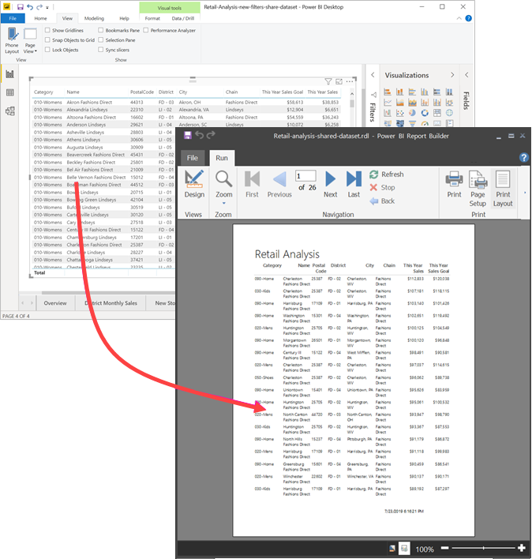
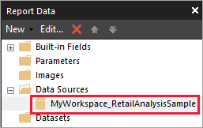
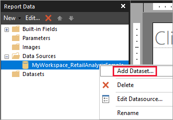
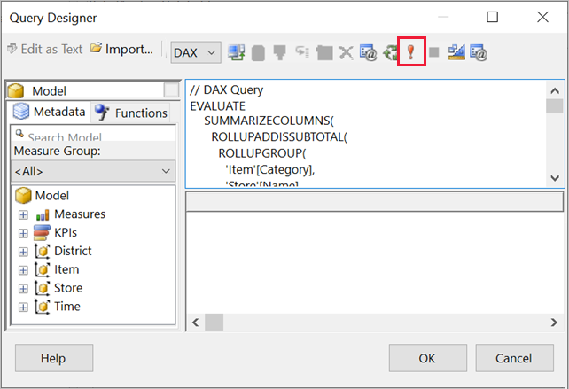
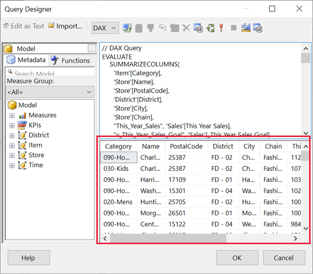
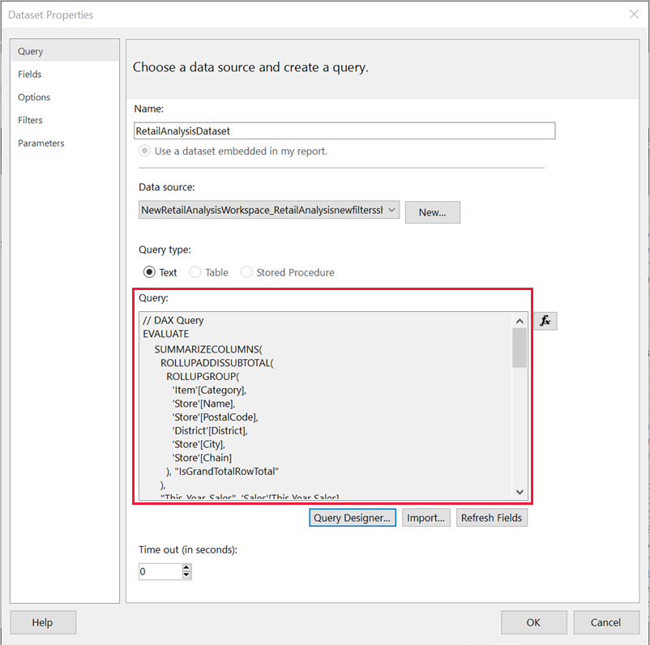
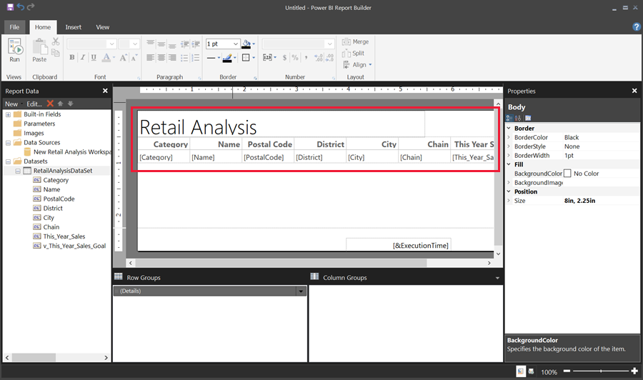
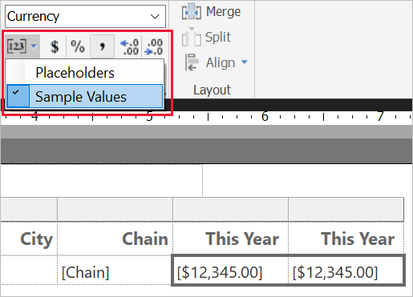

# Create a paginated report based on a Power BI shared dataset

[!INCLUDE [applies-yes-report-builder-no-desktop](../includes/applies-yes-report-builder-no-desktop.md)] 

You can use a dataset that you create in Power BI Desktop as a data source for Power BI Report Builder paginated reports. Picture this scenario: You've created a Power BI report in Power BI Desktop. You spent a lot of time designing the data model, then created a beautiful Power BI report with all sorts of great visuals. Your report has a matrix with many rows, so you have to scroll to see them all. Your report readers want a report they can print out, that will show all the rows in that matrix.

A Power BI paginated report can do that: print a table or matrix that runs to multiple pages, with page headers and footers and a perfect page layout that you design. It will complement the Power BI Desktop report. You want them to be based on the exact same data, with no discrepancies, so you use the same dataset.

## What you need

Here's a list of what you need and don't need to use a shared dataset in Power BI Report Builder.

- Download and install [Power BI Report Builder](https://aka.ms/pbireportbuilder).
- The dataset can be in any workspace, and you don't need to be a member of that workspace.
- To access a Power BI semantic model, you need to have *Build permission* for the dataset. Read about [Build permission](../connect-data/service-datasets-build-permissions.md).
- You need a [Power BI Pro](../fundamentals/service-self-service-signup-for-power-bi.md) license or [Premium Per User (PPU)](../enterprise/service-premium-per-user-faq.yml) license to publish your paginated report.
- You don't need a Power BI Pro or PPU license to create a paginated report in Power BI Report Builder. 
- You can publish to *My Workspace*. For any other workspace, you need at least a [Contributor role](../collaborate-share/service-roles-new-workspaces.md#workspace-roles).

If you want to follow along with this article, download the [Retail Analysis sample .pbix](https://download.microsoft.com/download/9/6/D/96DDC2FF-2568-491D-AAFA-AFDD6F763AE3/Retail%20Analysis%20Sample%20PBIX.pbix) file, open it in Power BI Desktop, and add a table with many columns. In the **Format** pane, slide the toggle under **Totals** to the off position.

Then [publish the report to a workspace](../create-reports/desktop-upload-desktop-files.md) in the Power BI service.

## Connect to the Power BI semantic model

1. Open Power BI Report Builder.
1. Select **Sign in** in the upper-right corner of Report Builder to sign in to your Power BI account.
1. In the Report Data pane, select **New** > **Power BI Semantic Model Connection**.

    

    > [!NOTE]
    > You can't create the data source or dataset for a Power BI Semantic Model by using the Report Builder Table, Matrix, or Chart wizards. After you've created them, you can use the wizards to create tables, matrixes, or charts based on them.

1. Search or browse for the dataset, or for the workspace where the dataset resides, then choose **Select**. Report Builder fills in the dataset name.

    

1. The dataset is listed under Data Sources in the Report Data pane.

    

    Remember, you can connect to multiple Power BI semantic models and other data sources in the same paginated report.

## Get the DAX query for the dataset

When you want the data in your Power BI report and in your paginated report to be the same, it's not enough to connect to the dataset. You also need the Data Analysis Expressions (DAX) query that's built on that dataset.

### Steps to get the DAX query

Follow these steps to get the query.

1. Open the Power BI report (.pbix) in Power BI Desktop.
1. Make sure you have a table in your report that contains all the data you want in your paginated report. The table needs to meet these two requirements:
    - It needs to be a flat table, not a matrix or other visual. If it's not a table, convert it to a table now, go through the Performance Analyzer steps that follow, then convert it back to the visual you want.
    - For your numeric fields, you need to use *predefined measures*. They have a calculator symbol next to them. Read about [creating measures](../transform-model/desktop-measures.md). 

        

1. On the **View** ribbon, select **Performance Analyzer**.

    

1. In the **Performance Analyzer** pane, select **Start recording**, then select **Refresh visuals**.

    

1. Expand the plus sign (**+**) next to the table name, and select **Copy query**. The query is the DAX formula you need for the dataset in Power BI Report Builder.

    

## Create the dataset with the query

1. Go back to Power BI Report Builder.
1. Right-click the dataset under **Data Sources** and select **Add Dataset**.

    

1. In Dataset Properties, give it a name, and select **Query Designer**.

4. Make sure **DAX** is selected, and deselect the **Design Mode** icon.

    

1. In the upper box, paste the query you copied from Power BI Desktop.

    > [!NOTE]
    > If your query includes the TOPN function, delete it from your query.

1. Select **Execute Query** (the red exclamation mark, !) to be sure your query works. 

    

    You see the results of the query in the lower box.

    

1. Select **OK**.

    You see your query in the **Query** window of the **Dataset Properties** dialog box.

    

1. Select **OK**.

    Now you see your new dataset with a list of its fields in the Report Data pane.

    

## Create a table in the report

One quick way to create a table is to use the Table Wizard.

1. On the **Insert** ribbon, select **Table** > **Table Wizard**.

    

1. Choose the dataset you created with the DAX query > **Next**.

    

1. To make a flat table, select the fields you want in **Available fields**. You can select multiple fields at a time by selecting the first one you want, holding the Shift key, and selecting the last one.

    

1. Drag the fields to the **Values** box > **Next**.

    

1. Choose the layout options you want > **Next**.

1. Select **Finish**. You see your table in Design View.

    

1. Select **Click to add title** and add a title.

1. Select **Run** to preview your report.

    

1. Select **Print Layout** to see how your report will look printed. 

    This report layout needs some work. It has 54 pages because the columns and margins make the table two pages wide.

    

## Format the report

You have several formatting options to make your table fit on one page. 

1. You can narrow the page margins in the Properties pane. If you don't see the Properties pane, on the **View** ribbon, select the **Properties** check box.

1. Select the report, not the table or title.

1. In the **Report Properties** pane, under **Page**, expand **Margins** and change each one to **0.75in**.

    

1. You can also make columns narrower. Select the column border and drag the right side to the left.

    

1. Another option is to make sure the number values are formatted well. Select a cell with a number value. 
    > [!TIP]
    > You can format more than cell at a time by holding down the Shift key while you select the other cells.

    

1. On the **Home** ribbon, in the **Number** section, change the **Default** format to a numeric format such as **Currency**.

    

1. Change the **Placeholder** style to **Sample Values** so you can see the formatting in the cell. 

    

1. If appropriate, decrease the decimals to save more space in the **Number** section.

### Getting rid of blank pages

Even if you've made the margins and the table columns narrower, you may still end up with every other page being blank. Why? Because of the math. 

When you add up the page margins you set, plus the width of the *body* of the report, it has to be less than the width of the report format.

For example, say your report has an 8.5" X 11" format and you've set the side margins to 0.75 each. The two margins together make 1.5", so the body has to be less than 7" wide.

1. Select the right edge of the report design surface, and drag it so it's less than the desired number on the ruler. 

    > [!TIP]
    > You can set it more accurately in the **Body** properties. Under **Size**, set the **Width** property.

    

1. Select **Run** to preview your report and make sure you've gotten rid of the blank pages. This report now has only 26 pages, instead of the original 54. Success!

    

## Considerations and limitations

- For datasets that use *Live Connection to Analysis Services*, you can connect directly by using the underlying Analysis Services connection instead of a shared dataset.
- If you want to use a Power BI semantic model that uses DirectQuery in Power BI Report Builder, the dataset has to include a measure, even if you don't plan to surface the measure in your report. Without the measure, the dataset won't return proper data results.
- Datasets with Promoted or Certified endorsements appear in the list of available datasets, but they aren't marked as such.

## Related content

- [What are paginated reports in Power BI?](paginated-reports-report-builder-power-bi.md)
