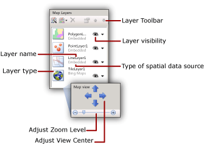
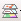
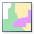
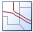

# Add, change, or delete a map or map layer in a Power BI paginated report (Power BI Report Builder)

[!INCLUDE [applies-yes-report-builder-no-desktop](../../includes/applies-yes-report-builder-no-desktop.md)]

  A map is a collection of layers. When you add a map to a Power BI paginated report, you define the first layer. You can create additional layers by using the map layer wizard.  
  
 The easiest way to add, remove, or change options for a layer is to use the map layer wizard. You can also change options manually from the Map pane. To display the **Map** pane, select in the map on the report design surface. The following figure displays the parts of the pane:  
  
   
  
 Map layers are drawn from bottom to top in the order that they appear in the Map pane. In the previous figure, the tile layer is drawn first and the polygon layer is drawn last. Layers that are drawn later might hide map elements on layers that are drawn earlier. You can change the order of layers by using the arrow keys on the Map pane toolbar. To show or hide layers, toggle the visibility icon. You can change the transparency of a layer on the **Visibility** page of the **Layer Data** properties dialog box.  
  
The following table displays the toolbar icons for the **Map** pane.  

|Symbol|Description|When to use|  
|------------|-----------------|-----------------|  
||Map Layer Wizard|To add a layer by using a wizard, select **New layer wizard**.|  
||Add Layer|To manually add a layer, select **Add Layer**, and then select the type of map layer to add.|  
||Polygon Layer|Add a map layer that displays areas or shapes that are based sets of polygon coordinates.|  
||Line Layer|Add a map layer that displays paths or routes that are based on sets of line coordinates.|  
||Point Layer|Add a map layer that displays locations that are based on sets of point coordinates.|  
||Tile Layer|Add a map layer that displays Bing Map tiles that correspond to the current map view area that is defined by the viewport.|  
  
 At the bottom of the Map pane is the Map view area. To change the center or zoom options for the map, use the arrow keys to adjust the view center and the slider to adjust the zoom level.  
  
 For more information about layers, see [Maps (Power BI Report Builder)](maps-report-builder.md).  
  
##   Add a layer from the map layer wizard  
  
- From the Ribbon, on the **Insert** menu, select **Map**, and then select **Map Wizard.** The wizard enables you to add a layer to the existing map. Most wizard pages are identical between the map wizard and the map layer wizard.  
  
     For more information, see [Map Wizard and Map Layer Wizard (Power BI Report Builder)](map-wizard-map-layer-wizard-report-builder.md).  
  
##   Change options for a layer by using the map layer wizard  
  
- Run the map layer wizard. This wizard enables you to change options for a layer that you created by using the map layer wizard. In the Map pane, right-click the layer, and on the toolbar, select the layer wizard button ().  
  
     For more information, see [Map Wizard and Map Layer Wizard (Report Builder)](map-wizard-map-layer-wizard-report-builder.md).  
  
##   Add a point, line, or polygon layer from the Map pane toolbar  
  
1. Select the map until the Map pane appears.  
  
1. On the toolbar, select the **Add Layer** button, and from the drop-down list, select the type of layer that you want to add: **Point**, **Line**, or **Polygon**.  
  
    > [!NOTE]  
    >  Although you can add a map layer and configure it manually, we recommend that you use the map layer wizard to add new layers. To launch the wizard from the Map pane toolbar, select the layer wizard button :::image type="icon" source="media/icon-map-layer-wizard.gif" border="false":::.  
  
1. Right-click the layer, and then select **Layer Data**.  
  
1. In **Use spatial data from**, select the source of spatial data. Options vary based on your selection.  
  
     If you want to visualize analytical from your report on this layer, do the following:  
  
    1. Select **Analytical data**.  
  
    1. In **Analytical dataset**, select the name of the dataset that contains analytical data and the match fields to build a relationship between analytical and spatial data.  
  
    1. Select **Add**.  
  
    1. Type the name of the match field from the spatial dataset.  
  
    1. Type the name of the match field from the analytical dataset.  
  
     For more information about linking spatial and analytical data, see [Customize the Data and Display of a Map or Map Layer (Power BI Report Builder)](/sql/reporting-services/report-design/customize-the-data-and-display-of-a-map-or-map-layer-report-builder-and-ssrs).  
  
1. Select **OK**.
  
##   Filter analytical data for the layer  
  
1. Select the map until the Map pane appears.  
  
1. Right-click the layer in the Map pane, and then select  **Layer Data**.  
  
1. Select **Filters**.  
  
1. Define a filter equation to limit the analytical data that is used in the map display. For more information, see [Filter Equation Examples (Power BI Report Builder)](/sql/reporting-services/report-design/filter-equation-examples-report-builder-and-ssrs).  
  
##   Control point properties for a point layer or for polygon center points  
  
- Select **General** on the **Map Point Properties** dialog box to change label, tooltip, and marker type options for the following map elements:  
  
    - All dynamic or embedded points on a point layer. Color rules, size rules, and marker type rules for points override these options. To override options for a specific embedded point, use the [Map Embedded Point Properties Dialog Box, Marker](maps-report-builder.md) page.  
  
    - The center point for all dynamic or embedded polygons on a polygon layer. Color rules, size rules, and marker type rules for center points override these options. To override options for a specific center point, use the [Map Embedded Point Properties Dialog Box, Marker](maps-report-builder.md) page.  
  
##   Specify embedded data as a source of spatial data  
  
1. Select the map until the Map pane appears.  
  
1. Right-click the layer, and then select **Layer Data**.  
  
1. In **Use spatial data from**, select **Data embedded in report**.  
  
1. To load map elements from an existing report, select **Browse**, point to the file, and then select **Open**. The map elements are embedded in this report definition. The spatial data that you point to must match the layer type. For example, for a point layer, you must point to spatial data that specifies sets of point coordinates.  
  
1. In **Spatial field**, specify the name of the field that contains spatial data. You might need to determine this name from the source of spatial data.  
     
1. Select **OK**.

##   Specify a report dataset field as a source of spatial data  
  
1. Select the map until the Map pane appears.  
  
1. Right-click the layer, and then select **Layer Data**.  
  
1. In **Use spatial data from**, select **Spatial field in a dataset**.  
  
1. In **Dataset name**, select the name of a dataset in the report that contains that spatial data that you want.  
  
1. In **Spatial field name**, select the name of the field in the dataset that contains spatial data.  
  
1. Select **OK**.
  
##   Add a tile layer  
  
1. Select the map until the Map pane appears.  
  
1. On the toolbar, select the **Add Layer** button, and from the drop-down list, select **Tile Layer**.  
  
    > [!NOTE]  
    >  For more information about the use of Bing map tiles in your report, see [Additional Terms of Use](https://go.microsoft.com/fwlink/?LinkId=151371).  
  
1. Right-click the tile layer in the Map pane, and then select **Tile Properties**.  
  
1. In **Tile options**, select a tile style. If the Bing map tiles are available, the layer on the design surface updates with the style that you select.  
  
    > [!NOTE]  
    >  A tile layer can also be added when you add a polygon, line, or point layer in the Map or Map Layer wizard. On the **Choose spatial data and map view options** page, select the option **Add a Bing Maps background for this map view**.  
  
##   Change the drawing order of a layer  
  
1. Select the map until the Map pane appears.  
  
1. Select the layer in the Map pane to select it.  
  
1. On the Map pane toolbar, select the up or down arrow to change the drawing order of each layer.  
  
##   Change the transparency of a polygon, line, or point layer  
  
1. Select the map until the Map pane appears.  
  
1. Right-click the layer, and then select **Layer Data**.  
  
1. Select **Visibility**.  
  
1. In **Transparency options**, type a value that represents the percentage transparency, for example, **40**. Zero (0) % transparency means that the layer is opaque. 100% transparency means that you will not see the layer in the report.  
  
1. Select **OK**.
  
##   Change the transparency of a tile layer  
  
1. Select the map until the Map pane appears.  
  
1. Right-click the layer, and then select **Tile Properties**.  
  
1. Select **Visibility**.  
  
1. In **Transparency options**, type a value that represents the percentage transparency, for example, **40**.  
  
1. Select **OK**.
  
##   Specify a secure connection for a tile layer  
  
1. Select the map until the Map pane appears.  
  
1. In the Map pane, select the tile layer to select it. The Properties pane displays the tile layer properties.  
  
1. In the Properties pane, set UseSecureConnection to **True**.  
  
 The connection for the Bing Maps Web service will use the HTTP SSL service to retrieve Bing map tiles for this layer. Transport Layer Security (TLS) was previously known as Secure Sockets Layer (SSL).
  
##   Specify the language for tile labels  
  
- By default, for tile styles that display labels, the language is determined from the default locale for Report Builder. You can customize the language setting for tile labels in the following ways.  
  
    - Select the map outside the viewport to select the map. In the Properties pane, for the TileLanguage property, select a culture value from the drop-down list.   
    - Select the report background to select the report. In the Properties pane, from for the Language property, select a culture value from the drop-down list.  

     The order of precedence for setting the tile label language is: report property Language, default locale for Report Builder, and map property TileLanguage.  
  
##   Conditionally hide a layer based on viewport zoom level  
  
Set **Visibility** options to control the display for a map layer.  
  
1. In the Map Layers pane, right-click a layer to select it, and on the Map Layers toolbar, select Properties to open **Map Layer Properties**.   
1. Select **Visibility**.  
1. In Layer visibility, select **Show or hide based on zoom value**.  
1. Enter minimum and maximum zoom values for when you display the layer.  
1. Optional. Enter a value for transparency.  
  
    You can also conditionally hide the layer. For more information, see [Hide an Item (Power BI Report Builder)](/sql/reporting-services/report-builder/hide-an-item-report-builder-and-ssrs).  
  
## Related content

- [Maps (Power BI Report Builder)](maps-report-builder.md)
- [Troubleshoot Map Reports (Power BI Report Builder)](troubleshoot-reports-map-reports-report-builder.md)  
