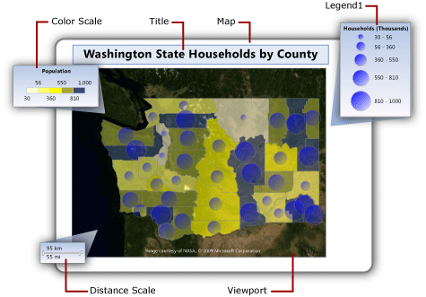

# Change map legends, color scale, and associated rules in a paginated report (Power BI Report Builder)

[!INCLUDE [applies-yes-report-builder-no-desktop](../../includes/applies-yes-report-builder-no-desktop.md)]

In a Power BI paginated report, a map can contain map legends, a color scale, and a distance scale. These parts of a map help users interpret the data visualization on the map.  
  
Legends include the following parts of a map:  
  
-   **Map legend** Displays a guide to help interpret the analytical data that varies the display of map elements on a map layer. A map can have multiple legends. For each map layer, you A specify which legend to use. A legend can provide a guide to more than one map layer.  
  
-   **Color scale** Displays a guide to help interpret colors on the map. A map has one color scale. Multiple layers can provide the data for the color scale.  
  
-   **Distance scale** Displays a guide to help interpret the scale of the map. A map has one distance scale. The current map viewport zoom value determines the distance scale.  
  
   
  
##   Change the position of a legend relative to the viewport  
  
  
1.  In Design view, right-click the legend and open the _\<report item>_**Properties** page.  
  
2.  In **Position**, select the location that specifies where to display the legend relative to the viewport.  
  
3.  To display the legend outside the viewport, select **Show \<report item> outside viewport**.  
  
4.  Select **OK**.
  
    > [!NOTE]  
    >  In preview, map legends and the color scale appear only when there are results from the rules related to that legend. If there are no items to display, the legend does not appear in the rendered report.  
  
##   Change the layout of a map legend  
  
  
1.  In Design view, right-click the legend and open the **Legend Properties** page.  
  
2.  In **Legend layout**, select the table layout that you want to use for the legend. As you select different options, the layout on the design surface changes.  
  
3.  Select **OK**.
  
##   Show or hide a map legend title  
  
  
-   Right-click the map legend on the design surface, and then select **Show Legend Title**.  
  
##   Show or hide a color scale title  
  
  
-   Right-click the color scale on the design surface, and then select **Show Color Scale Title**.  
  
##   Move items out of the first legend  
 Create as many additional legends as you need and then update the rules for each map layer specify which legend to display the rule results in.  
  
#### Create a new legend  
  
-   In Design view, right-click the map outside the map viewport, and then select **Add Legend**.  
  
     A new legend appears on the map.  
  
#### Display rule results in a legend  
  
1.  In Design view, select the map until the Map pane appears.  
  
2.  Right-click the layer that has the data that you want and then select _\<map element type>_**Color Rule**.  
  
3.  Select **Legend**.  
  
4.  In the **Show in this legend** drop-down list, select the name of the legend to display the rule results in.  
  
5.  Select **OK**.
  
##   Vary map element colors based on a template style  

  
1.  In Design view, select the map until the Map pane appears.  
  
2.  Right-click the layer that has the data that you want and then select _\<map element type>_**Color Rule**.  
  
3.  Select **Apply template style**.  
  
     A template style specifies font, border style, and color palette. Each map element is assigned a different color from the color palette for the theme that was specified in the Map Wizard or Map Layer Wizard. This is the only option that applies to layers that do not have associated analytical data.  
  
4.  Select **OK**.
  
##   Vary map element colors based on color palette  
  
  
1.  In Design view, select the map until the Map pane appears.  
  
2.  Right-click the layer that has the data that you want, and then select _\<map element type>_**Color Rule**.  
  
3.  Select **Visualize data by using color palette**.  
  
     This option uses a built-in or custom palette that you specify. Based on related analytical data, each map element is assigned a different color or shade of color from the palette.  
  
4.  In **Data field**, type the name of the field that contains the analytical data that you want to visualize by color.  
  
5.  In **Palette**, from the drop-down list, select the name of the palette to use.  
  
6.  Select **OK**.
  
##   Vary map element colors based on color ranges  

  
1.  In Design view, select the map until the Map pane appears.  
  
2.  Right-click the layer that has the data that you want, and then select _\<map element type>_**Color Rule**.  
  
3.  Select **Visualize data by using color ranges**.  
  
     This option, combined with the start, middle, and end colors that you specify on this page and the options that you specify on the **Distribution** page, divide the related analytical data into ranges. The report processor assigns the appropriate color to each map element based on its associated data and the range that it falls into.  
  
4.  In **Data field**, type the name of the field that contains the analytical data that you want to visualize by color.  
  
5.  In **Start color**, specify the color to use for the lowest range.  
  
6.  In **Middle color**, specify the color to use for the middle range.  
  
7.  In **End color**, specify the color to use for the highest range.  
  
8.  Select **OK**.
  
##   Vary map element colors based on custom colors  
  
 
1.  In Design view, select the map until the Map pane appears.  
  
2.  Right-click the layer that has the data that you want, and then select _\<map element type>_**Color Rule**.  
  
3.  Select **Visualize data by using custom colors**.  
  
     This option uses the list of colors that you specify. Based on related analytical data, each map element is assigned a color from the list. If there are more map elements than colors, no color is assigned.  
  
4.  In **Data field**, type the name of the field that contains the analytical data that you want to visualize by color.  
  
5.  In **Custom colors**, select **Add** to specify each custom color.  
  
6.  Select **OK**.
  
##   Set distribution options for a legend  
  
  
1.  In Design view, select the map until the Map pane appears.  
  
2.  Right-click the layer that has the data that you want, and then select _\<map element type>_**Color Rule**.  
  
3.  Select the **Visualize data by using** \<rule type> option. To use distribution options, you must create ranges on the **Distribution** page based on analytical data that is associated with the layer.  
  
4.  Select **Distribution**.  
  
5.  Select one of the following distribution types:  
  
    -   **EqualInterval**. Specifies ranges that divide the data into equal range intervals.  
  
    -   **EqualDistribution**. Specifies ranges that divide that data so that each range has an equal number of items.  
  
    -   **Optimal**. Specifies ranges that automatically adjust distribution to create balanced subranges.  
  
    -   **Custom**. Specify your own number of ranges to control the distribution of values.  
  
     For more information about distribution options, see [Vary Polygon, Line, and Point Display by Rules and Analytical Data &#40;Power BI Report Builder&#41;](/sql/reporting-services/report-design/vary-polygon-line-and-point-display-by-rules-and-analytical-data).  
  
6.  In **Number of subranges**, type the number of subranges to use. When the distribution type is **Optimal**, the number of subranges is automatically calculated.  
  
7.  In **Range start**, type a minimum range value. All values less than this number are the same as the range minimum.  
  
8.  In **Range end**, type a maximum range value. All values larger than this number are the same as the range maximum.  
  
9. Select **OK**.
  
##   Change the contents of a rule legend  

  
1.  In Design view, select the map until the Map pane appears.  
  
2.  Right-click the layer that has the data that you want, and then select _\<map element type>_**Rule**.  
  
3.  Verify that **Visualize data by using** \<*rule type*> is selected.  
  
4.  In **Data field**, verify that the analytical data that you are visualizing on the layer is selected.  
  
    > [!NOTE]  
    >  If no fields appear in the drop-down list, right-click the layer, and then select **Layer Data** to open the Map Layer Data Properties Dialog Box, Analytical Data page and verify that you have specified analytical data for this layer.  
  
5.  Select **Legend**.  
  
6.  In **Show in this legend**, select the map legend to use to display the rule results.  
  
7.  Select **OK**.
  
##   Change the contents of the color scale  
  
  
1.  In Design view, select the map until the Map pane appears.  
  
2.  Right-click the layer that has the data that you want, and then select _\<map element type>_**Color Rule**.  
  
3.  Select the color rule option to use. To display items in a map legend or color scale, you must select one of the **Visualize data by using** \<rule type> options.  
  
4.  In **Data field**, verify that the analytical data that you are visualizing on the layer is selected.  
  
    > [!NOTE]  
    >  If no fields appear in the drop-down list, right-click the layer, and then select **Layer Data** to open the Map Layer Data Properties Dialog Box, Analytical Data page and verify that you have specified analytical data for this layer.  
  
5.  Select **Legend**.  
  
6.  In **Color scale options**, select **Show in color scale** to display the rule results in the color scale. You can specify this option for more than one color rule.  
  
7.  Select **OK**.
  
##   Remove all items from a legend  

  
1.  In Design view, select the map until the Map pane appears.  
  
2.  Right-click the layer that has the data that you want, and then select _\<map element type>_**Rule**.  
  
3.  Select **Legend**.  
  
4.  Select **OK**.
  
##   Change the format of content in a legend  
 
 Set legend options for the rule that is associated with the map legend using the below steps:  
  
  
1.  In Design view, select the map until the Map pane appears.  
  
2.  Right-click the layer that has the data that you want, and then select _\<map element type>_**Rule**.  
  
3.  Select **Legend**.  
  
4.  **Legend text** displays keywords that specify which data appears in the legend. Use map keywords and custom formats to help control the format of legend text. For example, #FROMVALUE {C2} specifies a currency format with two decimal places. For more information, see [Vary Polygon, Line, and Point Display by Rules and Analytical Data &#40;Power BI Report Builder&#41;](/sql/reporting-services/report-design/vary-polygon-line-and-point-display-by-rules-and-analytical-data).  
  
5.  Select **OK**.
  
## Related content

- [Maps &#40;Power BI Report Builder&#41;](maps-report-builder.md)   
- [Add, Change, or Delete a Map or Map Layer (Power BI Report Builder)](add-change-delete-map-map-layer-report-builder.md)
- [Customize the display of a map or map layer in a paginated report (Power BI Report Builder)](customize-data-display-map-map-layer-report-builder.md)
- [Troubleshoot Reports: Map Reports &#40;Power BI Report Builder&#41;](troubleshoot-reports-map-reports-report-builder.md)
- [Map Wizard and Map Layer Wizard &#40;Power BI Report Builder&#41;](map-wizard-map-layer-wizard-report-builder.md)  
  
  
