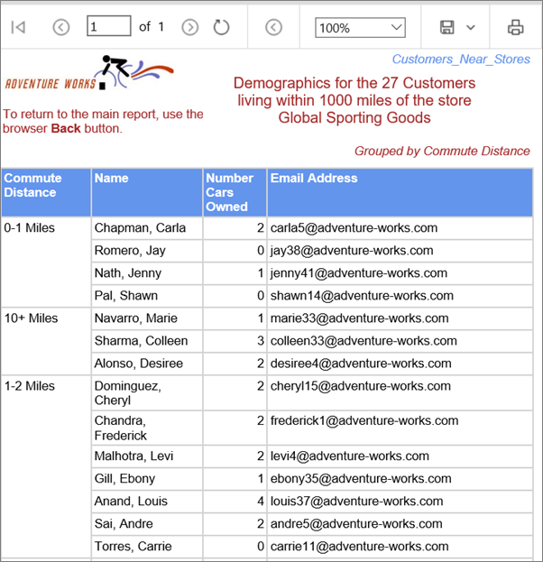
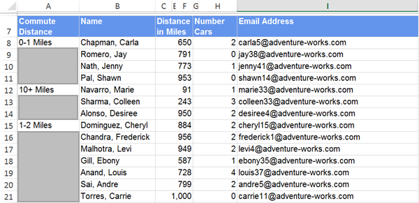
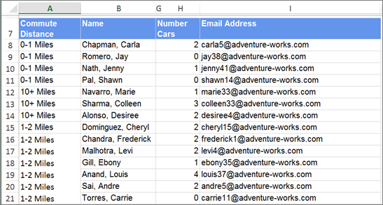

# Export a Power BI paginated report to Microsoft Excel (Power BI Report Builder)

[!INCLUDE [applies-yes-report-builder-no-desktop](../../includes/applies-yes-report-builder-no-desktop.md)]

The Excel rendering extension renders a Power BI paginated report to the Microsoft Excel format (.xlsx). With the Excel rendering extension, the width of columns in Excel more accurately reflects the width of columns in reports.  
  
 The format is Office Open XML. The content type of files generated by this renderer is **application/vnd.openxmlformats-officedocument.spreadsheetml.sheet** and the file extension is .xlsx.  
  
 You can change some default settings for this renderer by changing the device information settings. For more information, see [Excel device information settings](../device-info/excel-device-information-settings.md).  
  
 See [Export reports &#40;Power BI Report Builder&#41;](export-reports-report-builder.md) for details on how to export to Excel.  
  
> [!IMPORTANT]  
>  When you define a parameter of type **String**, the user is presented with a text box that can take any value. If a report parameter is not tied to a query parameter and the parameter values are included in the report, it is possible for a report user to type expression syntax, script, or a URL into the parameter value, and render the report to Excel. If another user then views the report and selects the rendered parameter contents, the user may inadvertently execute the malicious script or link.  
>   
>  To mitigate the risk of inadvertently running malicious scripts, open rendered reports only from trusted sources. For more information about securing reports, see [Secure reports and resources](/sql/reporting-services/security/secure-reports-and-resources).  
  
##   Excel limitations  
 Microsoft Excel places limitations on exported reports due to the capabilities of Excel and its file formats. The most significant are the following:  
  
-   The maximum column width is limited to 255 characters or 1726.5 points. The renderer does not verify that the column width is less than the limit.  
  
-   The maximum number of characters in a cell is limited to 32,767. If this is exceeded, the renderer displays an error message.  
  
-   The maximum row height is 409 points. If the contents of the row cause the row height to increase beyond 409 points, the Excel cell shows a partial amount of text up to 409 points. The rest of the cell contents is still within the cell (up to Excel's max number of characters of 32,767).

-  Because the maximum row height is 409 points, if the defined height of the cell in the report is something larger than 409 points, Excel splits the cell contents into multiple rows.
  
-   The maximum number of worksheets is not defined in Excel, but external factors, such as memory and disk space, might cause limitations to be applied.  
  
-   In outlines, Excel permits up to seven nested levels only.  
  
-   If the report item that controls whether another item is toggled isn't in the previous or next row or column of the item being toggled, the outline is disabled also.  
  
 For more details about Excel limitations, see [Excel specifications and limits](https://support.microsoft.com/en-us/office/excel-specifications-and-limits-1672b34d-7043-467e-8e27-269d656771c3).  
  
### Text boxes and text  
 The following limitations apply to text boxes and text:  
  
-   Text box values that are expressions are not converted to Excel formulas. The value of each text box is evaluated during report processing. The evaluated expression is exported as the contents of each Excel cell.  
  
-   Text boxes are rendered within one Excel cell. Font size, font face, decoration, and font style are the only formatting that is supported on individual text within an Excel cell.  
  
-   The text effect "Overline" is not supported in Excel.  
  
-   Excel adds a default padding of approximately 3.75 points to the left and right sides of cells. If a text box's padding settings are less than 3.75 points and is just barely wide enough to accommodate the text, the text may wrap in Excel.  
  
    > [!NOTE]  
    >  To work around this issue, increase the width of the text box in the report.  
  
### Images  
 The following limitations apply to images:  
  
-   Background images for report items are ignored because Excel does not support background images for individual cells.  
  
-   The Excel rendering extension only supports the background image of the report body. If a report body background image is displayed in the report, the image is rendered as a worksheet background image.  
  
### Rectangles  
 The following limitation applies to rectangles.  
  
-   Rectangles in report footers are not exported to Excel. However, rectangles in the report body, tablix cells, and so forth are rendered as a range of Excel cells.  
  
### Report headers and footers  
 The following limitations apply to report headers and footers:  
  
-   Excel headers and footers support a maximum of 256 characters including markup. The rendering extension truncates the string at 256 characters.  
  
-   Reporting Services does not support margins on report headers and footers. When exported to Excel, these margin values are set to zero and any header or footer that contains multiple rows of data might not print multiple rows, depending on the printer settings.  
  
-   Text boxes in a header or footer maintain their formatting but not their alignment when exported to Excel. This occurs because leading and trailing spaces are trimmed when the report is rendered to Excel.  
  
### Merging cells  
 The following limitation applies to merging cells:  
  
-   If cells are merged, word-wrap does not work correctly. If any merged cells exist on a row where a text box is rendered with the AutoSize property, autosize will not work.  
  
 The Excel renderer is primarily a layout renderer. Its goal is to replicate the layout of the rendered report as closely as possibly in an Excel worksheet and consequently cells might be merged in the worksheet to preserve the report layout. Merged cells can cause problems because the sort functionality in Excel requires cells to be merged in a very specific way for sort to work properly. For example, Excel requires that the ranges of merged cells have the same size in order to be sorted.  
  
 If it is important that reports exported to Excel worksheets can be sorted, then the following can help you reduce the number of merged cells in your Excel worksheets, which is the common cause for difficulties with Excel sort functionality.  
  
-   Not aligning items left and right is the most common cause of merged cells. Make sure the left and right edges of all report items line up with one another. Making items align and the same width will solve the problem in the majority of cases.  
  
-   Although you align all items precisely, you might find in some rare cases that some columns continue to be merged. This could be caused by internal unit conversion and rounding when the Excel worksheet is rendered. In the report definition language (RDL), you can specify position and size in different measurement units such as inches, pixels, centimeters, and points. Internally the Excel uses points. To minimize conversion and the potential inaccuracy of rounding when converting inches and centimeters to points, consider specifying all measurements in whole points for the most direct results. One inch is 72 points.  
  
### Report row groups and column groups  
 Reports that include row groups or column groups contain empty cells when exported to Excel. Imagine a report that groups rows on commute distance. Each commute distance can contain more than one customer. The following picture shows the report.  
  
   

  
 When the report is exported to Excel, the commute distance appears only in one cell of the Commute Distance column. Depending on the alignment of the text in the report (top, middle, or bottom) the value is in the first, middle, or last cell. The other cells are empty. The Name column that contains customer names has no empty cells. The following picture shows the report after it is exported to Excel. The red cell borders were added for emphasis. The gray boxes are the empty cells. (Neither the red lines nor the gray boxes are part of the exported report.)  
  
   
  
 This means that reports with row groups or column groups require modification after exporting to Excel and before you can display the exported data in pivot table. You must add the group value to cells in which they are missing to make the worksheet a flat table with values in all cells. The following picture shows the updated worksheet.  
  
   
  
 So if you create a report for the specific purpose of exporting it to Excel for further analysis of the report data, consider not grouping on rows or columns in your report.  
  
## Excel renderer  
  
### Current (.xlsx) Excel file renderer  
 In Reporting Services, the defaultExcel renderer is the version compatible with current (.xlsx) Microsoft Excel files. This is the **Excel** option on the **Exporting** menus in the Power BI Services web portal and SharePoint list.  
  
 When you use the default Excel renderer, instead of the earlier Excel 2003 (.xls) renderer, you can install the Microsoft Office Compatibility Pack for Word, Excel, and PowerPoint to allow earlier versions of Excel to open the files that are exported.  
  
  
### Differences between the current (.xlsx) Excel and Excel 2003 renderers  
 Reports, rendered by using the current (.xlsx) Excel or the Excel 2003 renderers are typically identical and only under rare circumstances will you notice differences between the two formats. The following table compares the Excel and the Excel 2003 renderers.  
  
|Property|Excel 2003|Current Excel|  
|--------------|----------------|-------------------|  
|Maximum columns per worksheet|256|16,384|  
|Maximum rows per worksheet|65,536|1,048,576|  
|Number of colors allowed in a worksheet|56 (palette)   If more than 56 colors are used in the report, the rendering extension matches the required color to one of the 56 colors already available in the custom palette.|Approximately 16 million (24-bit color)|  
|ZIP compressed files|None|ZIP compression|  
|Default font family|Arial|Calibri|  
|Default font size|10 pt|11 pt|  
|Default row height|12.75 pt|15 pt|  
  
 Because the report explicitly sets the row height, the default row height affects only rows that are sized automatically upon export to Excel.  
  
##   Report items in Excel  
 Rectangles, subreports, the report body, and data regions are rendered as a range of Excel cells. Text boxes, images, and charts, data bars, sparklines, maps, gauges, and indicators must be rendered within one Excel cell, which might be merged depending on the layout of the rest of the report.  
  
 Images, charts, sparklines, data bars, maps, gauges, indicators, and lines are positioned within one Excel cell but they sit on top of the cell grid. Lines are rendered as cell borders.  
  
 Charts, sparklines, data bars, maps, gauges, and indicators are exported as pictures. The data they depict, such as the value and member labels for a chart, is not exported with them and is not available in the Excel workbook unless it is included in a column or row in a data region within a report.  
  
 If you want to work with chart, sparkline, data bar, maps, gauge, and indicator data, export the report to a .csv file from the report. For more information, see [Exporting to a CSV file &#40;Power BI Report Builder&#41;](export-csv-file-report-builder.md).  
  
## Page sizing  
 The Excel rendering extension uses the page height and width settings to determine what paper setting to define in the Excel worksheet. Excel tries to match the PageHeight and PageWidth property settings to one of the most common paper sizes.  
  
 If no matches are found, Excel uses the default page size for the printer. Orientation is set to Portrait if the page width is less than the page height; otherwise, orientation is set to Landscape.  
  
##   Worksheet tab names  
 When you export a report to Excel, the report pages that were created by page breaks are exported to different worksheets. If you provided an initial page name for the report, each worksheet of the Excel workbook will have this name by default. The name appears on the worksheet tab. However, since each worksheet in a workbook must have a unique name, an integer starting at 1 and incremented by 1 is appended to the initial page name for each additional worksheet. For example, if the initial page name is **Sales report by fiscal year**, the second worksheet would be named **Sales report by fiscal year1**, the third one **Sales report by fiscal year2**, and so forth.  
  
 If all report pages created by page breaks provide new page names, each worksheet will have the associated page name. However, these page names might not be unique. If page names are not unique, the worksheets are named the same way as initial page names. For example, if the page name of two groups is **Sales for NW**, one worksheet tab will have the name **Sales for NW**, and the other **Sales for NW1**.  
  
 If the report provides neither an initial page name, nor page names related to page breaks, the worksheet tabs will have the default names **Sheet1**, **Sheet2**, and so forth.  
  
 Reporting Services provides properties to set on reports, data regions, groups, and rectangles to help you create reports that can be exported to Excel in a way that you want. For more information, see [Pagination in Reporting Services &#40;Power BI Report Builder&#41;](/sql/reporting-services/report-design/pagination-in-reporting-services-report-builder-and-ssrs).  
  
##   Document properties  
 The Excel renderer writes the following metadata to the Excel file.  
  
|Report element properties|Description|  
|-------------------------------|-----------------|  
|Created|Date and time of report execution as an ISO date/time value.|  
|Author|Report.Author|  
|Description|Report.Description|  
|LastSaved|Date and time of report execution as an ISO date/time value.|  
  
##   Page headers and footers  
 Depending on the Device Information SimplePageHeaders setting, the page header can be rendered in two ways: the page header can be rendered at the top of each worksheet cell grid, or in the actual Excel worksheet header section. By default, the header is rendered to the cell grid on the Excel worksheet.  
  
 The page footer is always rendered to the actual Excel worksheet footer section, regardless of the value of the SimplePageHeaders setting.  
  
 Excel header and footer sections support a maximum of 256 characters, including markup. If this limit is exceeded, the Excel renderer removes markup characters starting at the end of the header and/or footer string to reduce the number of total characters. If all markup characters are removed and the length still exceeds the maximum, the string is truncated starting from the right.  
  
### SimplePageHeader settings  
 By default, the Device Information SimplePageHeaders setting is set to **False**; therefore, the page headers are rendered as rows in the report on the Excel worksheet surface. The worksheet rows that contain the headers become locked rows. You can freeze or unfreeze the pane in Excel. If the **Print Titles** option is selected, these headers are automatically set to print on every worksheet page.  
  
 The page header repeats at the top of every worksheet in the workbook except the document map cover sheet if the **Print Titles** option is selected on the Page Layout tab in Excel. If the **Print on first page** or the **Print on last page** option is not selected in the Report Header Properties or Report Footer Properties dialog boxes, the header will not be added to the first or last page respectively.  
  
 Page footers are rendered in the Excel footer section.  
  
 Because of Excel limitations, text boxes are the only type of report item that can be rendered in the Excel header/footer section.  
  
##   Interactivity  
 Some interactive elements are supported in Excel. The following is a description of specific behaviors.  
  
### Show and hide  
 Microsoft Excel has limitations with how it manages hidden and displayed report items when they are exported. Groups, rows, and columns that contain report items that can be toggled are rendered as Excel outlines. Excel creates outlines that expand and collapse rows and columns across the entire row or column which can cause the collapse of report items that are not intended to be collapsed. In addition, Excel's outlining symbols can become cluttered with overlapping outlines. To address these issues, the following outlining rules are applied when using the Excel rendering extension:  
  
-   The report item in the top-left corner that can be toggled can continue to be toggled in Excel. Report items that can be toggled and share vertical or horizontal space with the report item that can be toggled in the top-left corner cannot be toggled in Excel.  
  
-   To determine whether a data region will be collapsible by rows or columns, the position of the report item that controls the toggling and the position of the report item that is toggled are determined. If the item controlling the toggling appears before the item to be toggled, the item is collapsible by rows. Otherwise, the item is collapsible by columns. If the item controlling the toggling appears beside and above the area to be toggled equally, the item is rendered with row collapsible by rows.  
  
-   To determine where the subtotals are placed in the rendered report, the rendering extension examines the first instance of a dynamic member. If a peer static member appears immediately above it, the dynamic member is assumed to be the subtotals. Outlines are set to indicate that this is summary data. If there are no static siblings of a dynamic member, the first instance of the instance is the subtotal.  
  
-   Due to an Excel limitation, outlines can be nested up to seven levels only.  
  
### Document map  
 If any document map labels exist in the report, a document map is rendered. The document map is rendered as an Excel cover worksheet inserted at the first tab position in the workbook. The worksheet is named **Document map**.  
  
 The text displayed in the document map is determined by the report item's or group's DocumentMapLabel property. Document map labels are listed in the order that they appear in the report, starting at the first row, in the first column. Each document map label cell is indented the number of levels deep it appears in the report. Each level of indentation is represented by placing the label in a subsequent column. Excel supports up to 256 levels of outline nesting.  
  
 The document map outline is rendered as a collapsible Excel outline. The outline structure matches the nested structure of the document map. The expand and collapse state of the outline starts at the second level.  
  
 The root node of the map is the report name, the \<*reportname*>.rdl, and it is not interactive. The document map links font is Arial, 10 pt.  
  
### Drillthrough links  
 Drillthrough links that appear in text boxes are rendered as Excel hyperlinks in the cell in which the text is rendered. Drillthrough links for images and charts are rendered as Excel hyperlinks on the image when rendered. When selected, the drillthrough link opens the client's default browser and navigates to the HTML view of the target.  
  
### Hyperlinks  
 Hyperlinks that appear in text boxes are rendered as Excel hyperlinks in the cell in which the text is rendered. Hyperlinks for images and charts are rendered as Excel hyperlinks on the image when rendered. When selected, the hyperlink opens the client's default browser and navigates to the target URL.  
  
### Interactive sorting  
 Excel does not support interactive sort.  
  
### Bookmarks  
 Bookmark links in text boxes are rendered as Excel hyperlinks in the cell in which the text is rendered. Bookmark links for images and charts are rendered as Excel hyperlinks on the image when rendered. When selected, the bookmark goes to the Excel cell in which the bookmarked report item is rendered.  
  
##   Changing reports at run-time  
 If a report must render to multiple formats and it is not possible to create a report layout that renders the way you want in all required formats, then you might consider using the value in the RenderFormat built-in global to conditionally change the report appearance at run time. This way you can hide or show report items depending on the renderer used to get the best results in each format. For more information, see [Built-in globals and users references &#40;Power BI Report Builder&#41;](/sql/reporting-services/report-design/built-in-collections-built-in-globals-and-users-references-report-builder).  
  
## Related content

- [Pagination in Reporting Services &#40;Power BI Report Builder&#41;](/sql/reporting-services/report-design/pagination-in-reporting-services-report-builder-and-ssrs)   
- [Rendering Behaviors &#40;Power BI Report Builder&#41;](/sql/reporting-services/report-design/rendering-behaviors-report-builder-and-ssrs)   
- [Interactive Functionality for Different Report Rendering Extensions &#40;Power BI Report Builder&#41;](/sql/reporting-services/report-builder/interactive-functionality-different-report-rendering-extensions)   
- [Rendering Report Items &#40;Power BI Report Builder&#41;](/sql/reporting-services/report-design/rendering-report-items-report-builder-and-ssrs)   
- [Tables, Matrices, and Lists &#40;Power BI Report Builder&#41;](../report-builder-tables-matrices-lists.md)  
  
  
