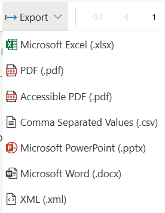

# Export Power BI paginated reports

[!INCLUDE [applies-yes-report-builder-no-desktop-yes-service](../../includes/applies-yes-report-builder-no-desktop-yes-service.md)]

You can export a Power BI paginated report to another file format, such as PowerPoint, Image, PDF, [Accessible PDF](/power-bi/report-server/rendering-extension-support) or Microsoft Word. You can export your report from Power BI  Report Builder (Accessible PDF is supported only on Power BI service).  
  
 Export a report to do one of the following tasks:  
  
-   **Work with the report data in another application.** For example, you can export your report to Excel and then continue to work with the data in Excel.  
  
-   **Print the report in a different format.** For example, you can export the report to the PDF file format and then print it.  
  
-   **Save a copy of the report as another file type.** For example, you can export a report to Word and save it, creating a copy of the report.  
  
    
 Report pagination might be affected when you export a report to a different format. When you preview a report, you are viewing the report as it is rendered by the HTML rendering extension, which follows soft-page break rules. When you export a report to a different file format, such as Adobe Acrobat (PDF), pagination is based on the physical page size, which follows hard-page break rules. Pages can also be separated by logical page breaks that you add to a report, but the actual length of a page varies based on the renderer type that you use. To change the pagination of your report, you must understand the pagination behavior of the rendering extension you choose. You might need to adjust the design of your report layout for this rendering extension. For more information see, [Page layout and rendering](/sql/reporting-services/report-design/page-layout-and-rendering-report-builder-and-ssrs).  
  

##  Export a report from Power BI Report Builder

1.  Run or Preview the report.  
  
2.  On the ribbon, select **Export**.  
  
       
  
3.  Select the format that you want to use.  
  
     The **Save As** dialog opens. By default, the file name is that of the report that you exported. Optionally, you can change the file name.  
  
##   Export a report from the Power BI service  
  
1.  From the Power BI service **Home** page, navigate to the report that you want to export.  
  
2.  Select the report to render and preview the report.  
  

3.  On the Report Viewer toolbar, select the **Export** drop-down arrow.  
  
      
  
4.  Select the format that you want to use.  
  
5.  Select **Export**. A dialog appears asking you if you want to open or save the file.  
  
6.  To view the report in the selected export format, select **Open**.  
  
     \- or -  
  
     To immediately save the report in the selected export format, select **Save**.  
  
     Using the application that is associated with the format that you chose, the report is either displayed or saved. If you select **Save**, you're prompted for a location where you can save your report.   
       
##   Rendering extension types  
 There are three types of Reporting Services rendering extensions:  
  
-   **Data renderer extensions** Data rendering extensions strip all formatting and layout information from the report and display only the data. The resulting file can be used to import the raw report data into another file type, such as Excel, another database, an XML data message, or a custom application. Data renderers do not support page breaks.  
  
     The following data rendering extensions are supported: CSV and XML.  
  
-   **Soft page-break renderer extensions** Soft page-break rendering extensions maintain the report layout and formatting. The resulting file is optimized for screen-based viewing and delivery, such as on a Web page or in the **ReportViewer** controls.  
  
     The following soft page-break rendering extensions are supported: Microsoft Excel, Microsoft Word, and Web archive (MHTML).  Web archive (MHTML) is supported only on Power BI Report Builder.
  
-   **Hard page-break rendering extensions** Hard page-break renderer extensions maintain the report layout and formatting. The resulting file is optimized for a consistent printing experience, or to view the report online in a book format.  
  
     The following hard page-break rendering extensions are supported: TIFF and PDF.  
  
##   Formats you can export while viewing reports  
 Reporting Services provides rendering extensions that render reports in different formats. You should optimize the report design for your chosen file format.  The following table lists the formats you can export from the user interface. There are additional formats you can use with Reporting Services subscriptions or if you are exporting from URL access.  See the section [Other ways of exporting reports](#OtherWaysExportingReports)in this topic.  
  
|Format|Rendering extension type|Description|  
|------------|------------------------------|-----------------|  
|Acrobat (PDF) file|Hard page-break|The PDF rendering extension renders a report to files that can be opened in Adobe Acrobat and other third-party PDF viewers that support PDF 1.3. Although PDF 1.3 is compatible with Adobe Acrobat 4.0 and later, Reporting Services supports Adobe Acrobat 6 or later. The rendering extension does not require Adobe software to render the report. However, PDF viewers such as Adobe Acrobat are required for viewing or printing a report in PDF format.   For more information, see [Exporting to a PDF file](export-pdf-file-report-builder.md).|  
|CSV|Data|The Comma-Separated Value (CSV) rendering extension renders reports as a flattened representation of data from a report in a standardized, plain-text format that is easily readable and exchangeable with many applications.   For more information, see [Exporting to a CSV File](export-csv-file-report-builder.md).|  
|EXCELOPENXML|Soft page-break|Displayed as "Excel" in the export menus when reviewing reports. The Excel rendering extension renders a report as an Excel document (.xlsx) that is compatible with Microsoft Excel 2013.  For more information, see [Exporting to Microsoft Excel](export-microsoft-excel-report-builder.md).|  
|PowerPoint|Hard page-break|The PowerPoint  rendering extension renders a report as a PowerPoint document  (.pptx) that is compatible with PowerPoint 2013.|  
|TIFF file|Hard page-break|The Image rendering extension renders a report to a bitmap or metafile. By default, the Image rendering extension produces a TIFF file of the report, which can be viewed in multiple pages. When the client receives the image, it can be displayed in an image viewer and printed.   The Image rendering extension can generate files in any of the formats supported by GDI+: BMP, EMF, EMFPlus, GIF, JPEG, PNG, and TIFF.   For more information, see [Exporting to an Image file](export-image-file-report-builder.md). The Image rendering extension is not exposed on the Power BI service.|  
|Web archive|Soft page-break|The HTML rendering extension renders a report in HTML format. The rendering extension can also produce fully formed HTML pages or fragments of HTML to embed in other HTML pages. All HTML is generated with UTF-8 encoding.   The HTML rendering extension is the default rendering extension for reports that are previewed in Power BI Report Builder and viewed in a browser, including when run in the Power BI service.   For more information, see [Rendering to HTML](/sql/reporting-services/report-builder/rendering-to-html-report-builder-and-ssrs). Web archive (MHTML) is supported only on Power BI Report Builder|  
|WORDOPENXML|Soft page-break|Displayed as "Word" in the export menu when viewing reports. The Word rendering extension renders a report as a Word document (.docx) that is compatible with Microsoft Word 2013.  For more information, see [Exporting to Microsoft Word](export-microsoft-word-report-builder.md).|  
|XML|Data|The XML rendering extension returns a report in XML format. The schema for the report XML is specific to the report, and contains data only. Layout information is not rendered and pagination is not maintained by the XML rendering extension. The XML generated by this extension can be imported into a database, used as an XML data message, or sent to a custom application.   For more information, see [Exporting to XML](export-xml-report-builder.md).|  
  
Power BI Report Builder provides additional features to help you create reports that work well in other formats. Page breaks on tablix data regions (table, matrix, and list), groups, and rectangles give you better control of report pagination. Report pages, delimited by page breaks, can have different page names and reset page numbering. By using expressions, the page names and page numbers can be dynamically updated when the report is run. For more information, see [Pagination in paginated reports (Power BI Report Builder)](/sql/reporting-services/report-design/pagination-in-reporting-services-report-builder-and-ssrs).  
  
In addition, you can use the RenderFormat built-in global to conditionally apply different report layouts for different renderers. For more information, see [Built-in globals and users rReferences](/sql/reporting-services/report-design/built-in-collections-built-in-globals-and-users-references-report-builder)

##   Troubleshoot exported reports  
 Sometimes your reports look different or do not work the way you want after you export them to a different format. This occurs because certain rules and limitations might apply to the renderer. You can address many limitations by considering them when you create the report. You might need to use a slightly different layout in your report, carefully align items within the report, confine report footers to a single line of text, and so forth.  

### Arabic numbers and dates

If your report contains Unicode text with Arabic numbers or dates in Arabic, the dates and numbers *don't* render correctly when you export the report to any of the following formats or print the report.  
  
-   PDF  
-   Word  
-   Excel  
-   Image/TIFF  
  
 If you export the report to HTML, the dates and numbers *do* render correctly.  
 
 ### Exporting reports with embedded or external images
 
When you export a paginated report in PowerPoint format, if the report has an embedded or external image in the background, the image doesn't come up in the exported file. The same is true when you export to other formats like PDF. 

##   Other ways to export reports  
 Exporting a report is an on-demand task that you perform when the report is open in the Power BI Report Builder. If you want to automate an export operation (for example, to export a report and send as email attachment on a recurring schedule), create a subscription that delivers the report to a shared folder.   
  
 Reports previewed in the reporting tools or opened in a browser application such as the Power BI service are always first rendered in HTML. You cannot specify a different rendering extension as the default for viewing. You can, however, create a subscription that produces a report in the rendering format you want for subsequent delivery to an e-mail inbox. 
  
 You can also access a report through a URL that specifies a rendering extension as a URL parameter and render the report directly to the specified format without rendering it in HTML first.   
 For more information, see [Export a Paginated Report using URL access](../report-builder-url-parameters.md).  

## Related content

- [Controlling Page Breaks, Headings, Columns, and Rows &#40;Power BI Report Builder&#41;](../report-design/control-page-breaks-headings-columns-rows-report-builder.md)   
- [Finding, Viewing, and Managing Reports &#40;Power BI Report Builder &#41;](/sql/reporting-services/report-builder/finding-viewing-and-managing-reports-report-builder-and-ssrs)   
- [Print Reports &#40;Power BI Report Builder &#41;](/sql/reporting-services/report-builder/print-reports-report-builder-and-ssrs)   
- [Saving Reports &#40;Power BI Report Builder&#41;](/sql/reporting-services/report-builder/saving-reports-report-builder)  

