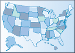
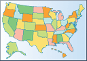
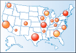
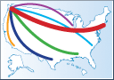
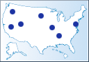
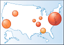

# Plan for adding a map to a Power BI paginated report (Power BI Report Builder)

[!INCLUDE [applies-yes-report-builder-no-desktop](../../includes/applies-yes-report-builder-no-desktop.md)]

Good reports present information that leads to actions or insights. To present analytical data such as sales totals or demographics against a geographic background, you can add a map to your Power BI paginated report. A map can contain multiple layers, where each layer displays map elements that are defined by a specific type of spatial data: points that represent locations, lines that represent routes, or polygons that represent areas. You can associate your analytical data with map elements on each layer.  

##   Specify the purpose of the map  
 Good report design provides information that help users take actions to address issues. To create a useful, easily understood map display, decide what questions you want the map to help answer. For example, on a map you can visualize the following types of data to identify market opportunities:  
  
- Relative sales for each store.  
  
- Sales categorized by customer demographics, based on customer location relative to store locations.  
  
- Comparative sales or other financial data by sales territory.  
  
- Comparative sales for different discount strategies across multiple stores.  
  
 After you identify the purpose of the map display, you must analyze what data you need. Analytical data comes from report datasets. Location data comes from spatial data sources that you must specify.  
  
##   Specify the spatial and analytical data  
 You must specify which spatial and analytical data that you need.  
  
 Analytical data comes from a report dataset, from sample data included with a map from the map gallery, or from analytical data included with spatial data in an ESRI Shapefile.  
  
 Spatial data comes in three forms: points, lines, and polygons.  
  
- **Points.** Points specify locations, for example, a city or an address for a store, restaurant, or convention center. For every location that you want to display on a map, you must provide the spatial data for that location. After you add points to a map, you can display a marker at the point location and vary the marker type, size, and color.  
  
- **Lines.** Lines specify paths or routes, for example, delivery routes or flight paths. After you add a line to a map, you can vary the line color and line width.  
  
- **Polygons.** Polygons specify areas, for example, territories, countries/regions, states, provinces, counties, cities, or areas covered by cities, postal codes, telephone exchanges, or census districts. After you add polygons to a map, in addition to displaying the outline, you can display a marker at the center point of the area of the polygon.  
  
 After you identify which spatial data that you need, you must find a source for it.  
  
### Find a source for spatial data  
 To find spatial data to use in your map, you can use the following sources:  
  
- Spatial data from SQL Server spatial data sources.  
  
- Maps from reports in the Map Gallery.  
    
- Bing map tiles, which provide a background for the map view. 
  
 Spatial data can be politically sensitive and possibly copyrighted. Check the terms of use and privacy statements for spatial data sources to understand how you can use spatial data in your report.  
  
 After you find the data that you want, you can embed the data in the report definition or retrieve the data dynamically when the report is processed. For more information, see [Balance Report Definition Size and Report Processing Time](#Embedding) later in this topic.  
  
### Determine the spatial data and the spatial data match fields  
 To display analytical data on a map and to vary the size, color, or marker type, you must specify fields that relate the spatial data and analytical data.  
  
 Spatial data must contain the following fields:  
  
- **Spatial data.** A spatial data field that has the sets of coordinates that define each point, line, or polygon.  
  
- **Match fields.** One or more fields that uniquely identify each spatial data field. For example, for a store location point, you might use the name of the store. If the store name is not unique in the spatial data, you might include the name of the city as well as the store.  
  
 The match fields are used to relate the spatial data with the analytical data.  
  
### Determine the analytical data and the analytical data match fields  
 After you identify the spatial data, you must identify the analytical data. Analytical data can come from the following sources:  
  
- An existing report dataset. Fields are specified as simple field expressions, for example, [Sales] or =Fields!Sales.Value.  
  
- Data fields provided by the spatial data source. Fields are specified as keywords that begin with # followed the field name from the source of spatial data.  
  
 You must then determine the names of the match fields:  
  
- Match fields. One or more fields that specify the same information as the spatial data match fields to build a relationship between the spatial data and the analytical data. Match fields should match data type as well as formatting.  
  
 When you have identified the spatial data source, the spatial data, the analytical data source, the analytical data, and the match fields, you are ready to decide which type of map to add to your report.  
  
##   Choose a map type  
 When you run the Map wizard, you add a map and the first map layer to your report. The wizard enables you to add one of the following types of maps to your report:  
  
- A basic map that displays locations without associated analytical data.  
  
- A map that has one analytical value associated with each map element, for example, sales total for each store location.  
  
- A map that has more than one analytical value associated with a map element, for example, number of customers and sales total for each store location.  
  
 The following table describes each map type. All map types allow you to select a theme that controls palette, border style, and font, and to display labels.  
  
|Wizard Icon|Layer style|Layer Type|Description and options|  
|-----------------|-----------------|----------------|-----------------------------|  
||Basic Map|Polygon|A map that displays areas only, for example, sales territories.   Options: Vary color by palette or use a single color. A palette is a predefined set of colors. When all colors in a palette have been assigned, shades of colors are assigned.|  
||Color Analytical Map|Polygon|A map that displays analytical data by varying color, for example, sales data by area.|  
||Bubble Map|Polygon|A map that displays analytical data by varying bubble size centered on areas, for example, sales data by area.   Options: Vary area colors based on a second analytical field and specify color rules.|  
||Basic Line Map|Line|A map that displays lines only, for example, delivery routes.   Options: Vary color by palette or use a single color.|  
||Analytical Line Map|Line|A map that varies line color and width, for example, number of packages delivered and on-time goals by route.   Options: Vary line width by one analytical field, vary line color by a second analytical field, and specify color rules.|  
||Basic Marker Map|Point|A map that displays a marker at each location, for example, cities.   Options: Vary color by palette or use a single color, and change marker style.|  
||Bubble Marker Map|Point|A map that displays a bubble for each location and varies bubble size by one analytical data field, for example, sales data by city.   Options: Vary bubble color by a second analytical field, and specify color rules.|  
||Analytical Marker Map|Point|A map that displays a marker at each location and varies marker color, size, and type based on analytical data, for example, top selling products, profit range, and discount strategy.   Options: Vary marker type by one analytical field, vary marker size by a second analytical field, vary marker color by a third analytical field, and specify color rules.|  
  
 After you add a map with the Map wizard, you can create additional layers or change options for a layer by using the Layer wizard. For more information about the wizards, see [Map Wizard and Map Layer Wizard &#40;Power BI Report Builder&#41;](map-wizard-map-layer-wizard-report-builder.md).  
  
 You can customize the display or data options for each layer independently. For more information about customizing a map after you run a wizard, see [Customize the Data and Display of a Map or Map Layer &#40;Power BI Report Builder&#41;](/sql/reporting-services/report-design/customize-the-data-and-display-of-a-map-or-map-layer-report-builder-and-ssrs).  
  
##   Plan for legends  
 To help your users interpret a map, you can add multiple map legends, a color scale, and a distance scale. When you design a map, plan where you want the legends to display. You can specify the following information about each legend:  
  
- **Legend location.** For example, legends can display inside or outside the viewport, and in 12 discrete locations relative to the viewport.  
  
- **Legend styles**. For example, you can specify the font style, border style, separator line, and fill properties.  
  
- **Legend title.** For example, you can specify title text, and independently control whether to display the title for a map legend or the color scale.  
  
- **Map legend layout.** For example, map legends can display as tall tables or wide tables.  
  
 The contents of the legend are created automatically during report processing based on rule options that you set for each layer.  
  
 By default, all layers display the results of rules in the first map legend. You can create multiple legends and then, for each rule, assign which legend to use to display the results.  
  
 For more information, see [Vary Polygon, Line, and Point Display by Rules and Analytical Data &#40;Power BI Report Builder&#41;](/sql/reporting-services/report-design/vary-polygon-line-and-point-display-by-rules-and-analytical-data) and [Change Map Legends, Color Scale, and Associated Rules &#40;Power BI Report Builder&#41;](/sql/reporting-services/report-design/change-map-legends-color-scale-and-associated-rules-report-builder-and-ssrs).  
  
##   Balance report definition size and report processing time

 Good report design for maps requires that you balance the options that control report performance and report definition size. Map elements that are based on spatial data, or Bing map tiles, can be static and embedded in the report definition or dynamic and created every time the report is processed. You must assess the trade-offs for static or dynamic map data and find the balance that works for your circumstances. Consider the following information to make this decision:  
  
- Embedded map elements can significantly increase the size of the report definition, but reduce the time that is required to view the map in the report. Your report server might have size limits that you need to work with.  
  
- The report definition specifies limits to the number of spatial data points that can be processed and a separate value that specifies the number of map elements that can be included in the report definition.  
  
- Dynamic map elements reduce the report definition size but increase the time that is required to process and render the map.  
  
- When the source of spatial data is located on your computer, map elements are always embedded in the report definition. This includes spatial data from the Map Gallery that have been installed locally.  

## Related content

- [Customize the Data and Display of a Map or Map Layer &#40;Power BI Report Builder&#41;](/sql/reporting-services/report-design/customize-the-data-and-display-of-a-map-or-map-layer-report-builder-and-ssrs)   
- [Tutorial: Map Report &#40;Power BI Report Builder&#41;](/sql/reporting-services/tutorial-map-report-report-builder)   
- [Maps &#40;Power BI Report Builder&#41;](../report-builder/maps-report-builder.md)   
- [Troubleshoot Reports: Map Reports &#40;Power BI Report Builder&#41;](troubleshoot-reports-map-reports-report-builder.md)  
  
  
