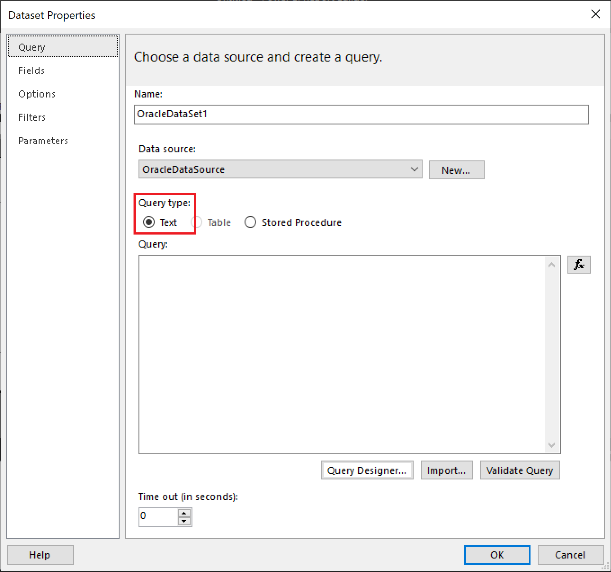

# Oracle connection type (Power BI Report Builder)

[!INCLUDE [applies-yes-report-builder-no-desktop](../../includes/applies-yes-report-builder-no-desktop.md)]

To use data from an Oracle database in your report, you must have a dataset that's based on a report data source of type Oracle. This built-in data source type uses the Oracle Data Provider directly and requires an Oracle client software component. This article explains how to download and install drivers for Power BI Report Builder.

> [!IMPORTANT]
> The following commands that use Oracle's OraProvCfg.exe tool to register Oracle's Managed and Unmanaged ODP.NET drivers are provided as examples for use with the above Microsoft products. For the configuration of the ODP.NET drivers specific to your environment, you may need to contact Oracle support or reference Oracle's documentation for [Configuring Oracle Data Provider for .NET](https://docs.oracle.com/en/database/oracle/oracle-database/19/odpnt/InstallConfig.html#GUID-1F689B90-2CC4-4907-B8FE-A5F4EE36F673).

## 32-bit drivers for Power BI Report Builder

[Power BI Report Builder](https://www.microsoft.com/download/details.aspx?id=53613) uses **Managed ODP.NET** for authoring paginated (RDL) reports. You only need the following steps when using Oracle ODAC drivers 12.2 and later. Otherwise, they install by default to a non-machine-wide configuration for a new Oracle home installation. These steps assume you've installed the ODAC 18.x files to the c:\oracle32 folder where Power BI Report Builder is installed. Follow these steps to register Managed ODP.NET:

1. On the Oracle download site, install the [Oracle "ODAC with Oracle Developer Tools for Visual Studio - OUI" (32-bit)](https://www.oracle.com/database/technologies/dotnet-odacdev-downloads.html).

2. Register ODP.NET Managed Client to GAC:

   ```
   C:\oracle32\product\18.0.0\client_1\odp.net\bin\4\OraProvCfg.exe /action:gac /providerpath:C:\oracle32\product\18.0.0\client_1\odp.net\managed\common\Oracle.ManagedDataAccess.dll
   ```

3. Add ODP.NET Managed Client entries to machine.config:

   ```
   C:\oracle32\product\18.0.0\client_1\odp.net\bin\4\OraProvCfg.exe /action:config /force /product:odpm /frameworkversion:v4.0.30319 /providerpath:C:\oracle32\product\18.0.0\client_1\odp.net\managed\common\Oracle.ManagedDataAccess.dll
   ```

## 64-bit drivers for Power BI Report Builder

> [!NOTE]
> The following instructions apply to Power BI Report Builder version 15.7.01678.0001 and later. For versions before 15.7.01678.0001, follow the **32-bit drivers for Power BI Report Builder** instructions above.

[Power BI Report Builder](https://go.microsoft.com/fwlink/?linkid=2086513) uses **Managed ODP.NET** for authoring paginated (RDL) reports. You only need the following steps when using Oracle ODAC drivers 12.2 and later. Otherwise, they install by default to a non-machine-wide configuration for a new Oracle home installation. These steps assume you've installed the ODAC 18.x files to the c:\oracle64 folder where Power BI Report Builder is installed. Follow these steps to register Managed ODP.NET:

1. On the Oracle download site, install the [Oracle 64-bit ODAC Oracle Universal Installer (OUI)](https://www.oracle.com/database/technologies/dotnet-odacdev-downloads.html).

1. Register ODP.NET Managed Client to GAC:

   ```
   C:\oracle64\product\18.0.0\client_1\odp.net\bin\4\OraProvCfg.exe /action:gac /providerpath:C:\oracle64\product\18.0.0\client_1\odp.net\managed\common\Oracle.ManagedDataAccess.dll
   ```

1. Add ODP.NET Managed Client entries to machine.config:

   ```
   C:\oracle64\product\18.0.0\client_1\odp.net\bin\4\OraProvCfg.exe /action:config /force /product:odpm /frameworkversion:v4.0.30319 /providerpath:C:\oracle64\product\18.0.0\client_1\odp.net\managed\common\Oracle.ManagedDataAccess.dll
   ```

##  <a name="Connection"></a> Connection string  

Contact your database administrator for connection information and for the credentials to use to connect to the data source. The following connection string example specifies an Oracle database on the server named "Oracle18" using Unicode. The server name must match what is defined in the Tnsnames.ora configuration file as the Oracle server instance name.  
  
```  
Data Source="Oracle18"; Unicode="True"  
```  
  
For more connection string examples, see [Create data connection strings - Power BI Report Builder](./data-connections-data-sources-connection-strings-report-builder.md).
  
##  <a name="Credentials"></a> Credentials  
Credentials are required to run queries, to preview the report locally, and to preview the report on Power BI web portal.  
  
After you publish your report, you may need to bind it to a Power BI Gateway connection. For more information, see [Manage your data source - Oracle](../../connect-data/service-gateway-onprem-manage-oracle.md)

  
##  <a name="Query"></a> Queries  
To create a dataset, you can either select a stored procedure from a drop-down list or create an SQL query. To build a query, you must use the text-based query designer. For more information, see [Text-based Query Designer User Interface (Power BI Report Builder)](./text-based-query-designer-user-interface-report-builder.md).  
  
You can specify stored procedures that return only one result set. Using cursor-based queries are not supported. 
 
##  <a name="Parameters"></a> Parameters  

If the query includes query variables, corresponding report parameters are automatically generated. Named parameters are supported by this extension. For Oracle version 9 or later, multi-value parameters are supported.  
  
 Report parameters are created with default property values that you might need to modify. For example, each report parameter is data type **Text**. After the report parameters are created, you might have to change default values.
  
##  <a name="Remarks"></a> Considerations and limitations  

Before you can connect an Oracle data source, the system administrator must have installed the version of the .NET Data Provider for Oracle that supports retrieving data from the Oracle database. This data provider must be installed on the same computer as Power BI Report Builder and also on machine hosting Power BI Gateway. For more information, see [Manage your data source - Oracle](../../connect-data/service-gateway-onprem-manage-oracle.md).

### Workaround for calling stored procedures

When you use an Oracle data source, if the paginated report has query type set as Stored Procedure, it fails to execute in the Power BI service due to a Power BI Gateway limitation. As a workaround, if you're using Oracle 12 or above, set query type to text and call the stored procedure inline, as in the following example.



```
DECLARE OUT_RPT_DATA SYS_REFCURSOR;
BEGIN
   SYSTEM.<Procedure_Name>(OUT_RPT_DATA);
   DBMS_SQL.RETURN_RESULT(OUT_RPT_DATA);
END;
```

### Platform and version information  

For more information about platform and version support, see [Supported data sources for Power BI paginated reports](../paginated-reports-data-sources.md).


## Related content

- [Manage your data source - Oracle](../../connect-data/service-gateway-onprem-manage-oracle.md)  
- [Filter, Group, and Sort Data (Power BI Report Builder)](../report-design/filter-group-sort-data-report-builder.md)
- [Expressions (Power BI Report Builder)](../expressions/expression-uses-reports-report-builder.md)
