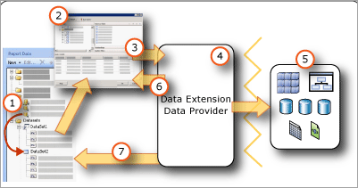

# Intro to report data in Power BI Report Builder

[!INCLUDE [applies-yes-report-builder-no-desktop](../../includes/applies-yes-report-builder-no-desktop.md)]

  Report data can come from multiple sources of data in your organization. Your first step in designing a report is to create data sources and datasets that represent the underlying report data. Each data source includes data connection information. Each dataset includes a query command that defines the set of fields to use as data from a data source. To visualize data from each dataset, add a data region, such as a table, matrix, chart, or map. When the report is processed, the queries run on the data source, and each data region expands as needed to display the query results for the dataset.  

## Data in Report Builder

   
  
1. **Data sources in the Report Data pane** A data source appears in the Report Data pane after you create an embedded data source.  
  
2. **Connection dialog box** Use the Connection Dialog Box to build a connection string or to paste a connection string.  
  
3. **Data connection information** The connection string is passed to the data extension.  
  
4. **Credentials** Credentials are managed separately from the connection string.  
  
5. **Data Extension/Data Provider** Connecting to the data can be through multiple data access layers.  
  
6. **External data sources** Retrieve data from relational databases, multidimensional databases, SharePoint lists, or Web services.  

##   Defining terms  
  
- **Data connection.** Also known as a *data source*. A data connection includes a name and connection properties that are dependent on the connection type. By design, a data connection does not include credentials. A data connection does not specify which data to retrieve from the external data source. To do that, you specify a query when you create a dataset.  
  
- **Connection string.** A connection string is a string version of the connection properties that are needed to connect to a data source. Connection properties differ based on data connection type. For examples, see [Create data connection strings - Power BI Report Builder](./data-connections-data-sources-connection-strings-report-builder.md).

- **Embedded data source.** Also known as a *report-specific data source*. A data source that is defined in a report and used only by that report.  
  
- **Credentials.** Credentials are the authentication information that must be provided to allow you access to external data.  
  
##   Tips for specifying report data

 Use the following information to design your report data strategy.  
  
- **Data sources** Paginated reports on Power BI service support embedded data sources, in other words, data sources defined within the report. Once published to service, you can manage connection settings using [Power BI Gateway](../../connect-data/service-gateway-onprem-indepth.md).
  
- **Datasets** Paginated reports on Power BI service support embedded datasets, in other words, datasets defined within the report.
  
- **Filter data** Report data can be filtered in the query or in the report. You can use datasets and query variables to create cascading parameters. With cascading parameters, users can narrow choices from thousands of selections to a more manageable number. You can filter data in a table or chart based on parameter values or other values that you specify.  
  
- **Parameters** Dataset query commands that include query variables automatically create matching report parameters. You can also manually create parameters. When you view a report, the report toolbar displays the parameters. Users can select values to control report data or report appearance. To customize report data for specific audiences, you can create sets of report parameters with different default values linked to the same report definition. You can also use the built-in **UserID** field to customize data for different audiences. For more information, see [Report Parameters (Power BI Report Builder)](../parameters/report-builder-parameters.md) and [Built-in Collections in Expressions (Power BI Report Builder)](../expressions/built-in-collections-in-expressions-report-builder.md).
  
- **Group and aggregate data** Report data can be grouped and aggregated in the query or in the report. If you aggregate values in the query, you can continue to combine values in the report within the constraints of what is meaningful.  For more information, see [Filter, Group, and Sort Data (Power BI Report Builder)](../report-design/filter-group-sort-data-report-builder.md) and [Aggregate Function (Report Builder)](/sql/reporting-services/report-design/report-builder-functions-aggregate-function).
  
- **Sort data** Report data can be sorted in the query or in the report. In tables, you can also add an interactive sort button to let the user control the sort order.  
  
- **Expression-based data** Because most report properties can be expression-based, and expressions can include references to dataset fields and report parameters, you can write powerful expressions to control report data and appearance. You can provide a user the ability to control the data they see by defining parameters.  
  
- **Display data from a dataset** Data from a dataset is typically displayed on one or more data regions, for example, a table and a chart.  
  
- **Display data from multiple datasets**  You can write expressions in a data region based on one dataset that looks up values or aggregates in other datasets. You can include subreports in a table based on one dataset to display data from a different data source.  
  
 Use the following list to help define sources of data for a report.  
  
- Collaborate with owners of sources of data to implement and use authentication and authorization technology that is appropriate for your organization.  
  
- Understand the software data layer architecture for your organization and the potential issues arising from data types. Understand how data extensions and data processing extensions can affect query results. Data types differ among the source of data, data providers, and the data types stored in the report definition (.rdl) file.  
  
- Understand the client/service architectures and tools. For example, in Report Builder, you author reports on a client machine that uses built-in data source types. When you publish a report, the data source types must be supported on Power BI service. For more information, see [Supported data sources for Power BI paginated reports](../paginated-reports-data-sources.md).
  
- Data source credentials vary based on data source type and on whether you are viewing reports on your client or Power BI service. For more information, see [Specify Credential and Connection Information for Report Data Sources](./data-connections-data-sources-connection-strings-report-builder.md), and [Managing credentials on Power BI service](../../connect-data/service-gateway-data-sources.md).  
  
## Related tasks

 Tasks related to creating data connections, adding data from external sources, datasets, and queries.  
  
|Common Tasks|Links|  
|-|-|  
|Create data connections|[Create data connection strings (Power BI Report Builder)](./data-connections-data-sources-connection-strings-report-builder.md)|  
|Create datasets and queries|[Report Embedded Datasets and Shared Datasets (Power BI Report Builder)](./report-embedded-datasets-report-builder.md)|
|Manage data sources after they are published|[Manage Report Data Sources](../../connect-data/service-gateway-data-sources.md)|
|Data retrieval guidance|[Data retrieval guidance for paginated reports](../../guidance/report-paginated-data-retrieval.md)|