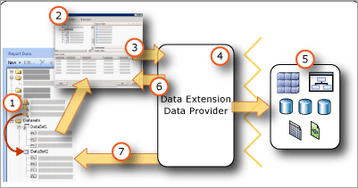

# Report embedded datasets (Power BI Report Builder)

[!INCLUDE [applies-yes-report-builder-no-desktop](../../includes/applies-yes-report-builder-no-desktop.md)]

  A dataset specifies the data that you want to use from a data connection. A dataset is based on a data connection that has been saved in the report as an embedded data source. The dataset includes a query that specifies a set of fields. As you drag these fields to the design surface, you create expressions that evaluate to the actual data when the report runs.  
  
 Paginated reports on Power BI service support embedded dataset.
  
- **Embedded dataset.** An embedded dataset is defined in and used by only the report it is embedded in. Use an embedded dataset when you want to get data from an external data source to be used only in one report. Changes made to an embedded dataset affect only that report.
  
 A dataset also includes parameters, filters, and data options that specify character sensitivities, such as case, kana type, width, accent, and collation information.  
  
 
  
1. **Datasets in the Report Data pane** A dataset appears in the Report Data pane after you create an embedded dataset. A dataset is based on a data source.  
  
2. **Query Designer** When you design a dataset query, the query designer that is associated with the data source type opens.  
  
3. **Query command** The query designer helps you build a query command. The command syntax is determined by the data provider.  
  
4. **Data Extension/Data Provider** Connecting to the data can be through multiple data access layers.  
  
5. **External data sources** Retrieve data from relational databases, multidimensional data bases, etc.  
  
6. **Query results** You can run the query and see an example result set. You must have design time credentials to run a query.  
  
7. **Metadata from schema** The data provider runs a schema query command separate from the query to retrieve metadata for the dataset field collection. For example, a Transact-SQL **SELECT** statement returns the column names for a database table. Use the Report Data pane to expand the dataset to view the dataset field collection.  
 
##  <a name="Overview"></a> Understand report datasets and queries

 A report dataset contains a query command that runs on the external data source and specifies what data to retrieve. To build the query command, you use the query designer that is associated with the data extension for the external data source. In the query designer, you can run the query command and view a result set. The result set is a rectangular row set that has column names and rows with the same number of values in each row. Hierarchical data, also known as *ragged hierarchies*, is not supported. The column names are saved in the report definition as a list of dataset fields.  
  
 After you add datasets to your report, you drag fields from their field collections in the Report Data pane to tables, charts, and other report items that you use to design the report layout. For more information about working with fields, see [Dataset Fields Collection (Power BI Report Builder)](./dataset-fields-collection-report-builder.md).
  
### Understand data from a report dataset

 Depending on the data extension, a report dataset can consist of the following types of data:  
  
- A result set from a relational database, which can result from running database commands, stored procedures, or user-defined functions. If multiple result sets are retrieved through a single query, only the first result set is processed, and all other result sets are ignored. For example, when you run the following query in the text-based query designer, only the result set for `Production.Product` appears in the result pane:  
  
    ```  
    SELECT ProductID FROM Production.Product  
    GO  
    SELECT ContactID FROM Person.Contact  
    ```  

- A flattened rowset from multidimensional data sources that use the XML for Analysis (XMLA) protocol. Some data providers supply additional cell and dimension properties from the data source that you cannot see in the result set but that are available in your report.  

- A result set from any registered and configured .NET Framework data provider.  

 When the report is processed at run time, the actual result set returned for a query may have zero or more rows. It is also possible that the columns defined in the query may be missing from the data source. Null values from the data source are mapped to the .NET Framework value **System.DBNull.Value**.  
  
 For more information about dataset fields, see [Dataset Fields Collection (Power BI Report Builder)](./dataset-fields-collection-report-builder.md).
  
### Dataset query

 When you run a dataset query in a query designer at design time, you see a row set from the data source that shows you example data. At run time, when a user views the report, the dataset query may produce different values because the data on the data source has changed. Each time the report is processed, new data may appear.  
  
 When you define each dataset, Power BI Report Builder opens the query designer that corresponds to the type of data source to help you design queries. For example, to define a query for data from a SQL Server relational database, the Table/Matrix, Chart, and Map wizards open a simple graphical interface that helps you build the query; all you need to do is select the fields that you want in your dataset.  
  
 In a query designer, you can do the following:  
  
- Toggle between graphical and text-based query view. Use the graphical to explore schemas, tables, views, and stored procedures on the data source. Use the text-based view to type, paste, or view an existing query, typically used for a complex query that cannot be displayed in a graphical query designer.
  
- Run the query to see data. The query returns a result set. The columns in the result set become the collection of fields for the dataset. The rows in the result become the data for the dataset. You can work with the query until you get the columns that you want.  
  
- Add query parameters to help retrieve just the data that you want for your report. Query parameters automatically generate matching report parameters. For a report model data source, the filter that you specify automatically generates a matching report parameter. Report parameters enable users to specify the report data that they want to see when they run the report. For example, the user selects which product categories they want to data for, and when the report runs, data for only those product categories appear in the report.  

 Query designers can provide a graphical mode or a text mode depending on the data source type. If you choose text mode, you must use the appropriate query syntax for the data source.  
  
 When you define a report dataset, you can set data properties in the query or accept the defaults set by the data provider. You can change a data type by using one of the following strategies:  
  
- Rewrite the dataset query to specifically convert a field to a different data type.  
  
- Edit the field in the dataset and provide a custom format.  
  
- Create a new custom field based on a database field and provide a custom format.  
  
 For more information, see [Dataset Fields Collection (Power BI Report Builder)](./dataset-fields-collection-report-builder.md).

##  <a name="SortGroupFilter"></a> Filter, sort, and group data in a dataset

 Data in a dataset comes from running a query command on an external data source. The query command syntax for a data extension determines whether data can be sorted or grouped. Sorting and grouping takes place in the query before the data is retrieved for a report. Filtering takes place after the data is retrieved for a report.  
  
 For more information, see [Filter, Group, and Sort Data (Power BI Report Builder)](../report-design/filter-group-sort-data-report-builder.md).
  
### Filter data in a dataset

 Filters are part of the dataset definition in a report. Use dataset filters to specify what data from a dataset to include in a report. When you specify filters on a dataset, all data regions that are based on the dataset display only data that passes through the dataset filters.  
 
 You can set additional filters on a data region or a data region group. You can also use a combination of parameters and filters enable users to choose the data that they want to see in a report. For more information, see [Report Parameters (Power BI Report Builder)](../parameters/report-builder-parameters.md).  
  
### Sort data in a dataset

 In a dataset, the order of the data is the order that it is retrieved from the external data source. This is the same order that you see when you run the query in the query designer. If the query-command syntax supports sorting, you can edit the query to sort the data at the source, before it is returned as report data. For example, for a Transact-SQL query, the ORDER BY statement controls the sort order.  
  
 To sort data after it is returned to the report, define sort expressions on data regions and data region groups. For more information, see the topic for the specific type of data region, for example, [Tables, Matrices, and Lists (Power BI Report Builder)]( /sql/reporting-services/report-design/tables-matrices-and-lists-report-builder-and-ssrs).
  
 You can also use a combination of parameters and sort expressions to enable users to choose the sort order for data in a report. For more information, see [Report Parameters (Power BI Report Builder)](../parameters/report-builder-parameters.md).  

### Group data in a dataset

 You cannot group data in a dataset. To aggregate data in a dataset, you can edit the query command to calculate aggregates before the data is retrieved for a report. These are known as *server aggregates*. In expressions, to identify these values as precalculated aggregates, use the Aggregate function. For more information, see [Aggregate Function (Report Builder)](/sql/reporting-services/report-design/report-builder-functions-aggregate-function).
  
##  <a name="Parameters"></a> Use parameters and datasets

 For an embedded dataset query that contains query variables, query parameters and corresponding report parameters are automatically created. When the report runs, the value of the report parameter is linked to the dataset query parameter. In this way, the query command that runs on the external data source includes the values that are specified for report parameters. Report parameters enable a user to help choose the data that they want to see in the report. You can view how query parameters and report parameters are linked in the Dataset Properties Dialog Box, Parameters page.  
  
 The following list describes support for query parameter values:  
  
- Can be expression based.  
  
- Can include default values.  
  
- Can be set to read-only. Read-only parameters cannot be changed in an instance of the shared dataset in a report.  
  
- Can't include references to the built-in collection Parameters, which represents report parameters.  
  
 For some tabular data sources, such as Analysis Services, the graphical query designer enables you to specify query filters and select an option to create a corresponding query parameter. When you select the parameter option, the data extension automatically creates a separate report dataset to provide available values for a drop-down list for that parameter. By default, these hidden datasets do not appear in the Report Data pane.  
  
 Report parameters that are linked to query parameters help filter data before the data is returned from the external data source. You can also filter data in the report by creating filters that are part of the report definition. For more information, see [Filter, Group, and Sort Data (Power BI Report Builder)](../report-design/filter-group-sort-data-report-builder.md).
  
### Display hidden datasets

 When you create a parameterized query for some tabular data sources, datasets that provide valid values for the parameter are automatically created. On some query designers, you do this by specifying filters and then selecting the option to create parameters. By default, these datasets do not appear in the Report Data pane, but they can be displayed.  
  
##  <a name="Maps"></a> Use maps and datasets

 If you include a map in your report, you must provide spatial data. Spatial data can come from a report dataset. Spatial data from a report does not appear as a dataset in the Report Data pane. For more information, see [Maps (Power BI Report Builder)](../report-builder/data-regions-maps-report-builder.md).
  
##  <a name="Multiple"></a> Display data from multiple datasets

 A report typically has more than one dataset. The following list describes how you can use datasets in a report:  
  
- You display the data from each dataset using a separate data region. For more information, see [Data Regions and Maps (Power BI Report Builder)](../report-builder/data-regions-maps-report-builder.md).
  
- You can link more than one data region to a dataset and provide multiple views of the same data.
  
- You can use datasets to provide a drop-down list of available values or default values for a report parameter. For more information, see [Report Parameters (Power BI Report Builder)](../parameters/report-builder-parameters.md).  
  
- You can link related data from multiple datasets by using parameters with drillthrough reports or subreports. For example, a sales report can show summary data for all stores, and a drillthrough link can specify the store identifier as a parameter to a report with a dataset query that retrieves the individual sales for the specified store. For more information, see [Drillthrough, Drilldown, Subreports, and Nested Data Regions (Power BI Report Builder)](../report-design/drillthrough-drilldown-subreports-nested-data-regions.md) and [Subreports (Power BI Report Builder)](../subreports.md).
  
- You cannot display detail data from multiple datasets in a single data region. However, you can display aggregate or built-in function values for multiple datasets within a data region. For more information, see [Aggregate Functions Reference (Report Builder)](/sql/reporting-services/report-design/report-builder-functions-aggregate-functions-reference). If you need to combine detail data from multiple datasets into one data region, you must rewrite your query to retrieve the data as a single dataset.  
  
##  <a name="NoRows"></a> Display a message when no rows of data are available

 During report processing, when the query for a dataset runs, the result set may contain no rows. In the rendered report, a data region linked to an empty dataset displays as an empty data region. You can specify text to display in the rendered report in place of the empty data region. You can also specify a message for subreports when the queries for all datasets produce no data at run time. For more information, see [Set a No Data Message for a Data Region (Power BI Report Builder)](./set-no-data-message-data-region-report-builder.md).
  
##  <a name="Options"></a> Set dataset options

 For data sources that support international data, you might need to adjust properties for a dataset that affect the sort order, international character properties, and case sensitivity. These properties include case, kanatype, width, accent, and collation. For more information about how to set these properties, see [Dataset Properties Dialog Box, Options (Power BI Report Builder)](./dataset-properties-dialog-box-options-report-builder.md).
  
## Related content

- [Manage Report Data Sources](../../connect-data/service-gateway-data-sources.md)
- [Data retrieval guidance for paginated reports](../../guidance/report-paginated-data-retrieval.md)
