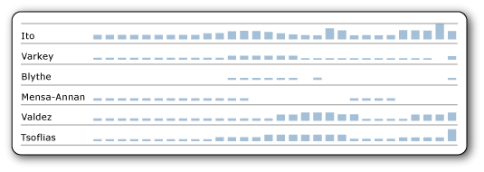

# Align the data in a paginated report chart in a table or matrix (Power BI Report Builder)

[!INCLUDE [applies-yes-report-builder-no-desktop](../../includes/applies-yes-report-builder-no-desktop.md)]

  Sparklines and data bars are small, simple charts that convey a lot of information with little extraneous detail in a paginated report. In a paginated report, when you check this option the values in your sparklines and data bars will align across the different cells in the table or matrix, even if there are missing values in the data they are based on.  
  
   
  
 In this image, the column chart shows daily sales for each employee. Note that for days that an employee has no sales, the chart leaves a blank and aligns subsequent days horizontally. It also aligns the charts vertically by making the sizes of the different charts relative to each other. For more information, see [Sparklines and Data Bars &#40;Power BI Report Builder&#41;](sparklines-data-bars-report-builder.md).  
  
## Align the data in a sparkline or data bar  
  
1.  [Add a sparkline or data bar](sparklines-data-bars-report-builder.md) to a table or matrix.  
  
1. Select the sparkline or data bar, and then select **Horizontal Axis Properties** or **Vertical Axis Properties**.  
  
1.  On the **Axis Options** tab, check the **Align axes in** box, and then in the dropdown box, select the group on which to align the axis.  
  
1.  Select **OK**.
  
## Related content

- [Charts &#40;Power BI Report Builder&#41;](../../paginated-reports/report-design/visualizations/charts-report-builder.md)   
- [Add Sparklines and Data Bars &#40;Power BI Report Builder&#41;](sparklines-data-bars-report-builder.md)  
  
  
