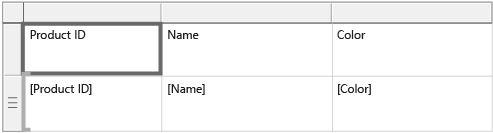
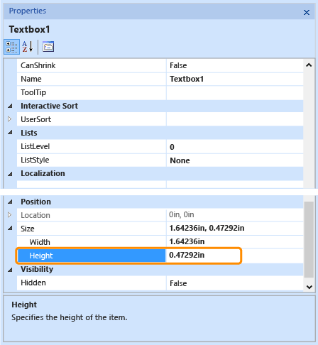

# Change row height or column width in a paginated report (Power BI Report Builder)

[!INCLUDE [applies-yes-report-builder-no-desktop](../../includes/applies-yes-report-builder-no-desktop.md)]

  When you set a row height, you are specifying the maximum height for the row in the rendered paginated report. However, by default, text boxes in the row are set to grow vertically to accommodate their data at run-time, and this can cause a row to expand beyond the height that you specify. To set a fixed row height, you must change the text box properties so they do not automatically expand.  
  
 When you set a column width, you are specifying the maximum width for the column in the rendered report. Columns do not automatically adjust horizontally to accommodate text.  
  
 If a cell in a row or column contains a rectangle or data region, the minimum height and width of the cell is determined by the height and width of the contained item. For more information, see [Rendering Behaviors &#40;Power BI Report Builder&#41;](../../paginated-reports/report-design/render-behaviors-report-builder-service.md).  
  
  
## Change row height by moving row handles  
  
1.  In Design view, select anywhere in the tablix data region to select it. Gray row handles appear on the outside border of the tablix data region.  
  
1.  Hover over the row handle edge that you want to expand. A double-headed arrow appears.  
  
1.  Select to grab the edge of the row and move it higher or lower to adjust the row height.  
  
## Change row height by setting cell properties  
  
1.  In Design view, select a cell in the table row.  
  
        
  
1.  In the **Properties** pane that displays, modify the **Height** property, and then select anywhere outside the **Properties** pane.  
  
       
  
## Prevent a row from automatically expanding vertically  
  
1.  In Design view, select anywhere in the tablix data region to select it. Gray row handles appear on the outside border of the tablix data region.  
  
1.  Select the row handle to select the row.  
  
1.  In the Properties pane, set CanGrow to **False**.  
  
    > [!NOTE]  
    >  If you cannot see the Properties pane, from the **View** menu, select **Properties**.  
  
## Change column width  
  
1.  In Design view, select anywhere in the tablix data region to select it. Gray column handles appear on the outside border of the tablix data region.  
  
1.  Hover over the column handle edge that you want to expand. A double-headed arrow appears.  
  
1.  Select to grab the edge of the column and move it left or right to adjust the column width.  
  
## Related content

- [Tablix Data Region &#40;Power BI Report Builder&#41;](../../paginated-reports/report-design/render-data-regions-report-builder-service.md)   
- [Tables, Matrices, and Lists &#40;Power BI Report Builder&#41;](../../paginated-reports/report-builder-tables-matrices-lists.md)  
  
  
