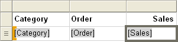
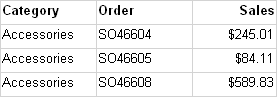
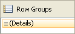
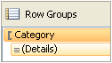
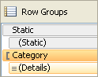
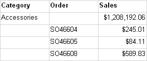
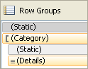

# Control row & column headings in a paginated report (Power BI Report Builder)

[!INCLUDE [applies-yes-report-builder-no-desktop](../../includes/applies-yes-report-builder-no-desktop.md)]

  A table, matrix, or list data region in a paginated report can span multiple pages horizontally or vertically. You can specify whether to repeat row or column headings on each page. In an interactive renderer such as the web portal or report preview, you can also specify whether to freeze row or column headings to keep them in view when you scroll across or down a report. In a table or matrix, the first row usually contains column headings that label data in each column; the first column usually contains row headings that label the data in each row. For nested groups, you might want to repeat the initial set of row and column headings that contain group labels. By default, a list data region doesn't include headings.  
  
 How you control whether headings repeat or freeze depends on the following:  
  
-   For column headings that repeat at the top of each page:  
  
    -   Whether the table or matrix has a column group area that expands horizontally.  
  
    -   Whether you want to control all rows that are associated with column groups as a unit.  
  
-   For row headings that repeat along the side of each page:  
  
    -   Whether the table or matrix has a row group area that expands vertically. Row headings are supported only for row groups with a row group header.  
  
  
## Understanding rows and columns in a tablix data region  
 A table or matrix is a template for the underlying tablix data region. A tablix data region has four possible areas: the row group area that controls rows that expand down a report, the column group area that controls columns that expand across a report, the body that displays data, and the corner. To understand where to set properties to control repeating or freezing headers, it helps to understand that there are two representations for a tablix data region:  
  
-   **In the report definition** Each row or column in a tablix data region definition is a tablix member of a specific row or column group. A tablix member is static or dynamic. A static tablix member contains labels or subtotals and repeats once per group. A dynamic tablix member contains group values and repeats once per unique value of a group, also known as a group instance.  
  
-   **On the design surface** On the design surface, dotted lines divide a tablix data region into the four areas. Each cell in a tablix data region area is organized into rows and columns. Rows and columns are associated with groups, including the details group. For a selected tablix data region, row and column handles and highlight bars indicate group membership. Cells in the row group or column group area represent group headers for tablix members. A single row or column can be associated with multiple groups.  
  
     For more information, see [Tablix Data Region &#40;Power BI Report Builder&#41;](../../paginated-reports/report-design/render-data-regions-report-builder-service.md) and [Tablix Data Region Cells, Rows, and Columns &#40;Power BI Report Builder&#41;](tablix-data-region-cells-rows-columns-report-builder.md).  
  
 For tablix data regions with row group or column group areas, control the associated rows and columns by setting properties on tablix data region. For all other cases, control the rows and columns by setting properties in the Properties pane for the selected tablix member. For step-by-step instructions, see [Display Row and Column Headers on Multiple Pages &#40;Power BI Report Builder&#41;](display-row-column-headers-multiple-pages-report-builder.md) and [Keep Headers Visible When Scrolling Through a Report &#40;Power BI Report Builder&#41;](../../paginated-reports/report-design/keep-headers-visible-when-scrolling-through-report-report-builder-service.md).  
  
##   Examples of tablix data regions  
 The most common examples of tablix data regions are for a matrix, a table with no groups, and a table with a row group and a row group header, and a table with a row group but no row group header. To control how to repeat or freeze headers, you must determine if the rows or columns that you want to control are associated with a group header in the row groups or column groups area.  
  
 The following sections provide examples for common layouts for a tablix data region:  
  
-   [Matrix](#Matrix)  
  
-   [Table with no groups](#TableNoGroups)  
  
-   [Table with row groups and row group area](#TableRowGroupsGroupHeader)  
  
-   [Table with row groups but no row group area](#TableRowGroupsNoGroupHeader)  
  
###   Matrix  
 By default, a simple matrix has one row group and one column group. The following figure shows a matrix with a row group that is based on Category and a column group that is based on Geography:  
  
   
  
 The dotted lines show the four tablix areas. The row group area has a row group header that controls the category labels in the first column. Similarly, the column group area has a column group header that controls the geography labels in the first row. In preview, as the matrix expands across the page, the first row displays the column headings, as shown in the following figure:  
  
   
  
 To repeat or freeze column headings in the first row, set properties for column headers on the tablix data region. Column headers for nested column groups are automatically included.  
  
 To repeat or freeze row headings in the first column, set properties for row headers on the tablix data region. Row headers for nested row groups are automatically included.  
  
 [Return to top](#Top)  
  
###   Table with no row groups  
 By default, a simple table with no groups does include the details group. The following figure shows a table that displays category, order number, and sales data:  
  
   
  
 There are no dotted lines because the table consists only of the tablix body area. The first row displays column headers, and represents a static tablix member that isn't associated with a group. The second row displays detail data, and represents a dynamic tablix member that is associated with the details group. The following figure shows the table in preview:  
  
   
  
 To repeat or freeze column headings, set properties on the tablix member for static row that is part of the tablix data region definition. To select the static row, you must use the Advanced mode of the Grouping pane. The following figure shows the Row Groups pane:  
  
   
  
 In Advanced mode, the following figure shows the static and dynamic tablix members for the row groups in the table:  
  
   
  
 To repeat or freeze column headings for the tablix member, select the static row that is labeled (**Static**). The properties pane displays the properties for the selected tablix member. By setting properties for this tablix member, you can control how the first row repeats or stays in view.  
  
 [Return to top](#Top)  
  
###   Table with row groups and a row group area  
 If you add a row group to a simple table, a row group area is added to the table on the design surface. The following figure shows a table with a row group that is based on Category:  
  
   
  
 The dotted lines show the tablix row groups area and the tablix body area. The row group area has a row group header but no column group header. The following figure shows this table in preview:  
  
   
  
 To repeat or freeze column headings, use the same approach as the previous example. The following figure shows the default view of the Row Groups pane:  
  
   
  
 Use the **Advanced** mode of the Row Groups pane to display the tablix members, as shown in the following figure:  
  
   
  
 For tablix members are listed: **Static**, (**Static**), Category, and (**Details**). A tablix member that includes parentheses () indicates that there's no corresponding group header. To repeat or freeze column headings, select the top Static tablix member, and set properties in the Properties pane.  
  
 [Return to top](#Top)  
  
###   Table with row groups and no row group area  
 A table can have row groups but no row groups area in several ways. Two possible ways to have a table like this are:  
  
-   Start with a table with row groups and a row group area and delete the columns for the row group area. Delete the columns only and not the groups. For example, you might want to control the table format to be a simple grid.  
  
-   Upgrade a report that was created for a previous RDL version, before tablix data regions were introduced.  
  
 The following figure shows a table with a row group but no row group area on the design surface:  
  
   
  
 The table has three rows. The first row contains column headers. The second row contains the group value and subtotals. The third row contains the detail data. There are no dotted lines because there's only a tablix body area. The following figure shows this table in preview:  
  
   
  
 To control how the rows repeat or stay in view, you must set properties on the tablix member for each row. In default mode, there's no difference between this example and the previous example for a table with a row group and a group header. The following figure shows the Grouping pane in default mode for this table:  
  
   
  
 However, in advanced mode, this layout structure shows a different set of tablix members. The following figure shows the Grouping pane in advanced mode for this table:  
  
   
  
 In the Row Groups pane, the following tablix members are listed: (**Static**), (Category), (**Static**), and (**Details**). To repeat or freeze column headings, select the top (**Static**) tablix member, and set properties in the Properties pane.  
  
 [Return to top](#Top)  
  
## Renderer support for repeating or freezing headers  
 Renderers vary in support for repeating or freezing headers.  
  
 Renderers that use physical pages (PDF, Image, Print) support the following features:  
  
-   Repeat row headers when a tablix data region expands horizontally across multiple pages.  
  
-   Repeat column headers when a tablix data region expands vertically down multiple pages.  
  
 In addition, renderers that use soft page breaks (the web portal, report preview, or the report viewer control) support the following features:  
  
-   Keep row headers in view when you scroll horizontally across a report.  
  
-   Keep column headers in view when you scroll vertically down a report.  
  
 For more information, see [Rendering Behaviors &#40;Power BI Report Builder&#41;](../../paginated-reports/report-design/render-behaviors-report-builder-service.md).  
  
## Related content

- [Filter, Group, and Sort Data &#40;Power BI Report Builder&#41;](../../paginated-reports/report-design/filter-group-sort-data-report-builder.md)   
- [Tables, Matrices, and Lists &#40;Power BI Report Builder&#41;](../../paginated-reports/report-builder-tables-matrices-lists.md)   
- [Pagination &#40;Power BI Report Builder&#41;](../../paginated-reports/paginated-reports-pagination.md)   
- [Export Reports &#40;Power BI Report Builder&#41;](../../paginated-reports/report-builder/export-reports-report-builder.md)  
  
  
