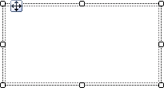
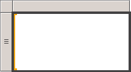
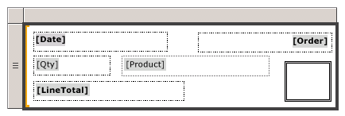
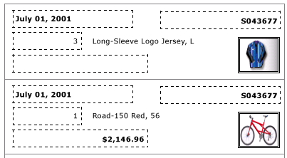
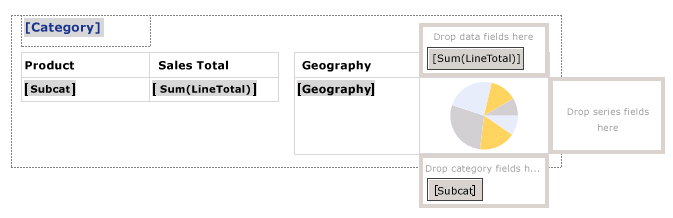
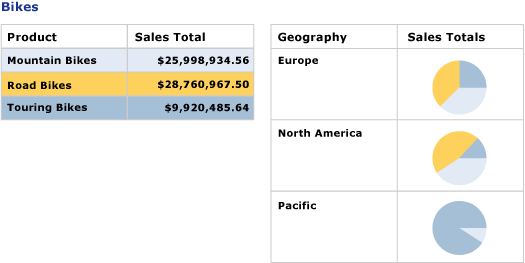

# Create invoices and forms with lists in a paginated report (Power BI Report Builder)

[!INCLUDE [applies-yes-report-builder-no-desktop](../../includes/applies-yes-report-builder-no-desktop.md)]

  A list data region repeats with each group or row in the paginated report dataset. A list can be used to create free-form reports or forms, such as invoices, or in conjunction with other data regions. You can define lists that contain any number of report items. A list can be nested wit  
  
  
  
##   Add a list to your report  
 Add a list to the design surface from the Insert tab on ribbon. By default, the list initially has a single cell in a row associated with the detail group.  
  
   
  
 When you select a list on the design surface, row and column handles appear, as shown in the following figure.  
  
   
  
 The list you start with is a template based on the tablix data region. After you add a list, you can continue to enhance the design by changing the content or appearance of the list by specifying filter, sort, or group expressions, or changing the way the list displays across report pages. For more information, see [Control the Tablix Data Region Display on a Report Page &#40;Power BI Report Builder&#41;](control-tablix-data-region-display-report-page.md). Although the list starts with a single column and row, you can further continue to develop your list design by adding nested or adjacent row groups or column groups, or adding additional detail rows. For more information, see [Exploring the Flexibility of a Tablix Data Region &#40;Power BI Report Builder&#41;](explore-flexibility-tablix-data-region-report-builder.md).  
  
  
##   Display data in a free-form layout  
 To organize report data in a free-form layout instead of a grid, you can add a list to the design surface. Drag fields from the Report Data pane to the cell. By default, the cell contains a rectangle that acts as a container. Move each field in the container until you have the design you want. Use the snaplines that appear when you drag text boxes in the rectangle container to help you align edges vertically and horizontally. Remove unwanted white space by adjusting the size of the cell. For more information, see [Change Row Height or Column Width &#40;Power BI Report Builder&#41;](change-row-height-column-width-report-builder.md).  
  
 The following figure shows a list that displays information about an order, including these fields: Date, Order, Qty, Product, LineTotal, and an image.  
  
   
  
 In Preview, the list repeats to display the field data in the free-form format, as shown in the following figure:  
  
   
  
> [!NOTE]  
>  The dotted lines displayed in these figures are included to show the free-form layout for each field value. Typically, you would not use dotted lines in a production report.  
  
  
##   Display data with one level of grouping  
 Because a list automatically provides a container, you can use a list to display grouped data with multiple views. To change the default list to specify a group, edit the Details group, specify a new name, and specify a group expression.  
  
 For example, you can embed a table and a chart that show different views of the same dataset. You can add a group to the list so that the nested report items repeat once for every group value. The following figure shows a list grouped by product category. Notice that there is no detail row. Two tables are nested side by side in the list. The first table displays the subcategories with total sales. The second table displays the category grouped by geographical area, with a chart that shows the distribution of subcategories.  
  
   
  
 In Preview, the table displays total sales for all subcategories of bicycles, and the table beside it displays the breakdown of sales per geographical area. By using an expression to specify the background color for the table and a custom palette for the chart, the first table also provides the legend for the chart colors.  
  
   

## Related content

- [Aggregate Functions Reference &#40;Power BI Report Builder&#41;](/sql/reporting-services/report-design/report-builder-functions-aggregate-functions-reference)   
- [Expression Examples &#40;Power BI Report Builder&#41;](../../paginated-reports/expressions/report-builder-expression-examples.md)  
  
  
