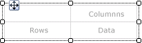
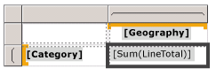
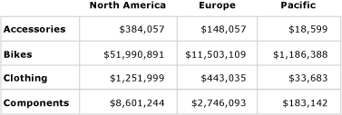
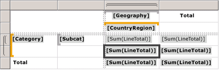
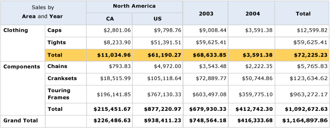
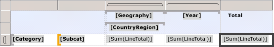
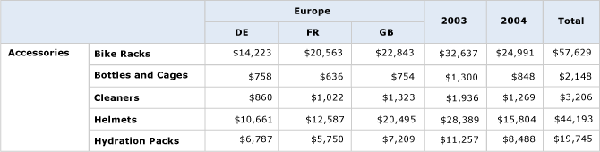

# Create a matrix in a paginated report (Power BI Report Builder)

[!INCLUDE [applies-yes-report-builder-no-desktop](../../includes/applies-yes-report-builder-no-desktop.md)]

  Use a matrix to display grouped data and summary information in a paginated report. You can group data by multiple fields or expressions in row and column groups. Matrices provide functionality similar to crosstabs and pivot tables. At run time, as the report data and data regions are combined, a matrix grows horizontally and vertically on the page. Values in matrix cells display aggregate values scoped to the intersection of the row and column groups to which the cell belongs. You can format the rows and columns to highlight the data you want to emphasize. You can also include drilldown toggles that initially hide detail data; the user can then select the toggles to display more or less detail as needed.  
  
 After your initial design, you can continue to develop a matrix to improve the viewing experience for the user. For more information, see [Controlling the Tablix Data Region Display on a Report Page &#40;Power BI Report Builder&#41;](control-tablix-data-region-display-report-page.md).  
  
 To quickly get started with matrices, see [Tutorial: Creating a Matrix Report &#40;Power BI Report Builder&#41;](/sql/reporting-services/tutorial-creating-a-matrix-report-report-builder).  
  
  
##   Add a matrix to your report  
 Add a matrix to the design surface from the Insert tab on the ribbon.   
  
 To describe how to configure a table from beginning to end, this topic uses the matrix template.  The matrix initially has a row group, a column group, a corner cell, and a data cell, as shown in the following figure.  
  
   
  
 When you select a matrix on the design surface, row and column handles appear, as shown in the following figure.  
  
   
  
 Add groups by dragging dataset fields to the Row Groups and Column Groups areas of the Grouping pane. The first field that you drag to the row groups or column groups pane replaces the initial empty default group. You can then apply formatting for each cell, depending on the data.  
  
   
  
 In Preview, the matrix expands to show the row group and column group values. The cells display summary values, as shown in the following figure.  
  
   
  
 The matrix you start with is a template based on the tablix data region. You can continue to develop your matrix design by adding nested or adjacent row groups or column groups, or even adding detail rows. For more information, see [Exploring the Flexibility of a Tablix Data Region &#40;Power BI Report Builder&#41;](explore-flexibility-tablix-data-region-report-builder.md).  
  
  
##   Add a parent group or child group to a matrix  
 To add a group based on a single dataset field, drag the field from the Report Data pane to the appropriate Row Groups or Column Groups area of the Grouping pane. Drop the field in the group hierarchy to set its relationship to existing groups. Drop it above an existing group to create a parent group, or drop it below an existing group to create a child group.  
  
 Several things happen when you drop a field in the **Grouping** pane:  
  
-   A new group with a unique name based on the field name is automatically created. The group expression is set to the simple field name reference, for example `[Category]`.  
  
-   A new row or column appears in the corresponding row group or column group area.  
  
-   In the new column, a row group cell appears for the default data rows from the report dataset. Cells in the tablix body for this row are now members of the row group. If there are any column groups defined, cells that are in the columns are members of those column groups. Group indicators provide visual cues for the group membership of each cell.  
  
 To customize the group after it is created, use the **Tablix Group** dialog box. You can change the group name, and edit or add additional expressions to the group definition. To add or remove rows from the table, see [Insert or Delete a Row &#40;Power BI Report Builder&#41;](insert-delete-row-report-builder.md).  
  
 When the report runs, dynamic column headers expand right (or left, if the Direction property of the matrix is set to RTL) for as many columns as there are unique group values. Dynamic rows expand down the page. The data that appears in the tablix body cells are aggregates based on the intersections of row and column groups, as shown in the following figure.  
  
   
  
 In preview, the report displays as in the following figure.  
  
   
  
 To write expressions that specify a scope other than the default scope, you must specify the name of a dataset, data region, or group in the aggregate function all. To calculate the percentage each subcategory contributes to the Clothing category group values, add a column inside the Category group next to the Total column, format the text box to show percentage, and add an expression that uses the default scope in the numerator, and the Category group scope in the denominator, as shown in the following example.  
  
 `=SUM(Fields!Linetotal.Value)/SUM(Fields! Linetotal.Value,"Category")`  
  
 For more information, see [Expression Scope for Totals, Aggregates, and Built-in Collections &#40;Power BI Report Builder&#41;](../../paginated-reports/expressions/expression-scope-for-totals-aggregates-and-built-in-collections.md).  
  
  
##   Add an adjacent group to a matrix  
 To add an adjacent group based on a single dataset field, use the shortcut menu in the Grouping pane. For more information, see [Add or Delete a Group in a Data Region &#40;Power BI Report Builder&#41;](../../paginated-reports/report-design/add-delete-group-data-region-report-builder.md). The following figure shows a group based on geography and an adjacent group based on year.  
  
   
  
 In this example, the query has filtered data values to only include those values for Europe and for the years 2003 and 2004. However, you can set filters on each group independently. In preview, the report displays as in the following figure.  
  
   
  
 To add a total column for an adjacent column group, select in the column group definition cell and use the **Add Total** command. A new static column is added next to the column group, with a default aggregate sum for every numeric field in the existing rows. To change the expression, manually edit the default aggregate, for example, `Avg([Sales])`. For more information, see [Add a Total to a Group or Tablix Data Region &#40;Power BI Report Builder&#41;](add-total-group-tablix-data-region-report-builder.md).  
  
  
## Related content

- [Aggregate Functions Reference &#40;Power BI Report Builder&#41;](/sql/reporting-services/report-design/report-builder-functions-aggregate-functions-reference)   
- [Expression Examples &#40;Power BI Report Builder&#41;](../../paginated-reports/expressions/report-builder-expression-examples.md)  
  
  
