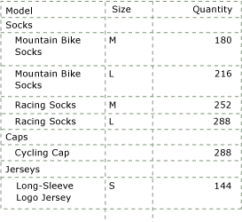
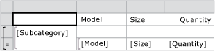
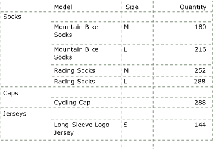
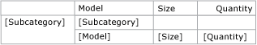
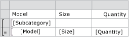

# Create a stepped paginated report (Power BI Report Builder)

[!INCLUDE [applies-yes-report-builder-no-desktop](../../includes/applies-yes-report-builder-no-desktop.md)]

A stepped report is a type of Power BI paginated report that shows detail rows or child groups indented under a parent group in the same column, as shown in the following example:  
  
   
  
 Traditional table reports place the parent group in an adjacent column on the report. The new tablix data region enables you to add a group and detail rows or child groups to the same column. To differentiate the group rows from the detail or child group rows, you can apply formatting such as font color, or you can indent the detail rows.  
  
 The procedures in this topic show you how to manually create a stepped report, but you can also use the New Table and Matrix Wizard. It provides the layout for stepped reports, making it easy to create them. After you complete the wizard, you can further enhance the report.  
  
> [!NOTE]  
>  The wizard is available only in Power BI Report Builder.  
  
  
## Create a stepped report  
  
1. Create a table report. For example, insert a tablix data region and add fields to the Data row.  
  
1. Add a parent group to your report.  
  
    1. Select anywhere in the table to select it. The Grouping pane displays the Details group in the Row Groups pane.  
  
    1. In the Grouping Pane, right-click the Details Group, point to **Add Group**, and then select **Parent Group**.  
  
    1. In the **Tablix Group** dialog box, provide a name for the group and type or select a group expression from the drop-down list. The drop-down list displays the simple field expressions that are available in the Report Data pane. For example, [PostalCode] is a simple field expression for the PostalCode field in a dataset.  
  
    1. Select **Add group header**. This option adds a static row above the group for the group label and group totals. Likewise, you can select **Add group footer** to add a static row below the group. Select **OK**.
  
     You now have a basic tabular report. When it is rendered, you see one column with the group instance value, and one or more columns with grouped detail data. The following figure shows what the data region might look like on the design surface.  
  
       
  
     The following figure shows how the rendered data region might look when you view the report.  
  
       
  
1. For a stepped report, you do not need the first column that shows the group instance. Instead, copy the value in the group header cell, delete the group column, and paste in the first text box in the group header row. To remove the group column, right-click the group column or cell, and select **Delete Columns**. The following figure shows what the data region might look like on the design surface.  
  
       
  
1. To indent the detail rows under the group header row in the same column, change the padding of the detail data cell.  
  
    1. Select the cell with the detail field that you want to indent. The text box properties for that cell appear in the Properties pane.  
  
    1. In the Properties pane, under **Alignment**, expand the properties for **Padding**.  
  
    1. For **Left**, type a new padding value, such as **.5in**. Padding indents the text in the cell by the value you specify. The default padding is 2 points. Valid values for the Padding properties are zero or a positive number, followed by a size designator.  
  
         Size designators are:  
  
        |Designator|Description|  
        |-|-|  
        |**in**|Inches (1 inch = 2.54 centimeters)|  
        |**cm**|Centimeters|  
        |**mm**|Millimeters|  
        |**pt**|Points (1 point = 1/72 inch)|  
        |**pc**|Picas (1 pica = 12 points)|  
  
     Your data region will look similar to the following example.  
  
       
  
     **Data region for Stepped report layout**  
  
1. On the **Home** tab select **Run**. The report displays the group with indented levels for the child group values.  
  
## Create a stepped report with multiple groups  
  
1. Create a report as described in the previous procedure.  
  
1. Add additional groups to your report.  
  
    1. In the Row Groups pane, right-click the group, select **Add Group**, and then choose the type of group you want to add.  
  
        > [!NOTE]  
        >  There are several ways to add groups to a data region. For more information, see [Add or delete a group in a data region (Power BI Report Builder)](add-delete-group-data-region-report-builder.md).  
  
    1. In the **Tablix Group** dialog box, type a name.  
  
    1. In **Group expression**, type an expression or select a dataset field to group on. To create an expression, select the expression (**fx**) button to open the **Expression** dialog box.  
  
    1. Select **OK**.
  
1. Change the padding for the cell that displays the group data.  
  
## Related content

- [Page headers and footers (Power BI Report Builder)](page-headers-footers-report-builder-service.md)   
- [Formatting report items (Power BI Report Builder)](/sql/reporting-services/report-design/formatting-report-items-report-builder-and-ssrs)   
- [Tables, Matrices, and Lists (Power BI Report Builder)](../report-builder-tables-matrices-lists.md)  
  
  
