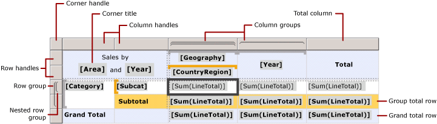

# Show row and column headers on multiple pages in a paginated report (Power BI Report Builder)

[!INCLUDE [applies-yes-report-builder-no-desktop](../../includes/applies-yes-report-builder-no-desktop.md)]

  You can control whether to repeat row and column headers on every page of a paginated report for a tablix data region (a table, matrix, or list) that spans multiple pages.
  
 How you control the rows and columns depends on whether the tablix data region has group headers. When you select a tablix data region that has group headers, a dotted line shows the tablix areas, as shown in the following figure:  
  
   
  
 Row and column group headers are created automatically when you add groups by using the New Table or Matrix wizard or the New Chart wizard, by adding fields to the Grouping pane, or by using context menus. If the tablix data region has only a tablix body area and no group headers, the rows and columns are tablix members.  
  
 For static members, you can display the top adjacent rows or the side adjacent columns on multiple pages.  
  
## Display row headers on multiple pages  
  
1. Right-click the row, column, or corner handle of a tablix data region, and then select **Tablix Properties**.  
  
1. In **Row Headers**, select **Repeat header rows on each page**.  
  
1. Select **OK**.
  
## Display column headers on multiple pages  
  
1. Right-click the row, column, or corner handle of a tablix data region, and then select **Tablix Properties**.  
  
1. In **Column Headers**, select **Repeat header columns on each page**.  
  
1. Select **OK**.
  
## Display a static row or column on multiple pages  
  
1. On the design surface, select the row or column handle of the tablix data region to select it. The Grouping pane displays the row and column groups.  
  
1. On the right side of the Grouping pane, select the down arrow, and then select **Advanced Mode**. The Row Groups pane displays the hierarchical static and dynamic members for the row groups hierarchy and the Column groups pane shows a similar display for the column groups hierarchy.  
  
1. Select the static member that corresponds to the static member (row or column) that you want to remain visible while scrolling. The Properties pane displays the **Tablix Member** properties.  
  
     If you don't see the Properties pane, select the **View** tab at the top of the Report Builder window and then select **Properties**.  
  
1. In the Properties pane, set **RepeatOnNewPage** to True.  
  
1. Set **KeepWithGroup** to After.  
  
1. Repeat this for as many adjacent members as you want to repeat.  
  
1. Preview the report.  
  
 As you view each page of the report that the tablix data region spans, the static tablix members repeat on each page.  
  
## Related content

- [Finding, Viewing, and Managing Reports &#40;Power BI Report Builder &#41;](/sql/reporting-services/report-builder/finding-viewing-and-managing-reports-report-builder-and-ssrs)   
- [Export Reports &#40;Power BI Report Builder&#41;](../../paginated-reports/report-builder/export-reports-report-builder.md)   
- [Control Page Breaks, Headings, Columns, and Rows &#40;Power BI Report Builder&#41;](../../paginated-reports/report-design/control-page-breaks-headings-columns-rows-report-builder.md)   
- [Display Headers and Footers with a Group &#40;Power BI Report Builder&#41;](../../paginated-reports/report-design/display-headers-footers-with-group-report-builder-service.md)   
- [Keep Headers Visible When Scrolling Through a Report &#40;Power BI Report Builder&#41;](../../paginated-reports/report-design/keep-headers-visible-when-scrolling-through-report-report-builder-service.md)  
  
  
