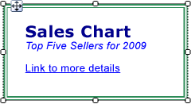
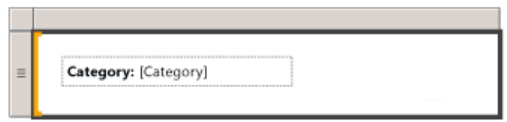

# Format Power BI paginated report items (Power BI Report Builder)

[!INCLUDE [applies-yes-report-builder-no-desktop](../../includes/applies-yes-report-builder-no-desktop.md)]

  Formatting the items in your paginated reports makes them look more attractive and enhances readability. You can format the text boxes and individual items within text boxes, the images, the expressions, and the data while in report design mode.  
  
   
  Text box with a double-line border and a variety of formatting styles, including a link.  
  
   
 Text box in with a text label and a placeholder.  
  
 You can change formatting options by selecting the item that you want to format and then opening the item's Properties dialog box. For example, if you want to format the contents of an entire text box or a selected word within the text box, right-click the item and select **Text Box Properties**. Then, you can apply the formatting styles that you want.  

## Related content

- [Format text and placeholders (Power BI Report Builder)](../../paginated-reports/report-design/format-text-placeholders-report-builder.md)  
 Describes how to format text and customize format options for different blocks of text within a text box.  
- [Format numbers and dates (Power BI Report Builder)](../../paginated-reports/report-design/format-numbers-dates-report-builder-service.md)    
 Describes how to use standard and custom formatting strings that are supported.
- [Format lines, colors, and images (Power BI Report Builder)](../../paginated-reports/report-design/format-lines-colors-images-report-builder-service.md)  
 Describes how to format lines, gridlines, colors, and images within report items and data regions.  
- [Format a Chart (Power BI Report Builder)](../../paginated-reports/report-design/visualizations/formatting-chart-report-builder.md)  
  
  
