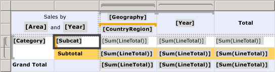
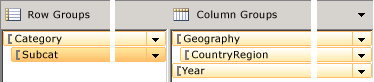

# Grouping pane in a paginated report (Power BI Report Builder)

[!INCLUDE [applies-yes-report-builder-no-desktop](../../includes/applies-yes-report-builder-no-desktop.md)]

  The Grouping pane in a paginated report displays the row groups and column groups for the currently selected tablix data region. The Grouping pane is not available for the Chart or Gauge data regions. The Grouping pane contains a Row Groups pane and a Column Groups pane. The Grouping pane has two modes: default and Advanced. Default mode displays a hierarchical view of the dynamic members for row and column groups. Advanced mode displays both dynamic and static members for row and column groups. A group is a named set of data from a report dataset that is displayed on a data region. Groups are organized into hierarchies that include static and dynamic members. For more information, see [Understanding groups &#40;Power BI Report Builder&#41;](/sql/reporting-services/report-design/understanding-groups-report-builder-and-ssrs).  
  
> [!NOTE]  
>  If you do not see the Grouping pane, on the **View** tab, in the **Show/Hide** group, click **Grouping**.  
  
 Cells in the row and column group areas can be static or dynamic members of a tablix row or column group. Static members repeat once per group and typically contain labels or totals. Dynamic members repeat once per group instance and typically contain the unique values of the group expression. As you select tablix cells in the row group area or column group area, the corresponding group member is selected in the Row Groups or Column Groups pane. Conversely, if you select groups in the Grouping pane, the corresponding cell associated with the group member is selected on the design surface. For more information about tablix row and column group areas, see [Tablix data region areas &#40;Power BI Report Builder&#41;](/sql/reporting-services/report-design/tablix-data-region-areas-report-builder-and-ssrs).  
  
 The Grouping pane supports the following modes:  
  
-   **Default.** Use the default mode to add, edit, or delete groups. You can add parent, child, and detail groups by dragging fields from the Report Data pane and inserting them in the group hierarchy. To add an adjacent group, you must use the **Add Group** shortcut. For more information, see [Add or delete a group in a data region &#40;Power BI Report Builder&#41;](/sql/reporting-services/report-design/add-or-delete-a-group-in-a-data-region-report-builder-and-ssrs).  
  
-   **Advanced**. Use the **Advanced mode** to view all members of row and column groups, and to set properties on static members. When you create groups or add totals, the properties that control how the tablix data region renders rows and columns on each report page are set automatically. To manually adjust these properties, you must set them on the tablix member. For more information, see [Controlling the Tablix data region display on a report page &#40;Power BI Report Builder&#41;](/sql/reporting-services/report-design/controlling-the-tablix-data-region-display-on-a-report-page).  
  
## Default mode  
 In default mode, the Row Groups pane and the Column Groups pane display a hierarchical view for all parent groups, child groups, and adjacent groups. A child group appears indented under its parent group. An adjacent group appears at the same indent level as its sibling groups. The following figure shows a tablix data region with nested row groups and nested and adjacent column groups.  
  
   
  
 The Grouping pane displays the corresponding row and column groups. In the following figure, the group based on subcategory has been selected in the Row Groups pane, and the [Subcat] grouping cell is selected in the tablix data region:  
  
   
  
 In the Row Groups pane, the group based on subcategory is a child of the group based on category. In the Column Groups pane, the country/region group is a child of the geography group. The year group and the country/region groups are adjacent groups.  
  
 For more information, see [Tablix data region cells, rows, and columns &#40;Power BI Report Builder&#41;](/sql/reporting-services/report-design/tablix-data-region-cells-rows-and-columns-report-builder-and-ssrs).  
  
## Advanced mode  
 In Advanced mode, the Row Groups pane and the Column Groups pane display a hierarchical view for all groups, including both static and dynamic members. When you select a member, the Properties pane displays properties for the currently selected tablix member.  
  
> [!NOTE]  
>  To toggle **Advanced mode**, right-click the down arrow at the side of the Column Groups pane, and then click **Advanced Mode**.  
  
 In most cases, properties that control the display of static and dynamic group rows and group columns are set automatically when you create a group or add totals. To edit the default values, you must select the group member in the Row or Column Groups pane, and change the property values in the Properties window. The following properties are available:  
  
-   **FixedData**. Boolean. For outer row and column headers. Freeze the row group area when scrolling vertically or the column group area when scrolling horizontally in a renderer such as HTML.  
  
-   **HideIfNoRows**. Boolean. For static members only. If set, Hidden and ToggleItem are ignored. Hide this member if the tablix data region contains no rows of data.  
  
-   **KeepTogether**. Boolean. Indicates that the entire tablix member and any nested members should be kept together on one page, if possible.  
  
-   **KeepWithGroup**. Boolean. For static row members only. Where possible, keep this row with the previous or following sibling dynamic member, if it is not hidden. To keep a row header with its associated group, set KeepWithGroup to **After**.  
  
-   **RepeatOnNewPage**. Boolean. For static row members only and where KeepWithGroup is not None. Where possible, repeat this static row on every page that has at least one instance of the dynamic member specified by KeepWithGroup. To keep a row header with its associated group, set RepeatOnNewPage to **True**.  
  
-   **Hidden**. Boolean. Indicates whether the row or column should be initially hidden.  
  
-   **ToggleItem.** String. The name of the text box to which to add the toggle image. The text box must be in the same group scope or a containing scope.  
  
 For more information, see [Controlling the Tablix data region display on a report page &#40;Power BI Report Builder&#41;](/sql/reporting-services/report-design/controlling-the-tablix-data-region-display-on-a-report-page), [Display headers and footers with a group &#40;Power BI Report Builder&#41;](/sql/reporting-services/report-design/display-headers-and-footers-with-a-group-report-builder-and-ssrs), and [Display row and column headers on multiple pages &#40;Power BI Report Builder&#41;](/sql/reporting-services/report-design/display-row-and-column-headers-on-multiple-pages-report-builder-and-ssrs).  
  
 Not every static member has a header that corresponds to a cell on the design surface. In the Grouping pane, the following convention indicates whether a static member has no header:  
  
-   **Static** Indicates a static member with a header cell.  
  
-   **(Static)** Indicates a static member with no header cell, known as a hidden static.  
  
## Next steps  
 [Filter, group, and sort data &#40;Power BI Report Builder&#41;](/sql/reporting-services/report-design/filter-group-and-sort-data-report-builder-and-ssrs)   
 [Tables, Matrices, and Lists &#40;Power BI Report Builder&#41;](/sql/reporting-services/report-design/tables-matrices-and-lists-report-builder-and-ssrs)  
  
  
