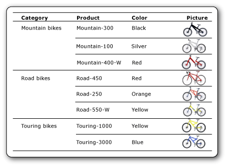

# Images in paginated reports (Power BI Report Builder)

[!INCLUDE [applies-yes-report-builder-no-desktop](../../includes/applies-yes-report-builder-no-desktop.md)]

An image is a Power BI paginated report item that contains a reference to an image that is embedded in the report, stored in a database, or stored elsewhere on the Web. An image can be a picture that's repeated with rows of data. You can also use an image as a background for certain report items.  
  
##   Comparing external, embedded, and data-bound images  

 When you use an external image in a report, the image item contains a path that points to an image wherever it exists on the Web. When you use an embedded image, however, the image data is stored within the report definition and does not exist as a separate file.  
  
 Embedded images ensure that the images are always available to the report, but they cannot be shared. Report definitions with external images are smaller than definitions with embedded images.  
  
 Data-bound images can also be displayed from binary data stored in a database. For example, the pictures that appear alongside product names in a product list are database images. In the following picture, the images of bicycles are stored in a database and retrieved in the report to illustrate each product.  
  
 

##   Embed images

 You can embed images in a report so that all image data is stored within the report definition. When you embed an image, the image is MIME-encoded and stored as text in the report definition. Using an embedded image ensures that the image is always available to the report, but it also increases the size of the report definition.  
  
 For more information about embedding an image, see [Embed an image in a Report &#40;Power BI Report Builder and service&#41;](./embed-image-report-report-builder-service.md).  

##   External images

 You can include stored images in a report by specifying a URL to the image. When you use an external image in a report, the image source is set to **External** and the value for the image is the URL address or path to the image.  

- When the report is run in Report Builder or Report Designer, preview uses the credentials of the user to display the image.
- When the report is run in the Power BI service, the image must be publicly available and not require authentication or additional sign-in to locate the image via external URL.
  
 For more information about adding an external image to a report, see [Add an External image &#40;Report Builder)](./add-external-image-report-builder-service.md).  
  
##   Background images

 You can use an image as a background image in the body of the report or in a rectangle, text box, list, matrix, or table. A background image and an image have similar properties. You can also specify how the image is repeated to fill the background of the item.  
  
> [!NOTE]  
> Image rendering extension does not render the body background image in the page header and footer.  
  
 For more information about adding a background image, see [Add a Background image &#40;Power BI Report Builder and service&#41;](./add-background-image-report-builder-service.md).  
  
  
##   Data-bound images  
 You can add images that are stored in a database to your report. You use the same image report item as the one used for static images, but with a set of properties that indicate that the image is stored in a database. To view instructions about working with data-bound images, see [Add a Data-Bound image &#40;Power BI Report Builder and service&#41;](./add-data-bound-image-report-builder-service.md).  

## Supported file types

These are the image file types you can use in paginated reports:

- BMP
- GIF
- JPG
- PNG
 
SVG files aren't supported.
 
## Related content

- [Add an external image &#40;Power BI Report Builder and service&#41;](./add-external-image-report-builder-service.md)  
- [Embed an image in a report &#40;Power BI Report Builder and service&#41;](./embed-image-report-report-builder-service.md)  
- [Add a background image &#40;Power BI Report Builder and service&#41;](./add-background-image-report-builder-service.md)  
- [Add a data-bound image &#40;Power BI Report Builder and service&#41;](./add-data-bound-image-report-builder-service.md)  
